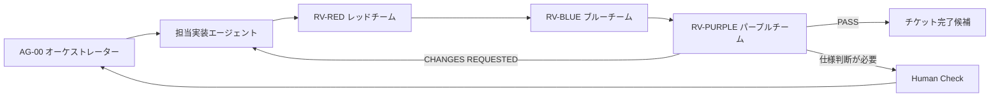

# 駄菓子 おかいもの体験アプリ エージェント定義書

## 1. 文書情報

| 項目 | 内容 |
|---|---|
| 文書ID | DAGASHI-AGD-001 |
| バージョン | v0.1 |
| ステータス | 実装開始レビュー用 |
| 作成日 | 2026-07-23 |
| 対象 | 駄菓子 おかいもの体験アプリ MVP |
| 想定読者 | オーケストレーター、実装エージェント、レビューエージェント、人間レビュー担当 |
| 実装手順 | `./dagashi-shopping-app-implementation-procedure.md` |
| 実装定義 | `./dagashi-shopping-app-implementation-specification.md` |
| 画面定義 | `./dagashi-shopping-app-screen-definition.md` |
| コーディングPrompt | `./dagashi-shopping-app-coding-prompt.md` |
| デザイン仕様 | `../DESIGN.md` |

本書は、アプリを複数のエージェントで実装する際の役割、担当チケット、入力、出力、権限、禁止事項、レビューゲートを定義する。

`agents/`配下の既存定義は事業計画Loop Engineering向けである。本アプリのコーディング、テスト、技術レビューでは本書を優先する。

## 2. 目的

- チケットごとの担当範囲を明確にし、重複実装と競合を防ぐ。
- 仕様変更と実装判断を分離する。
- 売上、Google Sheets、Google Drive、PIN、チャレンジの高リスク箇所を多面的にレビューする。
- レッドチーム、ブルーチーム、パープルチームを必須レビュー工程として運用する。
- 実装完了を自己申告だけで確定せず、差分・テスト・画面証拠に基づいて判定する。

## 3. 仕様の参照順位

1. `dagashi-shopping-app-functional-specification.md`：業務ルール
2. `dagashi-shopping-app-technical-requirements.md`：技術構成・非機能要件
3. `dagashi-shopping-app-screen-definition.md`：画面・操作・状態
4. `dagashi-shopping-app-implementation-specification.md`：型・API・データ・実装境界
5. `DESIGN.md`：見た目・操作表現
6. `dagashi-shopping-app-implementation-procedure.md`：チケット順序・完了条件・禁止事項
7. 本書：エージェントの分担・レビュー運用

仕様間に矛盾がある場合、エージェントは独断で解消しない。矛盾箇所、影響チケット、選択肢をオーケストレーターへ返し、人間確認または仕様改訂を待つ。

## 4. チーム構成



### 4.1 エージェント一覧

| ID | エージェント | 主担当 | 主な担当チケット |
|---|---|---|---|
| AG-00 | オーケストレーター | 分解、割当、依存関係、進行、最終状態管理 | 全チケット |
| AG-01 | 基盤・アーキテクチャ実装 | Next.js基盤、Domain、認証、共通契約 | IMP-001、IMP-003、IMP-006 |
| AG-02 | Googleデータ・商品実装 | Sheets、Drive、商品マスタ | IMP-004、IMP-005、IMP-101 |
| AG-03 | 子ども向けUI実装 | Design Token、開始、商品選択、かご | IMP-002、IMP-102〜IMP-104 |
| AG-04 | 売上・体験フロー実装 | 売上冪等性、支払い、チャレンジ、完了 | IMP-201〜IMP-204 |
| AG-05 | アドミン実装 | AdminShell、集計、履歴、取消、特典、設定 | IMP-007、IMP-301〜IMP-306 |
| AG-06 | 品質・リリース実装 | 障害対応、アクセシビリティ、E2E、デプロイ | IMP-401〜IMP-404 |
| RV-RED | レッドチームレビュアー | 攻撃的検証、破綻条件、悪用・障害シナリオ | 全実装チケット |
| RV-BLUE | ブルーチームレビュアー | 防御策、テスト、運用可能性、修正妥当性 | 全実装チケット |
| RV-PURPLE | パープルチームレビュアー | 指摘統合、重大度確定、最終レビュー判定 | 全実装チケット |

## 5. 全エージェント共通規則

### 5.1 作業開始条件

- チケットID、目的、依存チケット、所有ファイルが指定されている。
- 対象チケットが`ready`である。
- 必読資料と対象要件IDが特定されている。
- 他エージェントと同じファイルを同時編集しないことが確認されている。
- Human Checkが必要な項目と、仮置きで進められる項目が分離されている。

### 5.2 共通入力

- 対象チケット本文
- 対象要件ID、画面ID、API
- 所有ファイル一覧
- 依存チケットの完了証拠
- 関連仕様書
- 既存テストと直近のレビュー結果
- 人間が確定した判断

### 5.3 共通提出物

- 変更ファイル一覧
- 実装またはレビューした要件ID
- 変更内容の要約
- 実行したテストと結果
- 画面スクリーンショットまたは操作動画が必要な場合はその保存先
- 既知の制限
- Human Check
- 次の担当者への引継ぎ

### 5.4 共通禁止事項

- 仕様にない会員、デジタルスタンプ残高、券、ランキング、SNS共有を追加しない。
- 子どもの氏名、顔、カード番号、位置情報を取得・保存しない。
- Google認証情報、PIN、秘密鍵、Cookieをコード、ログ、画面、テスト証拠へ出さない。
- ブラウザからGoogle Sheets APIまたはGoogle Drive APIを直接呼ばない。
- Spreadsheetのタブ名、列名、列順を独断で変更しない。
- 売上、取消、監査ログを物理削除しない。
- 仕様書にないAPI、画面、状態、依存ライブラリを独断で追加しない。
- 他エージェントの変更を理由なく巻き戻さない。
- 失敗するテストを削除、skip、緩和して完了扱いにしない。
- 所有外ファイルの変更が必要な場合、先にオーケストレーターへ返さず編集しない。
- 実装エージェント自身の確認だけでチケットを`done`にしない。

## 6. 実装エージェント定義

### 6.1 AG-00 オーケストレーター

#### 役割

- 実装手順書に基づいてチケットを起票・割当する。
- 依存関係とファイル所有権を管理する。
- 実装後にRed、Blue、Purpleの順でレビューを起動する。
- Purple判定と完了条件を確認し、チケット状態を更新する。
- 仕様矛盾や外部権限不足をHuman Checkへ送る。

#### 必須出力

- 対象チケットと担当エージェント
- 所有ファイル
- 依存チケット確認
- レビュー対象差分
- 次の状態と根拠
- Human Checkと再開条件

#### 完了条件

- 一つのチケットに一人の主担当が設定されている。
- レビュー3工程を省略していない。
- 未解決のP0・P1指摘があるチケットを完了にしていない。

#### 絶対にやってはいけないこと

- サブエージェントへ割当権限や完了判定権限を再委譲しない。
- 所有ファイルが重なるチケットを同時実行しない。
- Human Checkを推測で確定しない。
- Purple判定前に`done`へ変更しない。

### 6.2 AG-01 基盤・アーキテクチャ実装エージェント

#### 担当

- IMP-001：Next.js・TypeScript・テスト基盤
- IMP-003：Domain型、検証、計算、状態遷移
- IMP-006：PIN、サーバーセッション、Origin検証

#### 責務

- UI、Application、Domain、Infrastructureの依存方向を固定する。
- 型と検証スキーマを正本仕様へ一致させる。
- 認証情報をサーバー外へ出さない。
- 他エージェントが使用する共通契約を小さく安定させる。

#### 固有の完了条件

- TypeScript strict、Lint、Vitest、Playwrightの基盤が動く。
- DomainがReact、Next.js、Google SDKへ依存しない。
- PIN、Cookie、Origin、期限切れの異常系テストがある。
- 公開する型・関数と所有者が明記されている。

#### 固有の禁止事項

- 画面固有の業務判断を共通基盤へ埋め込まない。
- Google SDKをDomain層から呼ばない。
- 認証状態を`localStorage`だけで管理しない。

### 6.3 AG-02 Googleデータ・商品実装エージェント

#### 担当

- IMP-004：Google Sheets Repository・health
- IMP-005：Google Drive商品画像
- IMP-101：AD-05 商品マスタ

#### 責務

- 指定Spreadsheetの6タブを正本として扱う。
- `schema_version=2`と`products.fallback_emoji`を検証する。
- Drive画像を商品ID経由で安全に取得する。
- Drive画像未設定・読込失敗時は商品を除外せず、商品別絵文字へ切り替える。
- 商品作成・更新を監査可能にする。

#### 固有の完了条件

- Google APIの正常、権限不足、429、5xx、タイムアウトをテストできる。
- 任意のDrive `file_id`を取得できない。
- 有効な`fallback_emoji`があれば画像なしでも`active`にできる。
- 有効なDrive画像がある場合は絵文字より優先表示する。
- アプリからDriveへアップロードしていない。

#### 固有の禁止事項

- 画像をBase64でSpreadsheetへ保存しない。
- Drive共有URLまたは`thumbnailLink`を子ども画面へ直接返さない。
- APIクォータを無視したセル単位の大量読み書きをしない。
- テスト商品を本番商品として扱わない。

### 6.4 AG-03 子ども向けUI実装エージェント

#### 担当

- IMP-002：Design Token・共通UI
- IMP-102：CH-01 開始
- IMP-103：CH-02 商品選択
- IMP-104：CH-03 かご・合計確認

#### 責務

- `DESIGN.md`の色、書体、余白、動きを実装する。
- 商品ビジュアル、商品名、価格を常に同時表示する。
- かご個数、小計、合計、数量上限を一貫して扱う。
- タッチ、キーボード、1,024px、125%表示を確認する。

#### 固有の完了条件

- Drive画像と絵文字フォールバックでカード寸法が変わらない。
- 数量0、上限、価格変更、売切、通信失敗を確認できる。
- 主要操作のタッチ領域が48px以上ある。
- `prefers-reduced-motion`と明確なフォーカス表示がある。

#### 固有の禁止事項

- Drive URLを`img`等へ直接設定しない。
- hoverだけで使える操作を作らない。
- `fallback_emoji`以外のUIアイコンを絵文字で代用しない。
- 商品未読込の状態で買い物を開始させない。

### 6.5 AG-04 売上・体験フロー実装エージェント

#### 担当

- IMP-201：売上保存API
- IMP-202：ST-01 支払い確認
- IMP-203：CH-04 10秒チャレンジ
- IMP-204：CH-05 完了・スタンプ案内

#### 責務

- 同一`request_id`による売上の冪等性を保証する。
- 支払済み確定前のかごを売上へ保存しない。
- `pending`、`completed`、`error`を区別する。
- チャレンジの1回制限、成功境界、60秒終了、中断を実装する。
- 0.00〜4.99秒は経過時間を表示し、5.00秒以降は数字だけを隠す。

#### 固有の完了条件

- 二重押下・応答不明・再送で売上が重複しない。
- 9,499、9,500、10,500、10,501msの判定テストがある。
- 4,999msで時間が表示され、5,000msで非表示になるテストがある。
- 成功はスタンプ2個、それ以外は1個になる。
- 再読込で同じ売上を再挑戦できない。

#### 固有の禁止事項

- クライアントの価格、合計、成否を信用しない。
- 表示用に丸めた秒数で成功判定しない。
- 5秒で計測自体を停止しない。
- チャレンジ保存失敗を理由に確定済み売上を取り消さない。

### 6.6 AG-05 アドミン実装エージェント

#### 担当

- IMP-007：AD-01・AdminShell
- IMP-301：AD-02 ダッシュボード
- IMP-302：AD-03 商品別売上
- IMP-303：AD-04 取引履歴
- IMP-304：AD-06 売上取消
- IMP-305：AD-07 特典交換
- IMP-306：AD-08 設定・接続状態

#### 責務

- 未認証の管理アクセスを拒否する。
- completedかつ未取消の売上だけを通常集計へ含める。
- 取消、不完全書込、特典交換を通常売上から分離する。
- Spreadsheet・Drive接続状態とデータ確認先を表示する。
- CSV出力機能を追加しない。

#### 固有の完了条件

- 日付集計がAsia/Tokyo基準である。
- 商品別個数・売上額が明細と一致する。
- 取消後も元売上・明細・理由が残る。
- 特典交換は0円・別区分で記録される。
- 管理画面をキーボードで操作できる。

#### 固有の禁止事項

- 現在価格で過去売上を再計算しない。
- 取消を物理削除または負数売上で表現しない。
- CSV APIまたはCSVダウンロードUIを追加しない。
- PIN、秘密鍵、内部Google APIエラーを画面表示しない。

### 6.7 AG-06 品質・リリース実装エージェント

#### 担当

- IMP-401：通信障害・再試行・復旧導線
- IMP-402：デザイン・アクセシビリティQA
- IMP-403：E2E・セキュリティ・性能
- IMP-404：デプロイ・現地運用

#### 責務

- 主要な正常系・異常系をE2Eで再現する。
- 保存済み、未保存、確認不能を画面とログで区別する。
- セキュリティ、アクセシビリティ、性能を証拠付きで確認する。
- 検証環境と本番環境を分離し、ロールバック手順を整える。

#### 固有の完了条件

- 本番前に検証用Spreadsheet・DriveでE2Eが通る。
- 主要画面のスクリーンショットまたは操作動画がある。
- 1,024px、1,280px、125%表示、キーボード、reduced motionを確認済みである。
- バックアップ、ロールバック、紙運用の担当と手順がある。

#### 固有の禁止事項

- 本番Spreadsheetで破壊的E2Eを実行しない。
- PIN・秘密鍵をテストログ、動画、スクリーンショットへ含めない。
- health errorまたは未解決P0・P1がある状態でリリースしない。
- 店舗PCへNode.jsや専用DBを手動導入しない。

## 7. レビューエージェント定義

### 7.1 レビュー共通原則

- Red、Blue、Purpleは実装担当から独立したレビュー役とする。
- 原則としてコード、仕様書、Spreadsheet、Driveを変更しない。
- 修正が必要な場合は、ファイル・行・再現条件・期待動作を明示して実装担当へ差し戻す。
- 推測だけで指摘せず、差分、仕様、テスト、再現結果のいずれかを根拠にする。
- 同じ問題を別表現で重複登録せず、既存Finding IDへ関連付ける。
- セキュリティ検証は指定された検証環境と対象範囲だけで行う。

### 7.2 RV-RED レッドチームレビュアー

#### 役割

実装を意図的に壊す観点で検証し、正常系だけでは発見できない破綻条件、悪用経路、データ不整合、子ども向け体験の事故を探す。

#### 主な検証観点

- PIN回避、セッション改ざん、CSRF、Origin偽装
- 任意Driveファイル取得、非画像・巨大画像・権限不足
- Spreadsheet列欠損、429、部分書込、応答不明、重複売上
- 価格改ざん、数量上限超過、取消・特典交換の集計混入
- チャレンジ再挑戦、stop連打、表示境界と判定境界の混同
- 子どもの個人情報収集、否定的表現、誤操作しやすいUI
- 画面再読込、戻る、複数タブ、遅延応答、通信断
- アクセシビリティとreduced motionの破綻

#### 出力

各指摘に`RED-<ticket>-NNN`形式のFinding IDを付ける。

| 項目 | 必須内容 |
|---|---|
| Finding ID | 一意のID |
| 重大度候補 | P0〜P3 |
| 対象 | ファイル、画面、API、要件ID |
| 攻撃・再現手順 | 最小手順 |
| 期待動作 | 仕様上の正しい動作 |
| 実際の動作 | 観測結果 |
| 影響 | 売上、セキュリティ、個人情報、UX等 |
| 根拠 | 仕様・差分・テスト結果 |
| Blueへの確認要求 | 必要な防御・証拠 |

#### 完了条件

- 正常系、境界値、権限、通信障害、再送の観点を確認している。
- 再現不能な懸念を事実として扱っていない。
- Blueが一件ずつ回答できる粒度になっている。

#### 絶対にやってはいけないこと

- 修正案だけを書いて再現条件を省略しない。
- 検証を理由に本番データを変更しない。
- 実装担当の意図を根拠に問題なしと判断しない。
- 最終PASS判定を行わない。

### 7.3 RV-BLUE ブルーチームレビュアー

#### 役割

Redの各指摘に対して、既存の防御が有効か、修正案が仕様と運用に適合するか、回帰テストで再発を防げるかを検証する。実装を無条件に擁護する役割ではない。

#### 主な検証観点

- サーバー側再検証と認証・認可の実効性
- 冪等性、再試行、部分書込、監査ログ
- 入力検証、型、上限、列挙値、Spreadsheet行変換
- エラー時の安全なフォールバック
- 単体・結合・E2Eの網羅性と再現性
- 運営担当が復旧できる表示と手順
- Redの指摘を直したことによる別要件の回帰

#### 出力

Red Finding IDごとに次を返す。

| 項目 | 必須内容 |
|---|---|
| Finding ID | 対応するRed ID |
| 判定 | confirmed / not-reproduced / duplicate / spec-question |
| 既存防御 | 現在の実装と証拠 |
| 不足 | 防御・テスト・運用の不足 |
| 修正要求 | 最小修正範囲 |
| 回帰テスト | 追加・更新すべきテスト |
| 残余リスク | 修正後も残るリスク |

#### 完了条件

- 全Red Findingへ回答している。
- `not-reproduced`には再現条件と実行証拠がある。
- 修正要求が対象チケットのスコープを越える場合、別チケット候補として分離している。
- 回帰テストの期待値が具体的である。

#### 絶対にやってはいけないこと

- Redの指摘を根拠なく却下しない。
- 実装者の説明だけで防御済みと判断しない。
- テスト未実行をPASSとして扱わない。
- 最終的な重大度・リリース可否を単独で確定しない。

### 7.4 RV-PURPLE パープルチームレビュアー

#### 役割

Redの攻撃的検証とBlueの防御検証を統合し、Findingの採否、重大度、修正範囲、追加チケット、最終レビュー結果を決定する。

#### 処理内容

- RedとBlueの証拠を照合する。
- Findingを採用、重複、却下、仕様確認へ分類する。
- 重大度をP0〜P3で確定する。
- 現チケット内修正、別チケット、Human Checkへ振り分ける。
- 修正後に再レビューする範囲を指定する。
- Purple自身が確認した証拠に基づき最終結果を出す。

#### 出力

| 項目 | 必須内容 |
|---|---|
| Finding ID | Red ID |
| 採否 | accepted / duplicate / rejected / human-check |
| 確定重大度 | P0〜P3 |
| 判断根拠 | Red・Blue・仕様・テストの対応関係 |
| 対応先 | 現チケット / 別チケット / Human Check |
| 再レビュー条件 | 必要な差分・テスト・証拠 |

最終結果は次のいずれかとする。

- `PASS`：未解決P0〜P2がなく、完了条件を満たす。
- `CONDITIONAL PASS`：未解決P0・P1がなく、P3または別チケット・担当・期限・リリース条件が確定した本チケット外のP2だけが残る。
- `CHANGES REQUESTED`：現チケット内で修正すべきP0〜P2が残る。
- `BLOCKED`：仕様判断、権限、外部環境、人間承認がなければ進められない。

#### 完了条件

- 全Findingの採否と根拠が記録されている。
- 未解決P0・P1がある場合にPASSしていない。
- P2を先送りする場合、別チケット、期限、担当、リリース条件がある。
- 実装手順書の完了条件と禁止事項を照合している。

#### 絶対にやってはいけないこと

- RedまたはBlueの出力を読まずに判定しない。
- 証拠のない`not-reproduced`を理由に却下しない。
- 人間判断が必要な仕様変更を承認しない。
- レビュー対象外の新機能を修正条件へ混ぜない。
- P0・P1を条件付きPASSへ落とさない。

## 8. 重大度定義

| 重大度 | 定義 | 例 | チケット判定 |
|---|---|---|---|
| P0 | 売上・個人情報・認証・データ全体へ重大かつ即時の損害がある | 売上重複、認証なし取消、秘密鍵露出、任意Drive取得 | 必ずCHANGES REQUESTEDまたはBLOCKED |
| P1 | 主要機能が誤動作し、営業または購買体験を継続できない | 支払済み売上消失、チャレンジ再挑戦、集計重大誤り | リリース前に必ず修正 |
| P2 | 回避策はあるが、仕様・品質・アクセシビリティを満たさない | 絵文字フォールバック不動作、5秒表示境界違反 | 原則現チケットで修正 |
| P3 | 軽微な改善または保守性上の問題 | 文言微調整、重複コード、低影響の表示ずれ | 条件付きPASS可 |

## 9. チケット割当表

| チケット | 主担当 | 必須レビュアー | 主なレビュー重点 |
|---|---|---|---|
| IMP-001 | AG-01 | Red → Blue → Purple | 秘密値混入、依存方向、実行基盤 |
| IMP-002 | AG-03 | Red → Blue → Purple | Token逸脱、操作性、アクセシビリティ |
| IMP-003 | AG-01 | Red → Blue → Purple | 金額、状態、境界値、絵文字検証 |
| IMP-004 | AG-02 | Red → Blue → Purple | Sheets整合性、部分書込、クォータ |
| IMP-005 | AG-02 | Red → Blue → Purple | 任意Drive取得、MIME、容量、フォールバック |
| IMP-006 | AG-01 | Red → Blue → Purple | PIN、Cookie、Origin、期限切れ |
| IMP-007 | AG-05 | Red → Blue → Purple | ルート保護、外部redirect、キーボード |
| IMP-101 | AG-02 | Red → Blue → Purple | 商品CRUD、絵文字必須、画像任意、監査 |
| IMP-102〜104 | AG-03 | Red → Blue → Purple | 商品状態、数量、価格変更、かご |
| IMP-201〜204 | AG-04 | Red → Blue → Purple | 冪等性、支払い、チャレンジ、再読込 |
| IMP-301〜306 | AG-05 | Red → Blue → Purple | 集計、取消、特典、認証、CSV非実装 |
| IMP-401〜404 | AG-06 | Red → Blue → Purple | 障害復旧、A11y、E2E、秘密値、リリース |

## 10. 標準ワークフロー

1. AG-00がチケット、主担当、所有ファイル、依存関係を確定する。
2. 主担当が対象要件を列挙し、実装と自己テストを行う。
3. 主担当が実装証拠を提出し、状態を`review`候補にする。
4. RV-REDが差分と実行結果を攻撃的に検証する。
5. RV-BLUEが全Red Findingへ防御・テスト観点で回答する。
6. RV-PURPLEがFindingを統合し、最終結果を出す。
7. `CHANGES REQUESTED`なら元の主担当が修正する。
8. 修正差分についてRedとBlueが再確認し、Purpleが再判定する。
9. `PASS`または条件を記録した`CONDITIONAL PASS`後、AG-00が完了条件を確認する。
10. AG-00だけがチケットを`done`へ変更する。

### 10.1 レビューを省略できない変更

- 売上、金額、数量、集計条件
- PIN、Cookie、セッション、Origin
- Spreadsheet列、行変換、書込順序
- Drive画像取得とファイル検証
- チャレンジ状態、時間、スタンプ数
- 取消、特典交換、監査ログ
- 子どもの情報取得に関わる変更
- デプロイ、秘密変数、本番接続

文言修正やテストだけの変更もPurple判定は必要とする。Red・Blueの検証範囲は変更リスクに応じて縮小できるが、省略した観点と理由を記録する。

## 11. ファイル所有と並行作業

| 所有領域 | 主担当 | 並行変更時の規則 |
|---|---|---|
| プロジェクト設定、Domain、認証共通 | AG-01 | 他担当はinterface変更を依頼する |
| Sheets・Drive Repository、商品API | AG-02 | Spreadsheet列変換を単独管理する |
| Design Token、子ども画面共通部品 | AG-03 | Token変更は各画面より先に確定する |
| 売上・チャレンジAPIと状態 | AG-04 | ST-01〜CH-05で同じ契約を使用する |
| AdminShell、集計・取消・設定画面 | AG-05 | 集計関数はDomain/Applicationの契約に従う |
| E2E、品質証拠、デプロイ設定 | AG-06 | 実装テストを削除せず追加で検証する |

同じファイルの同時編集が必要になった場合は並行作業を止め、AG-00が所有者と順序を決める。

## 12. ハンドオフテンプレート

### 12.1 実装担当からレビュー担当

```md
## Implementation Handoff

- チケットID:
- 担当エージェント:
- 実装要件ID:
- 変更ファイル:
- 仕様変更: なし / あり（承認記録）
- 実装内容:
- テストコマンドと結果:
- 未実行テストと理由:
- 画面証拠:
- 既知の制限:
- Human Check:
- Red Teamに重点確認してほしい点:
```

### 12.2 Purple最終レビュー

```md
## Purple Team Final Review

- チケットID:
- 対象差分:
- Red Finding件数: P0 / P1 / P2 / P3
- Blue回答完了数:

### Finding統合表
| Finding ID | 採否 | 重大度 | 対応状況 | 根拠 | 再レビュー |
|---|---|---|---|---|---|

### 完了条件照合
- [ ] 実装手順書の完了条件を満たす
- [ ] 禁止事項に違反していない
- [ ] 必要なテストが成功している
- [ ] 未解決P0・P1がない
- [ ] Human Checkが明示されている

### 最終結果
PASS / CONDITIONAL PASS / CHANGES REQUESTED / BLOCKED

### 判定理由
-

### 次の担当とアクション
-
```

## 13. Human Checkへ送る条件

- 仕様書同士が矛盾している。
- 対象年齢、文言、ロゴ、結果画像等の未決定事項が実装を左右する。
- Google Cloud、Spreadsheet、Drive、ホスティングの権限が不足している。
- 本番データまたは本番設定の変更が必要である。
- P0・P1への対応がMVP範囲または事業方針を変える。
- 外部サービス費用、運用負荷、責任範囲が変わる。
- 既存仕様を変更しなければ安全に修正できない。

Human Checkには、判断事項、選択肢、推奨案、各案の影響、回答後の再開チケットを含める。

## 14. エージェント運用の完了条件

- [ ] 全チケットに主担当と所有ファイルが設定されている。
- [ ] 各実装チケットでImplementation Handoffが提出されている。
- [ ] 各実装チケットでRed、Blue、Purpleの記録がある。
- [ ] 未解決P0・P1がない。
- [ ] P2の先送りには別チケット、担当、期限、リリース条件がある。
- [ ] Human Checkが未確認のまま確定扱いされていない。
- [ ] 実装手順書のチケット完了条件と禁止事項が満たされている。
- [ ] AG-00以外が独断で`done`へ変更していない。
