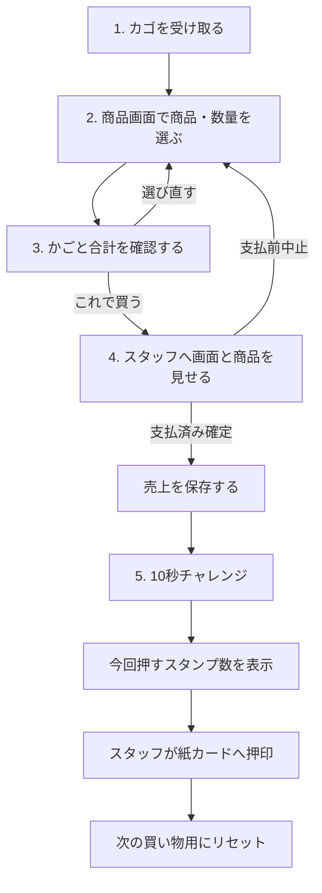

# 駄菓子 おかいもの体験アプリ 機能・運用仕様書

## 1. 文書情報

| 項目 | 内容 |
|---|---|
| 文書ID | DAGASHI-FS-001 |
| バージョン | v0.4 |
| ステータス | Draft / レビュー用 |
| 更新日 | 2026-07-23 |
| 対象 | MVP（単一レジ端末・Next.js + Google Sheets + Google Drive） |
| 想定読者 | 企画担当、開発担当、テスト担当、運営担当 |
| 上位資料 | `../outputs/dagashi_shopping_experience_concept_v0.2.docx` |
| 技術要件 | `./dagashi-shopping-app-technical-requirements.md` |

本書は、子ども向け購買体験、スタンプカード、10秒チャレンジ、売上管理の機能仕様と現場運用を定義する。画面の色、ロゴ、最終文言、対象年齢はUI設計時に確定する。

## 2. サービスコンセプト

子どもが商品と数量を自分で選び、合計を見て必要なら選び直し、スタッフに支払い、最後に10秒チャレンジを行う。店員体験ではなく、駄菓子を通した小さな購買体験を中心にする。

### 2.1 体験の原則

- 子どもが選択の主体になる。
- 合計金額を商品選択中から見せる。
- 子どもだけでは売上を確定できない。
- チャレンジの失敗を罰にしない。
- 多く買うほどスタンプが増える設計にしない。
- 個人名、ランキング、デジタルのスタンプ残高を扱わない。
- 商品表示、アレルギー、安全判断をアプリだけで完結させない。

## 3. 利用者と権限

| 利用者 | 主な操作 | 制限 |
|---|---|---|
| 子ども | 商品選択、数量変更、合計確認、10秒チャレンジ | 売上確定、取消、商品変更、集計閲覧は不可 |
| スタッフ | 支払い確認、支払済み確定、スタンプ押印、簡易案内 | PIN認証後にスタッフ操作を行う |
| アドミン | 商品マスタ、売上、取消、特典交換、設定、バックアップ | PIN認証必須 |
| 保護者 | 子どもの選択と支払いを見守る | アプリ上のアカウントや操作権限は持たない |

MVPではスタッフとアドミンを同じPIN権限で扱う。役割を分離する必要が出た場合は、後続版で権限を追加する。

## 4. 基本フロー

### 4.1 通常所要時間の目安

アプリ操作は、商品を選ぶ時間を除き1〜3分程度を目安とする。実際の所要時間は対象年齢、商品数、支払い方法、スタッフ補助によって検証する。

## 5. 業務ルール

| ID | ルール |
|---|---|
| BR-001 | 支払済みの買い物1回につき、購入スタンプ1個を付与する |
| BR-002 | 商品数や購入金額では購入スタンプ数を増やさない |
| BR-003 | 10秒チャレンジは1取引につき1回だけ行う |
| BR-004 | 9.50秒以上10.50秒以下の場合、追加スタンプ1個を付与する |
| BR-005 | チャレンジ不成功またはスキップでも購入スタンプ1個は付与する |
| BR-006 | 15スタンプで、運営が指定した商品の中からお菓子1個と交換する |
| BR-007 | スタンプ残高は紙カードだけで管理し、アプリへ保存しない |
| BR-008 | スタッフが支払済みを確定し、Google Sheetsへの書込が完了した時点で売上として扱う |
| BR-009 | 支払前に中止したカゴは売上に含めない |
| BR-010 | 特典交換は売上0円・特典1個として、通常売上と分けて記録する |
| BR-011 | 誤登録した売上は削除せず、取消状態と理由を保存する |
| BR-012 | 価格変更後も、確定済みの過去売上は変更しない |
| BR-013 | 販売中の商品にはフォールバック絵文字を必ず設定し、Drive画像は任意とする |
| BR-014 | Google Sheetsへの保存完了を確認できた取引だけを売上へ計上する |

## 6. 画面一覧

| 画面ID | 画面名 | 利用者 | 目的 |
|---|---|---|---|
| CH-01 | 開始画面 | 子ども・スタッフ | 新しい買い物を開始する |
| CH-02 | 商品選択 | 子ども | 商品と数量を選ぶ |
| CH-03 | かご・合計確認 | 子ども | 明細と合計を確認し、選び直すか支払いへ進む |
| ST-01 | 支払い確認 | 子ども・スタッフ | 支払いを行い、スタッフが売上を確定する |
| CH-04 | 10秒チャレンジ | 子ども | スタートとストップを1回操作する |
| CH-05 | 完了・スタンプ案内 | 子ども・スタッフ | 今回押すスタンプ数を伝える |
| AD-01 | PIN入力 | スタッフ・アドミン | 管理機能へ入る |
| AD-02 | ダッシュボード | アドミン | 当日の売上概要を確認する |
| AD-03 | 商品別売上 | アドミン | 指定期間の商品別個数・売上額を見る |
| AD-04 | 取引履歴・詳細 | アドミン | 売上明細を確認する |
| AD-05 | 商品マスタ | アドミン | 商品、価格、画像、表示状態を管理する |
| AD-06 | 売上取消 | アドミン | 誤登録を取消状態にする |
| AD-07 | 特典交換 | アドミン | 15スタンプの交換商品を0円で記録する |
| AD-08 | 設定・データ管理 | アドミン | 判定条件、接続状態、バックアップ情報を管理する |

## 7. 子ども向け画面仕様

### 7.1 CH-01 開始画面

#### 表示

- アプリ名
- 「おかいものをはじめる」ボタン
- スタッフ向けアドミン入口
- 必要に応じて短い案内文

#### 動作

- 開始ボタンで空のかごを作成し、CH-02へ移動する。
- 前の子のかご、チャレンジ結果、完了表示を残さない。
- アドミン入口は目立たせすぎず、選択するとAD-01を表示する。

### 7.2 CH-02 商品選択画面

#### 表示

- 販売中の商品カード
- Drive商品画像またはフォールバック絵文字、商品名、価格
- 数量の＋／－ボタン
- 商品ごとの選択数
- 現在の合計金額
- 「かごを見る」ボタン
- 必要に応じてカテゴリ切り替え

#### 動作

| ID | 仕様 |
|---|---|
| FR-CH-001 | 販売中の商品だけを表示する |
| FR-CH-002 | 売切商品は非表示または押せない状態で表示する |
| FR-CH-003 | ＋で数量を1増やし、－で1減らす。0未満にはしない |
| FR-CH-004 | 1商品の数量上限は初期値20個とする |
| FR-CH-005 | 数量変更後、商品小計とかご合計を即時更新する |
| FR-CH-006 | 商品が0件のときは「かごを見る」を無効にする |
| FR-CH-007 | 商品カードは商品マスタの表示順で並べる |

#### 入力エラー

- 商品データが読み込めない場合は買い物を開始せず、スタッフを呼ぶ案内を出す。
- 商品が1件も販売中でない場合は開始画面へ戻し、アドミンでの商品確認を促す。

### 7.3 CH-03 かご・合計確認画面

#### 表示

- 商品画像または商品名
- 単価、数量、小計
- 支払う合計金額
- 数量変更・削除
- 「商品をえらびなおす」ボタン
- 「これで買う」ボタン

#### 動作

- 商品を選び直す場合はCH-02へ戻り、かごを保持する。
- かごが空になった場合は「これで買う」を無効にする。
- 「これで買う」を押しても売上は作成せず、ST-01へ進む。
- 税計算は行わず、商品マスタの価格を支払額として合計する。

### 7.4 ST-01 支払い確認画面

#### 子ども向け表示

- 「お店の人に画面と商品を見せてね」
- 商品明細と合計金額
- 「商品をえらびなおす」ボタン

#### スタッフ操作

- 「支払済みにする」ボタン
- 「支払前に中止する」ボタン
- 支払い方法（初期候補：現金／その他）
- 必要時にPIN入力

#### 動作

| ID | 仕様 |
|---|---|
| FR-PAY-001 | 子どもの通常操作だけでは支払済みにできない |
| FR-PAY-002 | 支払済み確定前なら商品選択へ戻れる |
| FR-PAY-003 | 支払済み確定時に売上と明細を保存する |
| FR-PAY-004 | 保存完了後にだけCH-04へ進む |
| FR-PAY-005 | 保存処理中は確定ボタンを無効にし、二重売上を防ぐ |
| FR-PAY-006 | 保存失敗時は画面に留まり、再実行または紙運用への切り替えを案内する |

受取金額入力、おつり計算、キャッシュレス端末連携はMVPに含めない。

### 7.5 CH-04 10秒チャレンジ画面

#### 表示

- 「10秒だと思ったらストップ！」等の短い説明
- 大きな「スタート」ボタン
- 開始後の大きな「ストップ」ボタン
- 結果時間
- 成功時・不成功時の画像を含む結果ポップ
- 肯定的なメッセージと今回のスタンプ数
- スタッフ用「チャレンジをしない」操作

#### 動作

| ID | 仕様 |
|---|---|
| FR-CHL-001 | スタート前はストップできない |
| FR-CHL-002 | スタート後の経過時間を計測する |
| FR-CHL-003 | ストップ操作は1回だけ受け付ける |
| FR-CHL-004 | 9.50〜10.50秒を成功とする |
| FR-CHL-005 | 成否は丸め前のミリ秒値で判定し、表示は小数第2位までとする |
| FR-CHL-006 | 成功なら今回のスタンプ数を2個、不成功・スキップなら1個とする |
| FR-CHL-007 | 60秒で自動終了し、不成功として扱う |
| FR-CHL-008 | 画面再読み込みで同じ取引を再挑戦できないようにする |
| FR-CHL-009 | 計測中に画面が閉じた場合は中断扱いとし、購入スタンプ1個で完了する |
| FR-CHL-010 | ストップ受付後、画面全体を覆う結果ポップを直ちに表示する |
| FR-CHL-011 | 結果ポップには結果別の画像、結果時間、メッセージ、今回のスタンプ数を含める |
| FR-CHL-012 | 結果ポップは「つぎへ」を押すまで閉じず、背景操作を受け付けない |
| FR-CHL-013 | 成功時は星・紙吹雪等、不成功時は応援イラスト等の明るい演出を表示する |
| FR-CHL-014 | スキップ・中断時も、お買い物完了を示す画像付きポップを表示する |
| FR-CHL-015 | 動きを減らす端末設定では、紙吹雪等のアニメーションを停止または縮小する |
| FR-CHL-016 | 計測開始から5,000ms未満は、経過時間を秒単位・小数第2位まで表示する |
| FR-CHL-017 | 経過時間が5,000ms以上になった時点で計測中の数字を非表示にし、ストップ後の結果時間は小数第2位まで表示する |

「失敗」「ざんねん」だけで終わらせず、「ナイスチャレンジ」等の肯定的な文言を使う。公開ランキングや他の子との比較は行わない。

#### 結果ポップ

| 状態 | 見た目 | 主な表示 | 操作 |
|---|---|---|---|
| 成功 | 星、紙吹雪、笑顔のマスコット等 | 結果時間、「すごい！」、スタンプ2個 | 「つぎへ」 |
| 不成功 | 明るい応援イラスト、やさしい光等 | 結果時間、「ナイスチャレンジ！」、スタンプ1個 | 「つぎへ」 |
| スキップ・中断 | お買い物完了イラスト | 「おかいものスタンプを押すよ」、スタンプ1個 | 「つぎへ」 |

演出は結果を分かりやすくする補助として3秒程度を上限とし、赤い×、悲しい顔、強い点滅、失格音は使用しない。音を追加する場合も、音なしで結果が伝わるようにする。

### 7.6 CH-05 完了・スタンプ案内画面

#### 表示

- 「おかいもの完了」
- 今回スタッフが押すスタンプ数：1個または2個
- 「カードの15マスがたまったら対象のお菓子1個と交換」
- 「スタッフにカードをわたしてね」
- 「おわる」ボタン

#### 重要な仕様差分

企画書v0.2には「15個までの残り」の表示案があるが、MVPではデジタルのスタンプ残高を保存しない。そのため、正確な残数は表示せず、紙カードを見て確認する。今回付与数だけをアプリに表示する。

#### 終了動作

- 「おわる」でかご、画面上のチャレンジ結果、支払い画面を初期化する。
- 保存済み売上とチャレンジ記録は削除しない。
- 一定時間操作がない場合は、スタッフ確認後に開始画面へ戻せるようにする。

## 8. スタンプカード・特典仕様

### 8.1 物理カード

- 15マス、5 × 3配置を基本とする。
- カード番号、アプリ連携用QR、デジタル残高は使用しない。
- 氏名欄は必須にせず、店舗側は氏名をアプリへ転記しない。
- 購入後、完了画面を確認したスタッフが1個または2個を押印する。

### 8.2 交換

1. スタッフが紙カードの15マスを確認する。
2. 対象棚または上限金額内から子どもが商品を選ぶ。
3. アドミンがAD-07で商品を選び、特典交換を登録する。
4. 交換商品を売上0円・特典1個として保存する。
5. 紙カードを回収、穴あけ、交換済み押印等で再利用できない状態にする。

アプリは紙カードの真正性や15スタンプ到達を自動判定しない。スタッフの現物確認を前提とする。

### 8.3 紛失・再発行

紛失時の再発行、既存スタンプの引継ぎ、破損カードの扱いは店舗運用としてレビューで決定する。MVPには個別履歴がないため、アプリから残高を復元できない。

## 9. アドミン画面仕様

### 9.1 AD-01 PIN入力

- PIN入力欄、ログイン、キャンセルを表示する。
- 連続失敗時は一時的に入力を停止する。
- ログイン成功後は、支払い確認またはアドミンメニューへ戻る。
- PINを画面・ログへ表示しない。

### 9.2 AD-02 ダッシュボード

#### 当日表示

- 売上額
- 取引件数
- 販売個数
- 特典交換数
- 取消件数
- 最新の取引

売上額、取引件数、販売個数は、支払済みかつ未取消の通常売上だけを対象にする。特典交換は別欄へ表示する。

### 9.3 AD-03 商品別売上

#### 検索条件

- 開始日
- 終了日
- 商品名またはカテゴリ
- 販売中・非表示を問わず過去商品を検索可能

#### 一覧項目

- 商品ID
- 商品名
- 販売個数
- 売上額
- 特典交換数

#### 操作

- 商品名または販売個数で並べ替える。
- 取消済み売上を通常集計へ含めない。

### 9.4 AD-04 取引履歴・詳細

#### 一覧項目

- 取引日時
- 取引ID
- 状態：支払済み／取消
- 商品数
- 合計金額
- 支払い方法

#### 詳細項目

- 商品名、単価、数量、小計
- 合計金額
- チャレンジ実施有無、結果時間、成功・不成功
- 今回のスタンプ表示数
- 取消日時、取消理由

取引履歴には子どもの氏名、カード番号、顔写真、個人別購入履歴を持たせない。

### 9.5 AD-05 商品マスタ

#### 項目

| 項目 | 必須 | 仕様 |
|---|---|---|
| 商品名 | 必須 | 1〜40文字 |
| 価格 | 必須 | 1円以上の整数。MVPでは税込等の内訳計算は行わない |
| カテゴリ | 任意 | 1〜20文字 |
| フォールバック絵文字 | 販売中は必須 | 商品を表す絵文字を1つ設定する |
| 商品画像 | 任意 | Google Driveの画像`file_id`または共有URLを入力する。設定時は絵文字より優先表示する |
| 表示順 | 必須 | 0以上の整数 |
| 状態 | 必須 | 下書き、販売中、売切、非表示 |

#### 操作

- 新規作成、編集、複製、状態変更を行える。
- 売上履歴がある商品は完全削除せず、非表示にする。
- 価格変更前に確認を表示する。
- Drive画像なしでも、フォールバック絵文字が設定されていれば販売中に変更できる。
- 登録済み画像が読み込めない場合はフォールバック絵文字を子ども画面へ表示し、アドミンへ警告する。
- 商品画像の実体は、[商品画像専用Google Driveフォルダ](https://drive.google.com/drive/folders/1uhYVw7gofnxWvdbz_F3oHMidww1f2AR-)へ保存する。
- Spreadsheetの`products.fallback_emoji`には商品を表す絵文字を保存する。
- Spreadsheetの`products.image_file_id`には、画像ファイルのGoogle Drive `file_id`を保存する。
- 共有URLが入力された場合は、アプリが`file_id`を抽出して保存する。
- MVPではアプリからDriveへの画像アップロードは行わない。運営担当がDriveへ画像を置き、Spreadsheetまたは商品管理画面へ`file_id`を入力する。
- Drive画像は不特定多数へ公開せず、商品画像フォルダをアプリ用サービスアカウントへ閲覧共有する。
- Drive上で画像を差し替えた場合は、Spreadsheetの`image_updated_at`も更新する。
- 商品名の重複は警告するが、必要な場合は保存できる。

### 9.6 AD-06 売上取消

- 取消対象の明細と合計を表示する。
- 取消理由を必須とする。
- 確認ダイアログ後に取消状態へ変更する。
- 取消後も元の売上・明細を履歴表示できる。
- 取消済み取引を再度取り消せない。
- 返金や現金の戻し方はアプリ外の運用として扱う。

### 9.7 AD-07 特典交換

- 交換対象商品を検索・選択する。
- 商品名と通常価格を確認用に表示する。
- 「紙カード15個確認済み」のチェックを必須にする。
- 登録後、売上0円・特典1個として保存する。
- 通常売上額、通常販売個数には含めず、特典交換数へ含める。
- 誤登録時は特典交換の取消履歴を残せるようにする。

### 9.8 AD-08 設定・データ管理

#### 設定

- チャレンジ成功下限：初期9.50秒
- チャレンジ成功上限：初期10.50秒
- スタンプゴール数：画面案内用、初期15個
- 1商品あたり数量上限：初期20個
- 支払い方法の表示候補
- Spreadsheet接続状態

#### データ管理

- 不完全書込（`pending`または`error`）の確認
- アプリバージョン、Spreadsheetスキーマバージョン表示
- Spreadsheetと商品画像Driveフォルダへの接続状態表示

Google Spreadsheetを正本とし、バックアップは運営担当が日付付きでSpreadsheetを複製する。PIN変更はMVPでは管理画面から行わず、運営責任者がデプロイ環境の秘密変数を更新する。

## 10. 売上・集計仕様

### 10.1 売上確定

売上は、ST-01でスタッフが支払済みを確定し、Google Sheetsへの書込完了をアプリが確認した時点で作成する。チャレンジ完了を売上条件にしない。

確定操作には買い物ごとの`request_id`を付け、通信再試行でも同じIDを使用する。同じ`request_id`の完了済み取引がある場合は新しい売上を作らず、既存の結果を返す。書込途中の取引は`pending`または`error`として残し、通常売上へ集計しない。

### 10.2 取引合計

`取引合計 = Σ（取引時点の単価 × 数量）`

金額は円単位の整数とする。割引、税内訳、端数処理、クーポンはMVPに含めない。

### 10.3 日付範囲

- 日別集計は端末のAsia/Tokyo日付、0:00:00〜23:59:59を対象にする。
- 開始日・終了日は両端を含む。
- 端末日時が誤っている場合は売上日時も誤るため、営業開始前に時刻を確認する。

### 10.4 データ確認

MVPではアプリからCSVを出力しない。アドミンは権限を持つGoogle Spreadsheetへ直接アクセスして売上と明細を確認する。アプリ内のAD-02〜AD-04では、現場確認に必要な日計・商品別集計・取引詳細を表示する。

## 11. エラー・中断時仕様

| 状況 | 画面・データの扱い | スタッフ対応 |
|---|---|---|
| 商品読込・通信失敗 | 買い物開始を止める | 通信とSpreadsheet接続を確認して再読込 |
| Drive画像未設定・読込失敗 | `fallback_emoji`を商品画像領域へ表示する | `image_file_id`、Driveファイル、共有権限を確認 |
| 支払前のブラウザ更新 | 未確定かごを復元するか、破棄確認を表示 | 支払い済みでないことを確認 |
| 売上保存前の通信失敗 | 完了・チャレンジへ進まず「未保存」と表示 | 同じ取引のまま再試行し、解消しなければ紙記録へ切り替える |
| 売上保存結果が不明 | 同一`request_id`を照会し、保存済みか確認する | 新しい取引として再入力しない |
| 売上保存後のブラウザ終了 | 売上は保持し、チャレンジ未実施として残す | 基本スタンプ1個を手動案内できる |
| チャレンジ中の更新 | 中断として記録し、再挑戦を自動許可しない | スタッフが購入スタンプ1個で完了させる |
| Spreadsheet列構成異常 | 更新処理を止め、列名の不一致を表示する | バックアップと運用手順を確認して復旧する |
| 端末故障 | アプリを停止する | 紙の売上表または代替端末へ切り替える |

## 12. 表示文言の初期案

| 場面 | 文言案 |
|---|---|
| 開始 | おかいものをはじめよう |
| 商品選択 | ほしいおかしをえらんでね |
| 合計確認 | ぜんぶで○○円です。これでいいかな？ |
| 支払い | お店の人に画面とおかしを見せてね |
| チャレンジ | 10秒だと思ったらストップ！ |
| 成功 | すごい！ボーナススタンプ1個！ |
| 不成功 | ナイスチャレンジ！おかいものスタンプを押すよ |
| 完了1個 | 今回のスタンプは1個です。カードをお店の人にわたしてね |
| 完了2個 | 今回のスタンプは2個です。カードをお店の人にわたしてね |
| 特典 | 15個たまったら、対象のおかし1個とこうかんできます |

対象年齢に合わせ、漢字、ひらがな、読み上げの要否をUIレビューで決める。

## 13. 操作性・アクセシビリティ仕様

- 子ども向け主要ボタンはタッチしやすい大きさにする。
- 合計金額は商品選択画面と確認画面で常に見つけやすく表示する。
- 戻る、取り消す、確定するを色だけで区別しない。
- 成功時の演出は短くし、大音量や強い点滅を必須にしない。
- 動きを減らす端末設定では、結果ポップの動きを停止または縮小する。
- 誤操作を責める表現を使用しない。
- 商品画像だけでなく、商品名と価格を文字でも表示する。
- アドミン画面はキーボードで操作できるようにする。
- エラー時は「何が起きたか」「売上は保存されたか」「次に何をするか」を表示する。

## 14. 営業前・営業後の運用

### 14.1 営業前

1. 端末の日時とインターネット接続を確認する。
2. デプロイ済みURLを開き、SpreadsheetとGoogle Driveの接続が正常であることを確認する。
3. 商品名、価格、販売中／売切、全商品のDrive画像または絵文字を確認する。
4. テスト商品で商品選択と合計表示を確認し、テスト売上は本番へ残さない。
5. スタッフPINと支払済み確定操作を確認する。
6. 紙のスタンプカード、スタンプ、特典対象表示を準備する。
7. 食品表示、アレルギー、施設ルール、停止条件をアプリ外のチェックリストで確認する。

### 14.2 営業中

- 支払いを受け取ってから支払済みを確定する。
- 完了画面の1個／2個を確認して紙カードへ押印する。
- 現金差異、商品差異、安全上の懸念がある場合は販売を止め、記録する。
- 商品がなくなった場合は商品マスタを売切へ変更する。
- 誤登録は取消機能を使い、履歴を残す。

### 14.3 営業後

1. ダッシュボードの日計、取引件数、販売個数を確認する。
2. 商品別販売個数と実物の商品残を照合する。
3. 取消、特典交換、差異を確認する。
4. Spreadsheetを日付付きで複製し、バックアップする。
5. 複製したSpreadsheetを開き、件数・合計を確認する。
6. 端末とスタンプカード・現金を所定の方法で保管する。

## 15. 受け入れシナリオ

### AC-001 通常購入・チャレンジ成功

- Given：販売中の商品が登録されている。
- When：子どもが商品を選び、スタッフが支払済みを確定し、チャレンジを10.00秒で止める。
- Then：売上が1件保存され、星・紙吹雪等の画像付き結果ポップにスタンプ2個と表示される。

### AC-002 通常購入・チャレンジ不成功

- When：支払済み確定後、チャレンジを8.00秒で止める。
- Then：売上が保持され、肯定的な画像付き結果ポップにスタンプ1個と表示される。

### AC-003 支払前中止

- When：合計確認後に支払いを中止する。
- Then：売上、取引件数、販売個数は増えない。

### AC-004 二重押下

- When：スタッフが支払済み確定を短時間に複数回押す。
- Then：売上は1件だけ保存される。

### AC-005 価格変更

- Given：100円で販売済みの商品がある。
- When：商品価格を120円へ変更する。
- Then：過去売上は100円、新しい売上は120円で集計される。

### AC-006 売上取消

- When：確定済み売上を理由付きで取り消す。
- Then：元明細は履歴に残り、通常売上額と販売個数から除外される。

### AC-007 特典交換

- When：紙カード15個を確認し、対象商品を特典交換として登録する。
- Then：通常売上額は増えず、特典交換数が1増える。

### AC-008 通信失敗後の再試行

- Given：支払済み確定時に一時的な通信失敗が発生した。
- When：同じ画面から再試行する。
- Then：同一`request_id`が使用され、売上は最大1件だけ保存される。

### AC-009 Spreadsheetバックアップ

- Given：商品と売上が保存されている。
- When：運営担当がSpreadsheetを日付付きで複製する。
- Then：商品、売上、明細、取消、特典、設定の各シートが複製され、件数を確認できる。

### AC-010 絵文字フォールバック

- Given：商品名、価格、`fallback_emoji`が入力され、Driveの`image_file_id`が未設定である。
- When：アドミンが状態を販売中へ変更しようとする。
- Then：販売中への変更を受け付け、子ども画面の商品画像領域へ絵文字を表示する。

### AC-011 Drive画像表示

- Given：商品画像がDrive専用フォルダにあり、`products.image_file_id`へ有効なIDが設定されている。
- When：子ども向け商品選択画面を開く。
- Then：Next.jsの画像APIを経由して商品画像、商品名、価格が表示される。

### AC-012 Drive画像異常

- Given：`image_file_id`が削除済み、権限不足、または画像以外のファイルを示している。
- When：商品一覧を読み込む。
- Then：子ども画面には`fallback_emoji`が表示され、アドミン画面にはDrive画像の設定警告が表示される。

## 16. MVP外の将来候補

- 商品バーコード読み取り
- 在庫数の自動減算と棚卸し
- 受取金額・おつり計算
- 決済端末、レシートプリンター連携
- 複数端末・複数店舗同期
- スタッフ権限と管理者権限の分離
- チャレンジ種別の追加
- 保護者向け印刷物
- 会計ソフト連携

子どもの個人アカウント、公開ランキング、購入量に比例するスタンプ付与は、将来候補にも原則含めない。

## 17. Human Check / レビュー項目

| ID | レビュー項目 | 現在の仮置き |
|---|---|---|
| HC-FS-001 | 中心対象年齢と漢字・ひらがなの比率 | 未決定 |
| HC-FS-002 | 商品数、カテゴリ数、1商品の数量上限 | 20〜30商品、数量上限20 |
| HC-FS-003 | 支払い方法と支払い画面の入力項目 | 現金／その他、受取・おつり計算なし |
| HC-FS-004 | 10秒チャレンジ成功範囲 | 9.50〜10.50秒 |
| HC-FS-005 | チャレンジをスキップできる担当・条件 | スタッフのみ |
| HC-FS-006 | 特典対象棚または上限金額 | 未決定 |
| HC-FS-007 | スタンプカード紛失・破損・交換済み処理 | 未決定 |
| HC-FS-008 | 商品ビジュアルの必須条件 | 販売中はフォールバック絵文字必須。Drive画像は任意 |
| HC-FS-009 | 取消理由の選択肢と自由入力 | 自由入力必須 |
| HC-FS-010 | Spreadsheetバックアップの担当、保存先、保存期間 | 営業終了時に担当者が複製 |
| HC-FS-011 | 成功・不成功・中断用の結果画像 | 未決定 |
| HC-FS-012 | 結果音を付けるか | 初期は音なし |
| HC-FS-013 | 商品画像Driveフォルダの所有者・管理担当 | フォルダ確定、管理担当は未決定 |
| HC-FS-014 | `image_file_id`をSpreadsheetへ直接入力する担当 | 運営担当を仮置き |

## 18. 参照資料

- `../outputs/dagashi_shopping_experience_concept_v0.2.docx`
- `./dagashi-shopping-app-technical-requirements.md`
- `./issue-05-value-experience.md`
- `./issue-09-product-price.md`
- `./issue-10-operations-sop.md`
- `./issue-11-revenue-cost.md`
- `./issue-13-risk-response.md`
- `./issue-14-validation-criteria.md`
