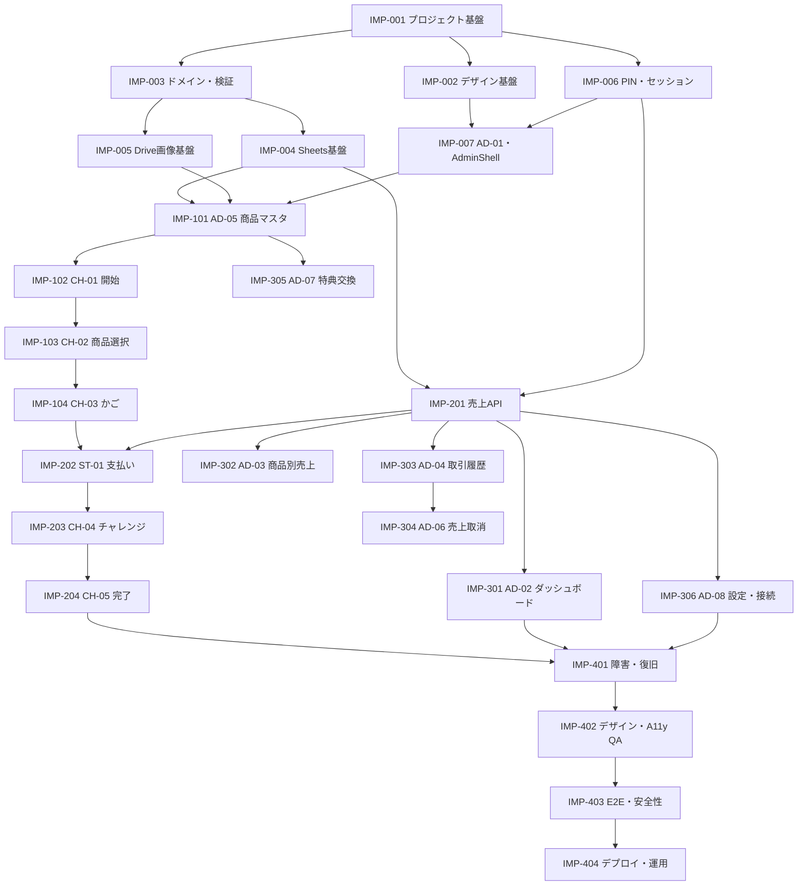

# 駄菓子 おかいもの体験アプリ 実装手順書

## 1. 文書情報

| 項目 | 内容 |
|---|---|
| 文書ID | DAGASHI-IP-001 |
| バージョン | v0.2 |
| ステータス | 実装開始レビュー用 |
| 作成日 | 2026-07-23 |
| 対象 | MVP（単一レジ端末・Next.js・Google Sheets・Google Drive） |
| 想定読者 | 実装担当エージェント、レビュー担当、QA担当、運用担当 |
| 機能仕様 | `./dagashi-shopping-app-functional-specification.md` |
| 技術要件 | `./dagashi-shopping-app-technical-requirements.md` |
| 画面定義 | `./dagashi-shopping-app-screen-definition.md` |
| 実装定義 | `./dagashi-shopping-app-implementation-specification.md` |
| エージェント定義 | `./dagashi-shopping-app-agent-definition.md` |
| コーディングPrompt | `./dagashi-shopping-app-coding-prompt.md` |
| デザイン仕様 | `../DESIGN.md` |

本書は、実装担当エージェントが「どの画面・機能から、どの順序で、何を完成させるか」を判断するための実行手順である。各チケットは、実装内容だけでなく、実装完了条件と絶対禁止事項を持つ。

担当エージェントの割当、ファイル所有、Red・Blue・Purple Teamによる必須レビューは、`dagashi-shopping-app-agent-definition.md`に従う。

## 2. 確定済みプロジェクト資源

### 2.1 Google Spreadsheet

- URL：[dagashi_shoping](https://docs.google.com/spreadsheets/d/1yhO3cx1ESXCW9MTmHTKGixLR_fuyD7KFEyNW6Fs3xM8/edit)
- Spreadsheet ID：`1yhO3cx1ESXCW9MTmHTKGixLR_fuyD7KFEyNW6Fs3xM8`
- タイムゾーン：`Asia/Tokyo`
- 用途：商品、売上、明細、特典交換、設定、監査ログの正本

準備済みタブ：

| タブ | 用途 |
|---|---|
| `products` | 商品マスタ |
| `sales` | 売上ヘッダー |
| `sale_items` | 売上明細 |
| `reward_redemptions` | 15スタンプ特典交換 |
| `settings` | 公開設定・スキーマバージョン |
| `audit_logs` | 管理操作履歴 |

`settings`には`schema_version=2`、チャレンジ成功範囲、60秒タイムアウト、`shop_enabled=true`の初期値を登録済みである。`products`には`fallback_emoji`列を追加済みである。

テスト商品は次の5件を登録済みである。名称先頭の`[テスト]`を維持し、本番商品と明確に区別する。

| 商品名 | 価格 | カテゴリ | フォールバック絵文字 | Drive画像 | 状態 |
|---|---:|---|---|---|---|
| `[テスト] チョコスナック` | 30円 | チョコ | 🍫 | 未設定 | `active` |
| `[テスト] フルーツラムネ` | 40円 | ラムネ | 🍬 | 未設定 | `active` |
| `[テスト] ポテトスナック` | 50円 | スナック | 🥔 | 未設定 | `active` |
| `[テスト] ミニクッキー` | 60円 | クッキー | 🍪 | 未設定 | `active` |
| `[テスト] フルーツグミ` | 70円 | グミ | 🍇 | 未設定 | `active` |

### 2.2 Google Drive商品画像フォルダ

- URL：[商品画像フォルダ](https://drive.google.com/drive/folders/1uhYVw7gofnxWvdbz_F3oHMidww1f2AR-)
- Folder ID：`1uhYVw7gofnxWvdbz_F3oHMidww1f2AR-`
- 用途：任意の商品画像ファイルの格納先
- 表示規則：有効なDrive画像を優先し、未設定・読込失敗時は`products.fallback_emoji`を表示する

### 2.3 未確定で実装開始を妨げないもの

- ホスティング先
- 正式ロゴ、マスコット
- 結果画像4種の完成データ
- 本番用スタッフPIN
- Googleサービスアカウント（`GOOGLE_CLIENT_EMAIL`／`GOOGLE_PRIVATE_KEY`）。ADC・Workload Identity等の短期認証は将来の移行候補であり、現行MVPの前提外

未確定アセットは仮データでコンポーネントとレイアウトを実装してよい。ただし、本番完了扱いにはしない。

## 3. 実装の基本原則

### 3.1 最初に作る画面

共通基盤を作成した後、最初に完成させる業務画面は`AD-05 商品マスタ`とする。商品とフォールバック絵文字を登録し、任意のDrive画像を検証できなければ、子ども向けの商品選択画面を実データで確認できないためである。

画面の主な実装順序は次のとおり。

1. `AD-01 PIN入力`と管理画面共通枠
2. `AD-05 商品マスタ`
3. `CH-01 開始`
4. `CH-02 商品選択`
5. `CH-03 かご・合計確認`
6. `ST-01 支払い確認`
7. `CH-04 10秒チャレンジ`
8. `CH-05 完了・スタンプ案内`
9. `AD-02 ダッシュボード`
10. `AD-03 商品別売上`
11. `AD-04 取引履歴・詳細`
12. `AD-06 売上取消`
13. `AD-07 特典交換`
14. `AD-08 設定・データ管理`

### 3.2 一つのチケットで守る単位

- 一つの明確な成果を持たせる。
- 変更対象ファイルと所有範囲を着手前に宣言する。
- API、ドメイン、画面、テストを可能な限り同じチケットで閉じる。
- 別チケットの仕様変更を同時に行わない。
- 完了条件をすべて満たすまで`done`へしない。
- 未決定事項は勝手に確定せず、Human Checkとして残す。

### 3.3 全チケット共通の絶対禁止事項

- 仕様書にない会員、個人情報、デジタルスタンプ残高を追加しない。
- 券、クーポン、ランキング、SNS共有を追加しない。
- 子どもの氏名、顔写真、カード番号を取得・保存しない。
- Google認証情報、PIN、セッション署名鍵をコードやブラウザへ置かない。
- ブラウザからGoogle Sheets API・Google Drive APIを直接呼ばない。
- Spreadsheetの列名、列順、タブ名を独断で変更しない。
- 売上・取消・監査ログの行を物理削除しない。
- クライアントから送られた価格・合計を信用しない。
- 売上確定結果が不明なとき、新しい`request_id`で再送しない。
- Driveの任意`file_id`をURLパラメータにして画像を取得させない。
- 完全オフライン対応済みと表現しない。
- テストを削除・無効化して通過扱いにしない。
- `DESIGN.md`にない色、角丸、影、余白を画面単位で増やさない。
- 他エージェントの変更を理由なく巻き戻さない。

## 4. チケット運用ルール

### 4.1 ステータス

| ステータス | 条件 |
|---|---|
| `ready` | 依存チケットが完了し、入力仕様が確定している |
| `in_progress` | 担当と所有ファイルが宣言済み |
| `review` | 自動テスト、手動確認、自己レビューが完了している |
| `blocked` | 外部判断がなければ安全に進められない |
| `done` | 本書の完了条件をすべて満たし、レビュー承認済み |

### 4.2 着手時に記録するもの

- チケットID
- 担当エージェント
- 変更予定ファイル
- 依存チケットの完了確認
- 使用するAPI契約
- 実行予定テスト
- Human Checkの有無

### 4.3 完了時に提出する証拠

- 変更ファイル一覧
- 実装した要件ID・画面ID
- 実行したコマンドと結果
- 画面スクリーンショットまたは短い操作動画
- 正常系と異常系の確認結果
- 残ったHuman Check
- 既知の制限

## 5. 依存関係



## 6. チケット一覧

| 順序 | ID | 対象 | 成果 |
|---:|---|---|---|
| 1 | IMP-001 | 全体 | Next.js・TypeScript・テスト基盤 |
| 2 | IMP-002 | 全画面共通 | DESIGN.md準拠のTokenと共通部品 |
| 3 | IMP-003 | Domain | 型、検証、状態遷移、計算 |
| 4 | IMP-004 | Data / Health | Sheetsリポジトリとヘルスチェック |
| 5 | IMP-005 | 商品画像 | Drive画像検証・配信 |
| 6 | IMP-006 | 認証 | PIN・サーバーセッション |
| 7 | IMP-007 | AD-01 | PIN画面と管理画面共通枠 |
| 8 | IMP-101 | AD-05 | 商品マスタ管理 |
| 9 | IMP-102 | CH-01 | 買い物開始 |
| 10 | IMP-103 | CH-02 | 商品選択・数量 |
| 11 | IMP-104 | CH-03 | かご・合計確認 |
| 12 | IMP-201 | API | 冪等な売上保存 |
| 13 | IMP-202 | ST-01 | 支払い確認・スタッフ確定 |
| 14 | IMP-203 | CH-04 | 10秒チャレンジ・結果ポップ |
| 15 | IMP-204 | CH-05 | 完了・スタンプ案内 |
| 16 | IMP-301 | AD-02 | ダッシュボード |
| 17 | IMP-302 | AD-03 | 商品別売上 |
| 18 | IMP-303 | AD-04 | 取引履歴・詳細 |
| 19 | IMP-304 | AD-06 | 売上取消 |
| 20 | IMP-305 | AD-07 | 特典交換 |
| 21 | IMP-306 | AD-08 | 設定・接続状態・Spreadsheet情報 |
| 22 | IMP-401 | 横断 | 障害・再試行・復旧導線 |
| 23 | IMP-402 | 横断 | デザイン・アクセシビリティQA |
| 24 | IMP-403 | 横断 | E2E・セキュリティ・性能 |
| 25 | IMP-404 | リリース | デプロイ・現地運用 |

## 7. 基盤チケット

### IMP-001 プロジェクト基盤

**対象**：Next.jsプロジェクト全体

**依存**：なし

**実装内容**：

- TypeScript strictのNext.js App Routerプロジェクトを作成する。
- Node.js Runtimeを前提にする。
- Lint、型チェック、Vitest、Playwrightの実行コマンドを定義する。
- 環境変数検証、共通エラー、構造化ログの土台を作る。
- `src/app`、`domain`、`application`、`infrastructure`の境界を作る。

**実装完了条件**：

- [ ] 開発サーバーが起動する。
- [ ] 型チェック、Lint、空の単体テスト、Playwrightスモークテストが成功する。
- [ ] 不足環境変数を起動時に検出できる。
- [ ] Google API用の秘密情報がクライアントbundleへ含まれない。
- [ ] アプリバージョンを表示できる基盤がある。

**絶対にやってはいけないこと**：

- `output: "export"`を設定しない。
- 秘密値を`.env.example`へ実値で書かない。
- UIからInfrastructureを直接importする構造にしない。
- 使用しない大型UIフレームワークを先に導入しない。

### IMP-002 デザインToken・共通UI基盤

**対象**：全画面共通、`DESIGN.md`

**依存**：IMP-001

**実装内容**：

- 色、書体、余白、角丸、影、MotionをCSS変数または同等のTokenにする。
- `AsyncButton`、`InlineError`、`Toast`、`ConfirmDialog`を作る。
- 子ども画面とアドミン画面の基本レイアウトを作る。
- `prefers-reduced-motion`とフォーカスリングを共通実装する。

**実装完了条件**：

- [ ] `DESIGN.md`の主要Tokenが一元定義されている。
- [ ] 共通部品の通常、hover、focus、disabled、loading、error状態を確認できる。
- [ ] 1,024pxと1,280pxの表示確認用ページまたはStoryがある。
- [ ] キーボードだけで共通ダイアログを操作できる。
- [ ] 子ども用とアドミン用の見た目が明確に分かれる。

**絶対にやってはいけないこと**：

- 画面ごとに色や余白の数値を直書きしない。
- 絵文字を恒久的なUIアイコンとして使わない。ただし、`products.fallback_emoji`を商品ビジュアルとして表示する用途は例外とする。
- 色だけで状態を区別しない。
- 結果画像が未確定でも、画像領域自体を省略しない。

### IMP-003 ドメイン・入力検証

**対象**：Product、Sale、SaleItem、Challenge、Reward、Settings

**依存**：IMP-001

**実装内容**：

- 実装定義書6章の型と列挙値を定義する。
- 金額、数量、小計、合計、売上集計条件を純粋関数にする。
- `fallback_emoji`が絵文字を含む1つの書記素クラスタか検証する。
- チャレンジ状態遷移と9,500〜10,500ms判定を実装する。
- API入力とSpreadsheet行の検証スキーマを分離する。

**実装完了条件**：

- [ ] 金額・数量・状態遷移に単体テストがある。
- [ ] 単一絵文字、ZWJを含む絵文字、不正な複数絵文字、通常文字の検証テストがある。
- [ ] 9,499、9,500、10,500、10,501msのテストが通る。
- [ ] 成功2個、不成功・スキップ・中断1個を保証する。
- [ ] 不正なSpreadsheet行を黙って正常値へ変換しない。
- [ ] Domain層がNext.js・React・Google SDKへ依存していない。

**絶対にやってはいけないこと**：

- 表示用に丸めた秒数で成功判定しない。
- 金額を浮動小数や文字列連結で計算しない。
- 未知の列挙値を既定値に置換して処理継続しない。
- スタンプ累積残高のモデルを追加しない。

### IMP-004 Google Sheets・ヘルスチェック基盤

**対象**：6タブ、`GET /api/health`

**依存**：IMP-003

**実装内容**：

- 指定Spreadsheetを`GOOGLE_SPREADSHEET_ID`から読み込む。
- 6タブのヘッダー名と`schema_version=2`を検証する。
- Product、Sale、SaleItem、Reward、Settings、AuditLogのRepositoryを実装する。
- Google APIエラーを共通エラーへ変換する。
- APIクォータ向けの上限付き再試行を実装する。

**実装完了条件**：

- [ ] 正しい認証で6タブを読み取れる。
- [ ] タブ・ヘッダー・スキーマ不足をhealth errorとして検出できる。
- [ ] 429と一時的5xxを最大3回まで再試行する。
- [ ] 商品名等を数式として解釈させずRAWで保存する。
- [ ] モックRepositoryによる結合テストがある。

**絶対にやってはいけないこと**：

- Spreadsheet全体をリクエストごとに何度も読み込まない。
- セル単位の大量API呼出をしない。
- 本番シートへテストデータを自動投入しない。
- ヘッダー名・列順をアプリ側だけで変更しない。
- ヘルスチェック応答へSpreadsheet IDや認証情報を返さない。

### IMP-005 Google Drive商品画像基盤

**対象**：`GET /api/product-images/[productId]`

**依存**：IMP-003

**実装内容**：

- Drive共有URL・直接IDから`file_id`を正規化する。
- 専用フォルダ直下、未削除、画像MIME、500KB以下を検証する。
- `productId`から商品行と`image_file_id`を解決する。
- Drive画像を同一オリジンAPIから返す。
- ETagと`image_updated_at`によるキャッシュ更新を実装する。
- `image_file_id`未設定・読込失敗時に`fallback_emoji`へ切り替える商品ビジュアル部品を実装する。

**実装完了条件**：

- [ ] WebP、PNG、JPEGを取得・表示できる。
- [ ] 権限不足、削除済み、非画像、容量超過、別フォルダを拒否する。
- [ ] 画像APIの入力は`productId`だけである。
- [ ] MIME typeと容量を返却前に再確認する。
- [ ] 画像未設定・異常時に商品を除外せず`fallback_emoji`へ切り替わる。
- [ ] Drive URL解析と異常系の自動テストがある。

**絶対にやってはいけないこと**：

- Drive共有URLや`thumbnailLink`をブラウザへ直接返さない。
- URLから受け取った任意`file_id`をそのまま取得しない。
- 画像をBase64でSpreadsheetへ保存しない。
- 画像エラーだけを理由に商品を販売一覧から除外しない。
- `fallback_emoji`の代わりに全商品共通の代替画像を表示しない。

### IMP-006 スタッフPIN・セッション

**対象**：`/api/admin/session`、管理・支払確定API共通

**依存**：IMP-001

**実装内容**：

- ソルト付きPINハッシュ照合を実装する。
- HttpOnly、Secure、SameSite=Laxの署名済みCookieを発行する。
- 15分無操作失効、ログアウト、5回失敗後30秒停止を実装する。
- 状態変更APIのOrigin検証を共通化する。

**実装完了条件**：

- [ ] 正しいPINでセッションを開始できる。
- [ ] 誤PIN、連続失敗、期限切れ、改ざんCookieを拒否する。
- [ ] ログアウト後に管理APIを呼べない。
- [ ] PINとCookie値がログへ出ない。
- [ ] 認証・CSRF相当の結合テストがある。

**絶対にやってはいけないこと**：

- 平文PINをSpreadsheet、ログ、Cookieへ保存しない。
- 認証状態を`localStorage`だけで管理しない。
- `NEXT_PUBLIC_`変数へPINハッシュや署名鍵を入れない。
- PINを強い個人認証と表現しない。

### IMP-007 AD-01 PIN入力・AdminShell

**対象画面**：AD-01、アドミン共通レイアウト

**依存**：IMP-002、IMP-006

**実装内容**：

- PIN入力、認証失敗、30秒停止、セッション期限切れ表示を作る。
- サイドバー、接続状態、バージョン、ログアウトを持つ`AdminShell`を作る。
- 未認証時の管理ルート保護を実装する。

**実装完了条件**：

- [ ] PIN入力から管理画面へ遷移できる。
- [ ] エラー理由と再操作可能時刻が分かる。
- [ ] 未認証で管理URLを直開きするとAD-01へ移動する。
- [ ] キーボードだけで入力・送信・ログアウトできる。
- [ ] AD-01の画面定義とDESIGN.mdに適合する。

**絶対にやってはいけないこと**：

- PINを入力欄外へ再表示しない。
- 認証失敗時にサーバー内部情報を表示しない。
- 子ども画面と同じ強い装飾をAdminShellへ使わない。
- 戻り先URLを無検証で外部URLへリダイレクトしない。

## 8. 商品・買い物画面チケット

### IMP-101 AD-05 商品マスタ

**対象画面**：AD-05

**依存**：IMP-004、IMP-005、IMP-007

**実装内容**：

- 商品一覧、作成、編集、状態変更を実装する。
- 商品名、価格、カテゴリ、必須のフォールバック絵文字、任意のDrive画像、表示順、状態を扱う。
- Drive URL入力から画像プレビュー・検証結果を表示する。
- `active`変更前に`fallback_emoji`を検証し、Drive画像が設定されている場合だけ画像を再検証する。
- 作成・更新を監査ログへ保存する。

**実装完了条件**：

- [ ] `draft`商品をDrive画像なしで保存できる。
- [ ] `fallback_emoji`があればDrive画像なしでも`active`にできる。
- [ ] Drive画像がある場合は画像を優先し、ない場合は絵文字プレビューになる。
- [ ] 画像不正の理由が管理画面で分かる。
- [ ] 価格変更後も過去売上スナップショットへ影響しない。
- [ ] 商品CRUD、Drive異常系、監査ログのテストが通る。

**絶対にやってはいけないこと**：

- アプリからDriveへ画像アップロードしない。
- 商品を物理削除しない。
- `fallback_emoji`なしの商品を`active`にしない。
- Drive画像を`active`の必須条件にしない。
- 共有URL全体を`products.image_file_id`へ保存しない。
- 商品更新時に過去の`sale_items`を書き換えない。

### IMP-102 CH-01 開始画面

**対象画面**：CH-01

**依存**：IMP-002、IMP-004、IMP-101

**実装内容**：

- healthと販売可能商品の事前確認を行う。
- 空のかごと新しい`request_id`を作る。
- 読込中、商品なし、通信失敗、販売可能の状態を表示する。
- スタッフ・アドミン入口を低強調で配置する。

**実装完了条件**：

- [ ] 販売可能商品がある場合だけ買い物を開始できる。
- [ ] 開始ごとに新しい`request_id`が一つ作られる。
- [ ] 通信失敗時に買い物を開始させない。
- [ ] 子ども向け案内とスタッフ向け詳細を分けて表示する。
- [ ] CH-01の画面定義・DESIGN.md確認が完了する。

**絶対にやってはいけないこと**：

- 商品未読込のまま開始させない。
- 以前のかごや`request_id`を引き継がない。
- 技術エラー全文を子どもへ表示しない。
- 管理画面入口を主要CTAと同じ強さにしない。

### IMP-103 CH-02 商品選択

**対象画面**：CH-02、`GET /api/products`

**依存**：IMP-101、IMP-102

**実装内容**：

- `active`かつ有効な`fallback_emoji`を持つ商品一覧を表示する。
- Drive画像優先・絵文字フォールバックの商品ビジュアル、商品名、価格、数量Stepperを実装する。
- `sessionStorage`のかご状態を更新する。
- かご個数・合計・固定かごバーを実装する。
- 再読込時の商品状態・価格変更を検出する。

**実装完了条件**：

- [ ] 商品の追加・減少・0件・上限を正しく扱う。
- [ ] 合計が操作直後に更新される。
- [ ] Drive画像または絵文字、商品名、価格が常に同時表示される。
- [ ] 画像異常時も商品が表示され、絵文字へ切り替わる。
- [ ] キーボード、タッチ、1,024pxで操作確認済みである。

**絶対にやってはいけないこと**：

- クライアントの価格を支払確定値として使用しない。
- 画像をDrive URLから直接表示しない。
- 数量を負数または上限超過にしない。
- 商品ビジュアルだけ、価格だけの商品カードを作らない。
- hoverだけに数量操作を置かない。

### IMP-104 CH-03 かご・合計確認

**対象画面**：CH-03

**依存**：IMP-103

**実装内容**：

- 商品別の画像、単価、数量、小計を表示する。
- 数量変更、削除、選び直しを実装する。
- ST-01遷移前に商品状態と価格を再検証する。
- 価格変更・売切・非表示を明示する。

**実装完了条件**：

- [ ] 明細小計と合計が一致する。
- [ ] かご0件で「これで買う」が無効になる。
- [ ] 価格変更時に新価格を確認して採用できる。
- [ ] 販売不能商品を支払画面へ持ち込まない。
- [ ] 戻る操作で有効なかごを保持する。

**絶対にやってはいけないこと**：

- 商品変更を黙って反映しない。
- 売切商品をそのまま支払対象にしない。
- 小計・合計を表示文字列から逆算しない。
- かご確認時点で売上行を作成しない。

## 9. 売上・体験フローチケット

### IMP-201 冪等な売上保存API

**対象機能**：`POST /api/sales`、`GET /api/sales/by-request/[requestId]`

**依存**：IMP-003、IMP-004、IMP-006

**実装内容**：

- 商品状態・現行価格をサーバーで再検証する。
- `pending`売上、明細、検証、`completed`更新を順に行う。
- 同じ`request_id`の再送で既存完了売上を返す。
- 部分書込を`error`として集計から除外する。
- 商品名・単価を明細へスナップショット保存する。

**実装完了条件**：

- [ ] 通常購入で`sales`1行と正しい`sale_items`が保存される。
- [ ] 同じ`request_id`を複数回送っても完了売上が1件になる。
- [ ] `pending`と`error`が通常売上へ含まれない。
- [ ] 書込途中エラーを削除せず監査できる。
- [ ] 正常、429、タイムアウト、部分書込相当のテストがある。

**絶対にやってはいけないこと**：

- `request_id`を受信ごとにサーバーで作り直さない。
- クライアントの合計金額をそのまま保存しない。
- 明細書込前に`write_status=completed`にしない。
- タイムアウトを売上未保存と断定しない。
- エラー行を自動削除しない。

### IMP-202 ST-01 支払い確認

**対象画面**：ST-01

**依存**：IMP-104、IMP-201

**実装内容**：

- 子ども向け支払い案内とスタッフ操作領域を分離する。
- 支払い方法選択、PIN確認、売上確定を実装する。
- 保存中、保存済み、未保存、結果不明を区別する。
- 応答不明時に同じ`request_id`で取引照会する。

**実装完了条件**：

- [ ] PIN認証後だけ支払済み確定できる。
- [ ] 二重押下しても売上が1件になる。
- [ ] `sale_id`取得後だけCH-04へ進む。
- [ ] 結果不明時に照会・再試行の安全な導線がある。
- [ ] 保存済みの場合、再支払いさせない表示になる。

**絶対にやってはいけないこと**：

- 支払い受領前に売上を保存しない。
- 子ども操作だけで支払済み確定できるようにしない。
- 保存中に確定ボタンを再押下可能にしない。
- 結果不明時にかご・`request_id`を消さない。

### IMP-203 CH-04 10秒チャレンジ

**対象画面**：CH-04、`PATCH /api/sales/[saleId]/challenge`

**依存**：IMP-202

**実装内容**：

- 開始状態をサーバーへ保存してから計測を開始する。
- `performance.now()`で計測し、stopを1回だけ受け付ける。
- 0〜4.99秒は経過時間を小数第2位まで表示し、5.00秒以降はストップまで数字を非表示にする。
- 60秒自動終了、スキップ、中断を実装する。
- 成否・時間・画像・肯定的文言・スタンプ数を結果ポップに表示する。
- 再読込時の再挑戦を防止する。

**実装完了条件**：

- [ ] 9,500〜10,500msだけ成功になる。
- [ ] 判定は丸め前、表示は小数第2位になる。
- [ ] 4,999msでは計測値が表示され、5,000msでは数字が非表示になる境界テストが通る。
- [ ] 5,000ms以降も計測とストップ操作が継続し、結果時間は表示される。
- [ ] stop連打、再読込、戻る操作で再挑戦できない。
- [ ] 成功・不成功・スキップ・中断の全ポップに画像がある。
- [ ] 結果ポップは「つぎへ」まで閉じない。
- [ ] `prefers-reduced-motion`で強い動きを止められる。

**絶対にやってはいけないこと**：

- 開始保存前にタイマーを動かさない。
- `Date.now()`だけで経過時間を計測しない。
- 表示用に丸めた値で成功判定しない。
- 5秒以降にタイマー計測自体を停止しない。
- 赤い×、悲しい顔、失敗音、ランキングを使わない。
- 結果保存失敗で確定済み売上を取り消さない。

### IMP-204 CH-05 完了・スタンプ案内

**対象画面**：CH-05、`GET /api/sales/[saleId]/completion`

**依存**：IMP-203

**実装内容**：

- お買い物完了、今回のスタンプ数、物理カード案内を表示する。
- 15個で対象のお菓子1個と交換できることを表示する。
- 「おわる」でかご、`request_id`、一時結果を破棄する。

**実装完了条件**：

- [ ] 保存済み結果から1個または2個を正しく表示する。
- [ ] 物理カードをスタッフへ渡す案内がある。
- [ ] 累積スタンプ数を表示していない。
- [ ] 「おわる」でCH-01へ空の状態で戻る。
- [ ] 再読込しても同じ売上結果を再現できる。

**絶対にやってはいけないこと**：

- デジタルスタンプ残高を作らない。
- 完了画面表示だけで新しい売上を作らない。
- 15個未満の残数を推測表示しない。
- 「おわる」前に自動で次の買い物を開始しない。

## 10. アドミン業務チケット

### IMP-301 AD-02 ダッシュボード

**対象画面**：AD-02

**依存**：IMP-201、IMP-007

**実装内容**：

- 当日の売上額、取引件数、販売個数、取消件数を表示する。
- 最新取引、不完全書込、接続状態を表示する。
- 通常売上と特典交換を分離する。

**実装完了条件**：

- [ ] Asia/Tokyoの当日範囲で集計できる。
- [ ] completedかつ未取消だけを通常売上に含める。
- [ ] pending、error、voidedを通常売上から除外する。
- [ ] 不完全書込件数と確認導線がある。
- [ ] 空データ時の表示がある。

**絶対にやってはいけないこと**：

- Spreadsheetの表示中フィルター状態に集計を依存させない。
- 特典交換金額を通常売上へ加算しない。
- `pending`を取引件数へ含めない。
- 前日UTC日付を日本の当日として扱わない。

### IMP-302 AD-03 商品別売上

**対象画面**：AD-03

**依存**：IMP-201、IMP-007

**実装内容**：

- 期間指定の商品別販売個数・売上額を表示する。
- 商品名は売上明細スナップショットを基準にする。

**実装完了条件**：

- [ ] 期間開始・終了をAsia/Tokyoで正しく扱う。
- [ ] 商品別個数と金額が明細合計と一致する。
- [ ] 取消と特典交換が混入しない。
- [ ] 価格変更前後の売上を正しい単価で集計できる。
- [ ] 0件時と通信失敗時の表示がある。

**絶対にやってはいけないこと**：

- 現在の商品価格で過去売上額を再計算しない。
- 現在の商品名だけで過去明細を上書き表示しない。
- 取消明細を集計へ残さない。
- Spreadsheetの表示中フィルターや現在の商品価格に集計を依存させない。

### IMP-303 AD-04 取引履歴・詳細

**対象画面**：AD-04

**依存**：IMP-201、IMP-007

**実装内容**：

- 期間、状態、取引IDによる検索を実装する。
- 売上ヘッダー、明細、チャレンジ結果を詳細表示する。
- 不完全書込と取消状態を明示する。

**実装完了条件**：

- [ ] 一覧と詳細の合計が一致する。
- [ ] completed、pending、error、voidedを区別できる。
- [ ] 明細の購入時商品名・単価を表示する。
- [ ] チャレンジ未実施・中断を区別できる。
- [ ] 大量全件読込を避けた期間制限またはページングがある。

**絶対にやってはいけないこと**：

- 一覧から直接行削除できるようにしない。
- 内部Google APIエラーをそのまま表示しない。
- 現在の商品情報で過去明細を置換しない。
- pending取引を完了済みと同じ表示にしない。

### IMP-304 AD-06 売上取消

**対象画面**：AD-06、`POST /api/admin/sales/[saleId]/void`

**依存**：IMP-303

**実装内容**：

- 対象取引、金額、明細を確認表示する。
- 取消理由を必須にする。
- `sale_status=voided`、日時、理由を保存する。
- 監査ログへ記録し、集計キャッシュを無効化する。

**実装完了条件**：

- [ ] 完了済み・未取消の売上だけ取消できる。
- [ ] 取消理由1〜200文字を検証する。
- [ ] 取消後に日計・商品別売上から除外される。
- [ ] 行と明細が残り、監査ログを確認できる。
- [ ] 二重取消をHTTP 409相当で拒否する。

**絶対にやってはいけないこと**：

- `sales`・`sale_items`行を削除しない。
- 理由なしで取消を確定しない。
- 取消を新規の負数売上として追加しない。
- 取消済み取引を通常状態へ黙って戻さない。

### IMP-305 AD-07 特典交換

**対象画面**：AD-07

**依存**：IMP-101、IMP-007

**実装内容**：

- スタッフが物理カード15個を目視確認した後に交換を記録する。
- 商品選択、確認、0円保存を実装する。
- `reward_redemptions`へ売上と別区分で保存する。

**実装完了条件**：

- [ ] 商品1個を`amount_yen=0`で記録できる。
- [ ] 交換前の確認画面がある。
- [ ] 通常売上額・販売個数へ含まれない。
- [ ] 特典交換数として別集計できる。
- [ ] 商品名を交換時スナップショットで保存する。

**絶対にやってはいけないこと**：

- アプリ内のスタンプ残高だけで交換可否を判定しない。
- 通常の`sales`へ0円売上として保存しない。
- 交換数を販売個数へ混入しない。
- 子どもやカードを識別する番号を追加しない。

### IMP-306 AD-08 設定・接続状態・Spreadsheet情報

**対象画面**：AD-08

**依存**：IMP-004、IMP-201、IMP-007

**実装内容**：

- Spreadsheet・Drive・アプリバージョンの接続状態を表示する。
- `shop_enabled`等の許可設定だけを編集できるようにする。
- schema versionを読取専用表示する。
- 権限を持つアドミン向けに、売上データ確認先Spreadsheetへのリンクを表示する。

**実装完了条件**：

- [ ] 接続先の正常・異常を秘密情報なしで表示できる。
- [ ] 許可された設定だけ更新できる。
- [ ] Spreadsheetへのリンクは設定済みの正本だけを指し、外部入力URLを使用しない。
- [ ] 設定変更結果を監査できる。

**絶対にやってはいけないこと**：

- Spreadsheet ID、Drive ID、秘密鍵を画面表示しない。
- `schema_version`を管理画面から変更させない。
- チャレンジ境界値を仕様改訂なしで編集可能にしない。
- CSV生成APIやCSVダウンロードUIを追加しない。

## 11. 横断品質・リリースチケット

### IMP-401 通信障害・再試行・復旧導線

**対象**：全画面、全API

**依存**：IMP-204、IMP-301〜306

**実装内容**：

- Sheets・Driveの429、5xx、タイムアウト、権限不足を分類する。
- 売上未保存・保存済み・確認不能を画面で区別する。
- 同じ`request_id`による照会・再試行を実装する。
- 紙運用へ切り替える案内位置を用意する。

**実装完了条件**：

- [ ] 商品読込失敗時に買い物開始を止める。
- [ ] 売上応答不明時に重複なしで復旧できる。
- [ ] チャレンジ保存失敗でも基本スタンプ1個で完了できる。
- [ ] 長時間障害時のスタッフ案内がある。
- [ ] 主要障害パターンの結合・E2Eテストがある。

**絶対にやってはいけないこと**：

- 通信失敗をすべて「未保存」と表示しない。
- 永続オフラインキューを無断で追加しない。
- 無限再試行しない。
- 子どもへGoogle APIやHTTPコードを表示しない。

### IMP-402 デザイン・アクセシビリティ・レスポンシブQA

**対象**：全14画面

**依存**：IMP-401

**実装内容**：

- `DESIGN.md`と画面定義を全画面で確認する。
- 1,024px、1,280px、125%表示倍率を確認する。
- キーボード、フォーカス、読み上げ、色コントラストを確認する。
- `prefers-reduced-motion`を確認する。

**実装完了条件**：

- [ ] 全14画面のスクリーンショットがある。
- [ ] 主要操作が44px以上、子ども向けは原則48px以上である。
- [ ] 見出し順、ラベル、alt、dialog、live regionを確認済みである。
- [ ] 成功・不成功を色だけで区別していない。
- [ ] 125%表示でも主要操作と保存状態が欠けない。

**絶対にやってはいけないこと**：

- スクリーンショット比較だけで操作性確認を終えない。
- フォーカスリングをデザイン理由で消さない。
- 文字を14px未満へ縮小して収めない。
- 強い点滅・自動再生音を追加しない。

### IMP-403 E2E・セキュリティ・性能

**対象**：MVP全体

**依存**：IMP-402

**実装内容**：

- 通常購入、チャレンジ全状態、取消、特典交換をE2E化する。
- 認証、Origin、入力上限、画像取得制限を検証する。
- 商品200件、通常売上確定の性能を測る。
- 秘密情報のbundle・ログ混入を確認する。

**実装完了条件**：

- [ ] 実装定義書19章の単体・結合・E2Eがすべて通る。
- [ ] 売上連打・再送テストで重複しない。
- [ ] 任意Driveファイルを画像APIから取得できない。
- [ ] 未認証で管理・支払確定APIを変更できない。
- [ ] 初期表示・売上確定が通常時3秒以内を目標に確認できる。
- [ ] 高重大度の未修正脆弱性がない。

**絶対にやってはいけないこと**：

- 本番Spreadsheetで破壊的E2Eを実行しない。
- テストを順序依存にしない。
- PIN・秘密鍵をテストログや動画に含めない。
- 性能問題をキャッシュだけで隠し、確定時の再検証を省かない。

### IMP-404 デプロイ・現地運用

**対象**：本番環境、店舗PC、運用資料

**依存**：IMP-403

**実装内容**：

- Node.js Runtime対応ホスティングへデプロイする。
- 本番秘密変数、Google権限、Spreadsheet、Driveを接続する。
- 本番前バックアップ、スモークテスト、ロールバック手順を用意する。
- 店舗PCで操作と通信障害時の紙運用を確認する。

**実装完了条件**：

- [ ] 店舗PCはブラウザだけで利用できる。
- [ ] 本番health、商品画像・絵文字フォールバック、テスト売上、取消を確認済みである。
- [ ] 本番用と検証用のSpreadsheet・Driveが分離されている。
- [ ] 秘密情報がリポジトリとブラウザにない。
- [ ] バックアップ・ロールバック・障害時紙運用の担当が決まっている。
- [ ] 技術要件18章の受け入れ条件をすべて確認した。

**絶対にやってはいけないこと**：

- 検証用認証情報を本番へ流用しない。
- Spreadsheet変更のバックアップなしでリリースしない。
- health errorのまま営業開始しない。
- 店舗PCへNode.jsや専用DBを手作業で導入しない。
- 本番確認用の売上を残したまま営業を開始しない。

## 12. 並行実装可能範囲

依存チケット完了後、次は並行してよい。

| 並行グループ | チケット | 条件 |
|---|---|---|
| A | IMP-002、IMP-003、IMP-006 | IMP-001完了後 |
| B | IMP-004、IMP-005 | IMP-003完了後。Repository interfaceを先に固定 |
| C | IMP-301、IMP-302、IMP-303、IMP-305 | 売上・商品API契約完了後 |
| D | IMP-304、IMP-306 | 取引詳細・集計契約完了後 |

次は同時変更を避ける。

- IMP-003と他チケットによるDomain型の同時編集
- IMP-004と他チケットによるSpreadsheet列変換の同時編集
- IMP-201とIMP-202による売上API契約の同時変更
- IMP-203とIMP-204によるチャレンジ結果型の同時変更
- IMP-002と各画面による共通Tokenファイルの同時変更

## 13. エージェントへのチケット投入テンプレート

```text
チケットID: IMP-XXX
目的:
対象画面・API:
依存チケット:
所有ファイル:

必ず読む資料:
- docs/dagashi-shopping-app-functional-specification.md
- docs/dagashi-shopping-app-technical-requirements.md
- docs/dagashi-shopping-app-screen-definition.md
- docs/dagashi-shopping-app-implementation-specification.md
- DESIGN.md
- docs/dagashi-shopping-app-implementation-procedure.md の対象チケット

作業:
1. 対象要件を列挙する。
2. API・型・Spreadsheet列の変更有無を確認する。
3. 実装する。
4. 単体・結合・必要なE2Eを実行する。
5. 完了条件を一項目ずつ証拠付きで確認する。
6. 禁止事項に違反していないことを自己レビューする。

禁止:
- 所有外ファイルを理由なく変更しない。
- 仕様を独断で追加・変更しない。
- 他エージェントの変更を巻き戻さない。
- テストを無効化しない。

提出:
- 変更ファイル
- 実装要件ID
- テスト結果
- 画面証拠
- Human Check
- 既知の制限
```

## 14. MVP全体の実装完了条件

- [ ] IMP-001〜IMP-404がすべて`done`である。
- [ ] 全14画面が画面定義とDESIGN.mdに適合する。
- [ ] 指定Spreadsheetの6タブへ仕様どおり読み書きできる。
- [ ] Drive商品画像を非公開のまま安全に表示し、未設定・読込失敗時は商品別の絵文字を表示できる。
- [ ] 支払前のかごが売上へ入らない。
- [ ] 同一`request_id`の再送で売上が重複しない。
- [ ] 商品別に何が何個、いくら売れたか確認できる。
- [ ] 取消・特典交換・不完全書込が通常売上から分離される。
- [ ] チャレンジ全結果に画像と肯定的な表示がある。
- [ ] チャレンジ中は4.99秒まで数字が見え、5.00秒以降はストップまで数字が見えない。
- [ ] スタンプは今回の1個または2個だけを表示する。
- [ ] 子どもの個人情報とスタンプ残高を保存していない。
- [ ] 店舗PCからブラウザだけで利用できる。
- [ ] 障害時の売上保存状態と次の対応が分かる。
- [ ] 本番バックアップ、ロールバック、紙運用手順がある。
