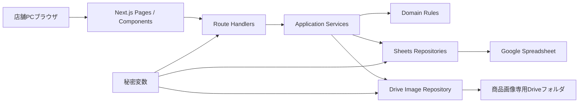
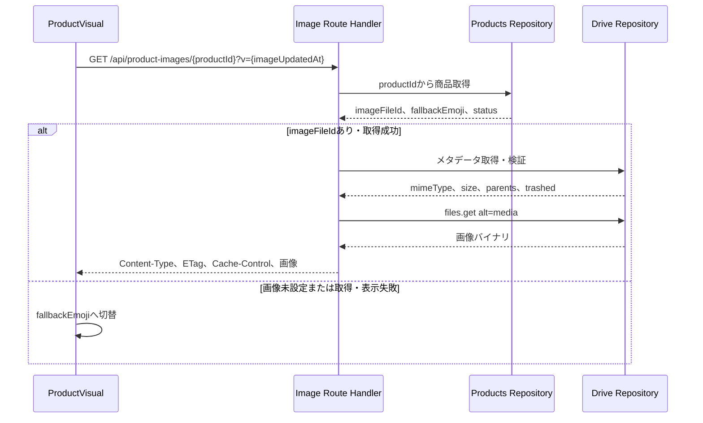
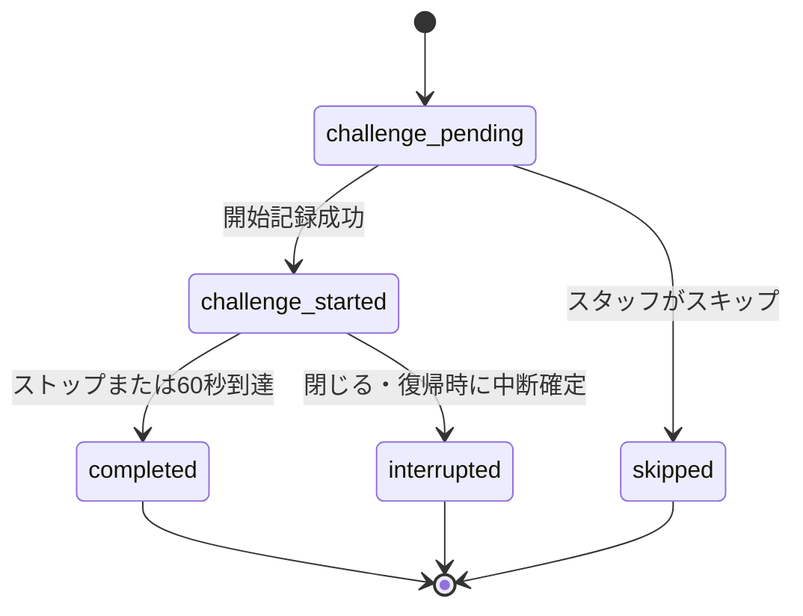
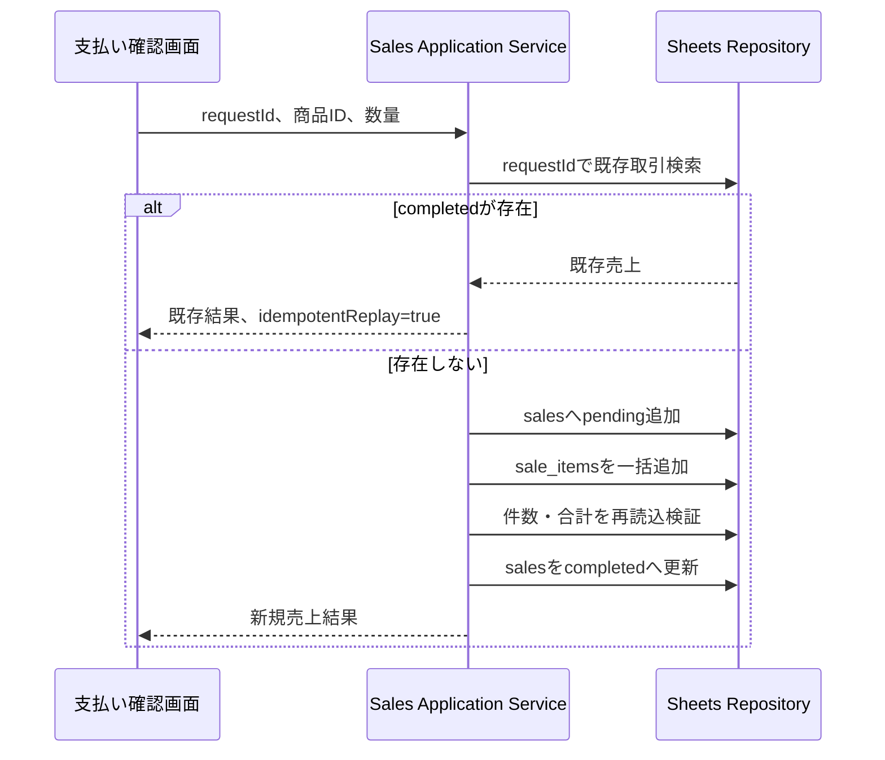

# 駄菓子 おかいもの体験アプリ 実装定義書

## 1. 文書情報

| 項目 | 内容 |
|---|---|
| 文書ID | DAGASHI-IS-001 |
| バージョン | v0.2 |
| ステータス | Draft / 実装レビュー用 |
| 作成日 | 2026-07-23 |
| 対象 | MVP（単一レジ端末・クラウド配信Webアプリ） |
| 想定読者 | 実装担当エージェント、レビュー担当、QA担当、運用準備担当 |
| 機能仕様 | `./dagashi-shopping-app-functional-specification.md` |
| 技術要件 | `./dagashi-shopping-app-technical-requirements.md` |
| 画面定義 | `./dagashi-shopping-app-screen-definition.md` |
| 実装手順 | `./dagashi-shopping-app-implementation-procedure.md` |
| デザイン仕様 | `../DESIGN.md` |

本書は、機能仕様・技術要件・画面定義をコードへ落とす際の実装境界、データ型、API契約、永続化手順、テスト条件を固定する。実装担当は、本書にない業務ルールを独自に追加しない。

## 2. 仕様の優先順位と変更ルール

仕様が競合する場合は、次の順で扱う。

1. 機能・運用仕様書：業務ルール、対象範囲、受け入れ条件
2. 技術要件定義書：アーキテクチャ、セキュリティ、非機能要件
3. 画面定義書：表示、操作、画面遷移
4. `DESIGN.md`：色、書体、余白、部品表現、動き
5. 本実装定義書：コード構造、型、API、実装手順
6. 操作動画：操作感の参考

不整合を発見した場合は、実装で推測して吸収せず、該当文書を修正してから実装する。API、Spreadsheet列、列挙値、チャレンジ成功条件を変更する場合は、関連文書とテストも同じ変更単位で更新する。

## 3. 実装の前提と採用技術

| 項目 | 採用内容 |
|---|---|
| 言語 | TypeScript |
| Webフレームワーク | Next.js App Router |
| UI | React |
| サーバー処理 | Next.js Route Handlers、Node.js Runtime |
| 永続化 | Google Sheets API |
| 商品画像 | Google Drive API |
| 入力検証 | スキーマ検証ライブラリを1つ採用。初期候補はZod |
| 単体・結合テスト | Vitest |
| E2E | Playwright |
| 実行環境 | Next.jsのサーバー実行、HTTPS、秘密変数に対応したホスティング |

### 3.1 実装しないもの

- 専用RDB、店舗PC上のDB、SQLite
- 店舗PC上でのNode.jsサーバー起動
- 純粋な静的書き出し
- 永続的なオフライン売上キュー
- 会員、子どもの氏名、スタンプカード残高のデジタル管理
- アプリからGoogle Driveへの画像アップロード
- 複数レジの同時書込整合性

### 3.2 TypeScript共通設定

- `strict: true`を必須とする。
- API入力、環境変数、Spreadsheet行は実行時にも検証する。
- `any`はGoogle SDK等の外部境界に限定し、境界内で`unknown`から検証済み型へ変換する。
- 金額と数量は`number`の整数として扱い、保存前に`Number.isSafeInteger`を確認する。
- 日時はサーバーでUTCのISO 8601文字列へ変換する。
- ドメイン列挙値は文字列リテラルunionまたは同等のスキーマで一元管理する。

## 4. 全体アーキテクチャ



### 4.1 層ごとの責務

| 層 | 責務 | 禁止事項 |
|---|---|---|
| Presentation | 画面表示、入力、アクセシビリティ、画面状態 | Google APIの直接呼出、業務集計 |
| Route Handler | HTTP認証、入力検証、応答変換 | Spreadsheet列番号への直接依存 |
| Application | ユースケース、処理順序、再試行判断 | React依存、HTTP固有処理 |
| Domain | 金額、状態遷移、チャレンジ、集計条件 | Google SDK、Next.js依存 |
| Infrastructure | Sheets・Drive・セッションの実装 | UI文言、業務判断の独自追加 |

ブラウザからGoogle Sheets APIまたはGoogle Drive APIを直接呼び出してはならない。Google認証情報、Spreadsheet ID、DriveフォルダIDはサーバー側だけで使用する。

## 5. 推奨ディレクトリ構成

```text
src/
  app/
    (child)/
      page.tsx
      shop/page.tsx
      cart/page.tsx
      checkout/page.tsx
      challenge/[saleId]/page.tsx
      complete/[saleId]/page.tsx
    admin/
      login/page.tsx
      page.tsx
      sales/page.tsx
      sales/products/page.tsx
      sales/[saleId]/void/page.tsx
      products/page.tsx
      rewards/new/page.tsx
      settings/page.tsx
    api/
      health/route.ts
      products/route.ts
      product-images/[productId]/route.ts
      sales/route.ts
      sales/by-request/[requestId]/route.ts
      sales/[saleId]/challenge/route.ts
      sales/[saleId]/completion/route.ts
      admin/session/route.ts
      admin/dashboard/route.ts
      admin/sales/route.ts
      admin/sales/products/route.ts
      admin/sales/[saleId]/void/route.ts
      admin/products/route.ts
      admin/products/[productId]/route.ts
      admin/rewards/route.ts
      admin/settings/route.ts
  components/
    child/
    admin/
    common/
  domain/
    product.ts
    sale.ts
    challenge.ts
    reward.ts
    settings.ts
  application/
    products/
    sales/
    challenge/
    admin/
  infrastructure/
    google/
      auth.ts
      sheets-client.ts
      drive-client.ts
      repositories/
    session/
  lib/
    env.ts
    errors.ts
    validation.ts
    logger.ts
tests/
  unit/
  integration/
  e2e/
```

ルートグループ名や細かなファイル分割は変更してよい。ただし、UI、ユースケース、ドメイン、Google API実装の境界は維持する。

## 6. ドメインモデル

以下は契約を示す疑似TypeScriptである。実装時は検証スキーマから型を生成してもよい。

```ts
type ProductStatus = "draft" | "active" | "sold_out" | "hidden";
type WriteStatus = "pending" | "completed" | "error";
type SaleStatus = "completed" | "voided";
type ExperienceStatus =
  | "challenge_pending"
  | "challenge_started"
  | "completed"
  | "skipped"
  | "interrupted";
type PaymentMethod = "cash" | "other";

interface Product {
  productId: string;
  name: string;
  priceYen: number;
  category: string;
  fallbackEmoji: string;
  imageFileId: string | null;
  imageUpdatedAt: string | null;
  displayOrder: number;
  status: ProductStatus;
  createdAt: string;
  updatedAt: string;
}

interface Sale {
  saleId: string;
  requestId: string;
  soldAt: string;
  writeStatus: WriteStatus;
  saleStatus: SaleStatus;
  totalYen: number;
  paymentMethod: PaymentMethod;
  experienceStatus: ExperienceStatus;
  elapsedMs: number | null;
  challengeSuccess: boolean | null;
  stampCount: 1 | 2 | null;
  voidedAt: string | null;
  voidReason: string | null;
  createdAt: string;
  updatedAt: string;
}

interface SaleItem {
  saleItemId: string;
  saleId: string;
  productId: string;
  productNameSnapshot: string;
  unitPriceYen: number;
  quantity: number;
  lineTotalYen: number;
  createdAt: string;
}

interface RewardRedemption {
  redemptionId: string;
  redeemedAt: string;
  productId: string;
  productNameSnapshot: string;
  quantity: number;
  amountYen: 0;
  status: "completed" | "voided";
  voidedAt: string | null;
  voidReason: string | null;
  createdAt: string;
  updatedAt: string;
}
```

### 6.1 ドメイン不変条件

| ID | 条件 |
|---|---|
| IMP-DOM-001 | `priceYen`、`totalYen`、`unitPriceYen`、`lineTotalYen`は0以上の整数 |
| IMP-DOM-002 | 購入数量は商品ごとに1〜99の整数 |
| IMP-DOM-003 | `lineTotalYen = unitPriceYen × quantity` |
| IMP-DOM-004 | `totalYen`は全明細の`lineTotalYen`合計 |
| IMP-DOM-005 | `active`商品には`fallbackEmoji`が必要。Drive画像は任意 |
| IMP-DOM-006 | 成功は`9,500 <= elapsedMs <= 10,500` |
| IMP-DOM-007 | 成功時の`stampCount`は2、それ以外は1 |
| IMP-DOM-008 | 売上集計対象は`writeStatus=completed`かつ`saleStatus=completed` |
| IMP-DOM-009 | 特典交換の`amountYen`は0で、通常売上には加算しない |
| IMP-DOM-010 | 取消は行削除ではなく状態更新で表現する |
| IMP-DOM-011 | `fallbackEmoji`は前後空白を除き、絵文字を含む1つの書記素クラスタとする |

## 7. Spreadsheet物理設計

### 7.1 共通規則

- 1行目は固定ヘッダーとし、削除・並べ替え・列名変更を禁止する。
- 値書込は`RAW`を使用し、先頭が`=`等の商品名を数式として解釈させない。
- 日時はUTCのISO 8601、IDはUUID、真偽値は`TRUE`または`FALSE`で保存する。
- 空値は空セルとし、文字列`null`や`undefined`を書かない。
- 読取時はヘッダー名から列を解決し、想定ヘッダー不足時は起動・ヘルスチェックエラーとする。
- 書込後にアプリが値を再読込して検証できるようにする。
- `settings`に`schema_version`を保存し、初期値は`2`とする。

### 7.2 `products`

| 列名 | 型 | 必須 | 規則 |
|---|---|---|---|
| `product_id` | UUID文字列 | 必須 | 不変 |
| `name` | 文字列 | 必須 | 1〜60文字 |
| `price_yen` | 整数 | 必須 | 0〜999,999 |
| `category` | 文字列 | 必須 | 1〜30文字 |
| `fallback_emoji` | 文字列 | 条件付き | `active`時必須。商品を表す1つの書記素クラスタの絵文字 |
| `image_file_id` | 文字列 | 任意 | 設定時はDrive画像を優先表示 |
| `image_updated_at` | ISO日時 | 条件付き | 画像設定時必須 |
| `display_order` | 整数 | 必須 | 0以上 |
| `status` | 列挙 | 必須 | `draft`、`active`、`sold_out`、`hidden` |
| `created_at` | ISO日時 | 必須 | 作成時固定 |
| `updated_at` | ISO日時 | 必須 | 更新ごとに変更 |

### 7.3 `sales`

| 列名 | 型 | 必須 | 規則 |
|---|---|---|---|
| `sale_id` | UUID文字列 | 必須 | 取引ID |
| `request_id` | UUID文字列 | 必須 | 再送時も同一 |
| `sold_at` | ISO日時 | 必須 | 支払済み確定時刻 |
| `write_status` | 列挙 | 必須 | `pending`、`completed`、`error` |
| `sale_status` | 列挙 | 必須 | `completed`、`voided` |
| `total_yen` | 整数 | 必須 | サーバー再計算値 |
| `payment_method` | 列挙 | 必須 | `cash`、`other` |
| `experience_status` | 列挙 | 必須 | 6章の定義に一致 |
| `elapsed_ms` | 整数 | 任意 | 未実施時は空 |
| `challenge_success` | 真偽値 | 任意 | 未実施時は空 |
| `stamp_count` | 整数 | 任意 | 1または2 |
| `voided_at` | ISO日時 | 任意 | 取消時必須 |
| `void_reason` | 文字列 | 任意 | 取消時1〜200文字 |
| `created_at` | ISO日時 | 必須 | 作成時固定 |
| `updated_at` | ISO日時 | 必須 | 更新ごとに変更 |

### 7.4 `sale_items`

| 列名 | 型 | 必須 | 規則 |
|---|---|---|---|
| `sale_item_id` | UUID文字列 | 必須 | 明細ID |
| `sale_id` | UUID文字列 | 必須 | `sales.sale_id`参照 |
| `product_id` | UUID文字列 | 必須 | 購入時の商品ID |
| `product_name_snapshot` | 文字列 | 必須 | 購入時の商品名 |
| `unit_price_yen` | 整数 | 必須 | 購入時の単価 |
| `quantity` | 整数 | 必須 | 1〜99 |
| `line_total_yen` | 整数 | 必須 | 単価×数量 |
| `created_at` | ISO日時 | 必須 | 作成時固定 |

### 7.5 `reward_redemptions`

| 列名 | 型 | 必須 | 規則 |
|---|---|---|---|
| `redemption_id` | UUID文字列 | 必須 | 交換ID |
| `redeemed_at` | ISO日時 | 必須 | 交換確定時刻 |
| `product_id` | UUID文字列 | 必須 | 交換商品 |
| `product_name_snapshot` | 文字列 | 必須 | 交換時の商品名 |
| `quantity` | 整数 | 必須 | MVPは1 |
| `amount_yen` | 整数 | 必須 | 常に0 |
| `status` | 列挙 | 必須 | `completed`、`voided` |
| `voided_at` | ISO日時 | 任意 | 取消時必須 |
| `void_reason` | 文字列 | 任意 | 取消時必須 |
| `created_at` | ISO日時 | 必須 | 作成時固定 |
| `updated_at` | ISO日時 | 必須 | 更新ごとに変更 |

### 7.6 `settings`

| 列名 | 型 | 必須 | 規則 |
|---|---|---|---|
| `key` | 文字列 | 必須 | アプリ内で一意として扱う |
| `value` | 文字列 | 必須 | スキーマごとに検証 |
| `updated_at` | ISO日時 | 必須 | 更新ごとに変更 |

初期設定キーは次のとおりとする。

| key | 初期値 | 用途 |
|---|---|---|
| `schema_version` | `2` | `fallback_emoji`追加後のシート構成の互換性確認 |
| `challenge_success_min_ms` | `9500` | 成功下限 |
| `challenge_success_max_ms` | `10500` | 成功上限 |
| `challenge_timeout_ms` | `60000` | 自動終了時間 |
| `shop_enabled` | `true` | 営業中かどうか |

MVPではチャレンジ境界値を管理画面から変更しない。変更可能にする場合は機能仕様とテストを先に改訂する。

### 7.7 `audit_logs`

| 列名 | 型 | 必須 | 規則 |
|---|---|---|---|
| `log_id` | UUID文字列 | 必須 | ログID |
| `occurred_at` | ISO日時 | 必須 | 操作時刻 |
| `action` | 文字列 | 必須 | `product.create`等 |
| `target_type` | 文字列 | 必須 | `product`、`sale`等 |
| `target_id` | 文字列 | 必須 | 対象ID |
| `summary` | 文字列 | 必須 | PIN・秘密情報・個人情報を含めない |

## 8. Google Drive商品画像実装

### 8.1 登録フロー

1. 運営担当が[指定の商品画像Driveフォルダ](https://drive.google.com/drive/folders/1uhYVw7gofnxWvdbz_F3oHMidww1f2AR-)（folder ID: `1uhYVw7gofnxWvdbz_F3oHMidww1f2AR-`）へ画像を配置する。
2. 運営担当が商品管理画面へDriveの共有URLまたは`file_id`を入力する。
3. サーバーが入力から`file_id`だけを抽出する。
4. Drive APIでメタデータを取得し、対象フォルダ直下、未削除、画像MIME type、容量を検証する。
5. 検証成功時に`products.image_file_id`と`image_updated_at`を保存する。
6. `active`への変更時は`fallback_emoji`を必須検証する。Drive画像が設定されている場合は同じ画像検証も再実行する。

共有URLは少なくとも`/file/d/{fileId}/view`と`open?id={fileId}`を受け付け、最終的には英数字・`-`・`_`だけの`file_id`へ正規化する。解析できないURL、DriveフォルダURL、外部URLは拒否する。

### 8.2 画像取得フロー



### 8.3 画像検証

| 項目 | 条件 |
|---|---|
| 所属 | `GOOGLE_DRIVE_IMAGE_FOLDER_ID`の直下 |
| 削除状態 | `trashed=false` |
| MIME type | `image/webp`、`image/png`、`image/jpeg` |
| ファイル容量 | 500KB以下 |
| 商品状態 | 子ども画面では`active`のみ |

Driveメタデータは`id,name,mimeType,size,modifiedTime,parents,trashed`だけを取得する。APIルートのパラメータに`file_id`を直接使用せず、必ず`productId`からサーバー側で解決する。Driveの閲覧URLや短期`thumbnailLink`をブラウザへ返さない。

### 8.4 画像応答

- 成功時はDriveの検証済み`Content-Type`を返す。
- `ETag`は`file_id`と`modifiedTime`から生成する。
- `image_updated_at`をクエリへ含め、画像差替え時にURLが変わるようにする。
- 通常応答は短時間キャッシュし、商品更新時に無効化する。
- `image_file_id`未設定時は画像APIを呼ばず、`fallback_emoji`を表示する。
- 不正・権限不足・削除済みは画像を返さず、商品一覧APIからは除外しない。UIは商品の`fallback_emoji`へ切り替え、アドミン画面へ警告する。
- 一時障害時は有効な短時間キャッシュがあれば使用し、利用できなければ`fallback_emoji`へ切り替える。

## 9. ブラウザ状態と画面間引継ぎ

### 9.1 かご

- 買い物開始時にUUIDの`requestId`を発行する。
- かごは`sessionStorage`へ保存し、同じタブ内の画面遷移・再読込に耐えるようにする。
- 保存対象は`requestId`、`productId`、数量、取得時の商品表示用スナップショットだけとする。
- 支払確定ではクライアントの価格を信用せず、サーバーが商品マスタから再計算する。
- 完了画面から次の買い物へ進んだ時だけ、かごと`requestId`を破棄する。
- 売上保存結果が不明な場合は、同じ`requestId`で照会・再試行する。
- 永続的なオフラインキューやタブ間同期は実装しない。

### 9.2 チャレンジ状態機械



開始ボタン押下時は、サーバーへ`challenge_started`を保存できてから計測を開始する。これにより再読込で再挑戦できないようにする。計測はクライアントの`performance.now()`を使用し、停止時に整数ミリ秒へ変換して送信する。サーバーは状態遷移と値域を再検証して成否・スタンプ数を決定する。

計測中の表示は、`elapsedMs < 5000`の間だけ`elapsedMs / 1000`を小数第2位まで更新する。`elapsedMs >= 5000`になった時点で数字のDOMを非表示にするが、計測とストップ操作は継続する。停止後は結果値を改めて小数第2位まで表示する。表示制御に使う5,000msは成功判定条件を変更しない。

開始済みの売上へチャレンジ画面が再度開かれた場合は、再挑戦画面を表示せず`interrupted`として基本スタンプ1個で完了させる。完了済み、スキップ済み、中断済みは保存済み結果を表示する。

## 10. HTTP API共通契約

### 10.1 JSON応答

成功時：

```json
{
  "data": {},
  "meta": {
    "requestId": "server-request-id"
  }
}
```

失敗時：

```json
{
  "error": {
    "code": "VALIDATION_ERROR",
    "message": "入力内容を確認してください",
    "retryable": false,
    "requestId": "server-request-id",
    "details": []
  }
}
```

`message`は画面表示可能な日本語とし、内部例外、Spreadsheet ID、Drive `file_id`、認証情報を含めない。詳細ログは同じサーバー`requestId`で追跡する。

### 10.2 エラーコード

| コード | HTTP | 再試行 | 用途 |
|---|---:|---|---|
| `VALIDATION_ERROR` | 400 | 不可 | 入力形式、範囲、状態不正 |
| `UNAUTHORIZED` | 401 | 条件付き | PIN未認証、セッション期限切れ |
| `FORBIDDEN` | 403 | 不可 | 権限・Origin不正 |
| `NOT_FOUND` | 404 | 不可 | 商品・売上がない |
| `CONFLICT` | 409 | 条件付き | 状態遷移競合、重複処理 |
| `RATE_LIMITED` | 429 | 可 | Google API等の制限 |
| `SHEETS_UNAVAILABLE` | 503 | 可 | Sheets一時障害 |
| `DRIVE_IMAGE_UNAVAILABLE` | 503 | 可 | Drive画像一時障害 |
| `SALE_STATUS_UNKNOWN` | 503 | 照会後 | 売上書込結果を断定できない |
| `INTERNAL_ERROR` | 500 | 条件付き | 未分類障害 |

### 10.3 APIルート一覧

| メソッド | ルート | 認証 | 用途 |
|---|---|---|---|
| GET | `/api/health` | なし | アプリ稼働確認 |
| GET | `/api/products` | なし | 販売可能商品一覧 |
| GET | `/api/product-images/[productId]` | なし | Drive商品画像 |
| POST | `/api/sales` | スタッフ | 支払済み確定・売上保存 |
| GET | `/api/sales/by-request/[requestId]` | スタッフ | 応答不明時の取引照会 |
| PATCH | `/api/sales/[saleId]/challenge` | なし | チャレンジ状態更新 |
| GET | `/api/sales/[saleId]/completion` | なし | 完了表示用の最小情報 |
| GET | `/api/admin/session` | なし | セッション状態確認 |
| POST | `/api/admin/session` | PIN | ログイン |
| DELETE | `/api/admin/session` | アドミン | ログアウト |
| GET | `/api/admin/dashboard` | アドミン | 当日集計 |
| GET | `/api/admin/sales` | アドミン | 取引一覧・詳細 |
| GET | `/api/admin/sales/products` | アドミン | 商品別集計 |
| POST | `/api/admin/sales/[saleId]/void` | アドミン | 取消 |
| GET / POST | `/api/admin/products` | アドミン | 商品一覧・作成 |
| GET / PATCH | `/api/admin/products/[productId]` | アドミン | 商品取得・更新 |
| POST | `/api/admin/rewards` | アドミン | 特典交換記録 |
| GET / PATCH | `/api/admin/settings` | アドミン | 設定取得・更新 |

子ども画面から呼ぶチャレンジAPIは、売上IDだけで任意の売上内容を取得・変更できないよう、許可する状態遷移と返却項目を最小化する。売上金額、明細、管理情報はアドミンAPIだけで返す。

## 11. 主要API詳細

### 11.1 `GET /api/products`

販売中で`fallbackEmoji`の検証を通過した商品を`displayOrder`、`name`の順に返す。Drive画像の有無や障害は商品自体の除外条件にしない。

```json
{
  "data": {
    "products": [
      {
        "productId": "uuid",
        "name": "チョコレート",
        "priceYen": 30,
        "category": "チョコ",
        "fallbackEmoji": "🍫",
        "displayOrder": 10,
        "imageUrl": null
      }
    ]
  },
  "meta": {
    "requestId": "server-request-id"
  }
}
```

### 11.2 `POST /api/sales`

入力：

```json
{
  "requestId": "uuid",
  "paymentMethod": "cash",
  "items": [
    {
      "productId": "uuid",
      "quantity": 2
    }
  ]
}
```

サーバーは`active`商品、数量、現行価格、`fallbackEmoji`を再検証し、金額を再計算する。Drive画像の一時障害だけを理由に会計を拒否しない。完了時：

```json
{
  "data": {
    "saleId": "uuid",
    "requestId": "uuid",
    "totalYen": 60,
    "writeStatus": "completed",
    "experienceStatus": "challenge_pending",
    "idempotentReplay": false
  },
  "meta": {
    "requestId": "server-request-id"
  }
}
```

同じ`requestId`の完了済み取引がある場合はHTTP 200で既存結果を返し、`idempotentReplay=true`とする。支払確定前の画面操作ではこのAPIを呼ばない。

### 11.3 `PATCH /api/sales/[saleId]/challenge`

入力は次のいずれかとする。

```json
{ "action": "start" }
```

```json
{ "action": "stop", "elapsedMs": 10002 }
```

```json
{ "action": "skip" }
```

```json
{ "action": "interrupt" }
```

`start`は`challenge_pending`だけ、`stop`は`challenge_started`だけで受理する。`skip`はスタッフ操作として認証を要求し、`challenge_pending`だけで受理する。`interrupt`は開始済み取引だけを基本スタンプ1個で完了させる。結果応答には`result`、`elapsedMs`、`stampCount`、肯定的な`messageKey`だけを返す。

### 11.4 `POST /api/admin/sales/[saleId]/void`

```json
{
  "reason": "入力を誤ったため"
}
```

完了済み・未取消の売上だけを対象に、`sale_status=voided`、`voided_at`、`void_reason`を更新する。行は削除しない。同じ売上の再取消はHTTP 409とする。取消操作を`audit_logs`へ記録する。

### 11.5 `POST /api/admin/products`

```json
{
  "name": "チョコレート",
  "priceYen": 30,
  "category": "チョコ",
  "fallbackEmoji": "🍫",
  "imageSource": null,
  "displayOrder": 10,
  "status": "draft"
}
```

`fallbackEmoji`は`active`指定時に必須とする。`imageSource`は任意で、共有URLまたは`file_id`を受け付けるが、保存値は`file_id`だけとする。画像が設定されている場合は検証し、不正時は警告を返して絵文字表示へ切り替える。価格・商品名変更後も過去の`sale_items`は更新しない。

### 11.6 `POST /api/admin/rewards`

```json
{
  "productId": "uuid",
  "quantity": 1
}
```

スタッフが物理カード15個を目視確認した後に呼ぶ。売上とは別シートへ`amount_yen=0`で保存し、商品別売上額・販売個数へ含めない。

## 12. 売上書込の冪等性と整合性



### 12.1 実装手順

1. 同じ`request_id`の行を検索する。
2. `completed`なら既存結果を返す。
3. `pending`または`error`なら内容を照合し、安全に再開できなければ`SALE_STATUS_UNKNOWN`を返す。
4. 新しい`sale_id`を発行し、`sales`へ`pending`行を追加する。
5. 商品マスタを読み、価格・商品名をスナップショット化する。
6. `sale_items`をまとめて追加する。
7. 明細件数と合計を再読込して検証する。
8. 一致すれば`sales.write_status=completed`へ更新する。
9. 一致しなければ`sales.write_status=error`とし、通常集計から除外する。

Google Sheetsには一意制約がないため、これは単一レジMVPの実用的な防止策であり、複数端末で完全な同時実行保証を提供しない。複数レジへ拡張する際は専用DBへ移行する。

### 12.2 クライアントの応答不明処理

- POSTがタイムアウトしても新しい`requestId`を発行しない。
- `/api/sales/by-request/[requestId]`で既存結果を照会する。
- `completed`ならチャレンジ画面へ進む。
- 未存在なら同じ入力・同じ`requestId`で再試行する。
- `pending`または`error`ならスタッフへ確認案内を出し、無条件に再追加しない。

## 13. 管理認証とセキュリティ

### 13.1 PINとセッション

- PINは環境変数のソルト付きハッシュと照合する。Node.js標準の`scrypt`または同等以上を使用する。
- 平文PINをコード、Spreadsheet、Cookie、ログへ保存しない。
- ログイン成功時に署名済みセッションCookieを発行する。
- Cookieは`HttpOnly`、`Secure`、`SameSite=Lax`、`Path=/`とする。
- セッションは15分無操作で失効し、操作時に有効期限を更新する。
- 明示ログアウトでCookieを失効させる。
- 5回連続失敗で30秒停止する。単一インスタンスのメモリだけに依存する場合は限界を運用資料へ明記する。

MVPのPINは、レジ利用者の誤操作防止を主目的とする。強い個人認証や操作人物の特定が必要になった場合は、Google Workspace等の個人アカウント認証へ移行する。

### 13.2 API防御

- 管理APIと支払確定APIは有効なスタッフセッションを必須とする。
- 状態変更APIは`Origin`と`Host`を照合し、許可した同一オリジンだけを受け付ける。
- JSONのContent-Type、本文サイズ、文字列長、数値範囲、列挙値を検証する。
- UIへ返す文字列をHTMLとして解釈しない。
- Spreadsheetへ書く文字列は数式として評価させない。
- 秘密情報を`NEXT_PUBLIC_`環境変数へ置かない。
- Drive画像は検証済みMIME typeと容量だけを同一オリジンから返す。

## 14. 環境変数

| 変数 | 公開可否 | 必須 | 用途 |
|---|---|---|---|
| `GOOGLE_SPREADSHEET_ID` | 非公開 | 必須 | 正本Spreadsheet |
| `GOOGLE_DRIVE_IMAGE_FOLDER_ID` | 非公開 | 必須 | 商品画像専用フォルダ。設定値は`1uhYVw7gofnxWvdbz_F3oHMidww1f2AR-` |
| `GOOGLE_CLIENT_EMAIL` | 非公開 | 必須 | サービスアカウント |
| `GOOGLE_PRIVATE_KEY` | 非公開 | 必須 | サービスアカウント秘密鍵 |
| `ADMIN_PIN_HASH` | 非公開 | 必須 | スタッフPIN照合 |
| `SESSION_SECRET` | 非公開 | 必須 | セッション署名 |
| `APP_TIMEZONE` | 非公開 | 必須 | 初期値`Asia/Tokyo` |
| `NEXT_PUBLIC_APP_VERSION` | 公開 | 必須 | 画面表示用バージョン |

現行実装はサービスアカウント認証のみをサポートし、`GOOGLE_CLIENT_EMAIL`と`GOOGLE_PRIVATE_KEY`を必須とする。Application Default Credentials（ADC）やWorkload Identity相当の短期認証へ切り替える場合は、認証クライアント、環境変数検証、README、テストを同時に更新する。秘密鍵の改行表現はサーバー側で正規化し、秘密変数からのみ読み込む。`.env`実体をコミットしない。

起動時に環境変数を検証し、不足または不正ならサーバーを正常起動扱いにしない。本番用と検証用はSpreadsheet、Driveフォルダ、秘密変数を分離する。

## 15. Google APIクライアント実装

### 15.1 共通方針

- Googleクライアントはサーバープロセス内で再利用し、リクエストごとに認証クライアントを作り直さない。
- 必要な範囲・列だけをまとめて読み書きし、セル単位の大量呼出を避ける。
- 429と一時的な5xxは、ジッター付き指数バックオフで最大3回再試行する。
- 認証失敗、入力不正、権限不足は自動再試行しない。
- APIタイムアウトを設定し、画面を無期限に待たせない。
- Sheets・DriveのSDK例外をアプリ共通エラーへ変換する。

### 15.2 リポジトリ契約

```ts
interface ProductRepository {
  listAll(): Promise<Product[]>;
  findById(productId: string): Promise<Product | null>;
  create(input: Product): Promise<Product>;
  update(input: Product): Promise<Product>;
}

interface SaleRepository {
  findByRequestId(requestId: string): Promise<Sale | null>;
  findById(saleId: string): Promise<Sale | null>;
  appendPending(sale: Sale): Promise<void>;
  appendItems(items: SaleItem[]): Promise<void>;
  update(sale: Sale): Promise<void>;
}

interface ProductImageRepository {
  inspect(fileId: string): Promise<DriveImageMetadata>;
  download(fileId: string): Promise<DriveImageContent>;
}
```

テストではこれらの境界をインメモリ実装またはモックへ差し替える。Route HandlerからGoogle SDKを直接呼ばない。

## 16. キャッシュと性能

| 対象 | 方針 |
|---|---|
| 商品一覧 | サーバーで短時間キャッシュし、商品作成・更新後に無効化 |
| 商品画像 | `image_updated_at`付きURLと`ETag`で再利用 |
| 管理集計 | 期間条件ごとに短時間キャッシュ可能。取消・売上後に無効化 |
| チャレンジ状態 | キャッシュしない |
| セッション | 認証判断で共有公開キャッシュしない |

商品20〜30件を基準とし、200件でも操作可能にする。初期表示と売上確定は通常時3秒以内を目標とする。キャッシュが古いことにより、販売停止商品を支払確定できないよう、売上APIは必ず最新商品状態を再検証する。

## 17. エラー処理とUI連携

| 状況 | サーバー動作 | 画面動作 |
|---|---|---|
| 商品一覧読込失敗 | `SHEETS_UNAVAILABLE` | 買い物開始不可、再読込とスタッフ案内 |
| 画像不正 | 商品は販売一覧に残し、画像APIはエラーを返す | `fallbackEmoji`へ切り替え、管理画面に商品名と理由を表示 |
| 売上入力不正 | `VALIDATION_ERROR` | かごへ戻り修正 |
| 売上結果不明 | `SALE_STATUS_UNKNOWN` | 同じ`requestId`で照会 |
| PIN期限切れ | `UNAUTHORIZED` | PIN入力後、支払確認状態へ戻る |
| チャレンジ保存失敗 | 売上は保持 | 基本スタンプ1個で完了可能にする |

エラー画面は「売上が保存されたか」を明示する。売上が保存済みの場合、エラーを理由に再支払いさせない。

## 18. ログと監視

### 18.1 構造化ログ項目

- サーバー`requestId`
- 発生時刻
- アプリバージョン
- ルート名、HTTPメソッド、ステータス
- 処理時間
- ユースケース名
- `saleId`、`productId`等の内部ID
- Google API種別、再試行回数、分類済みエラーコード

PIN、Cookie、認証情報、Drive `file_id`、Spreadsheet ID、商品画像本体をログへ出さない。子どもの氏名等はそもそも入力・保存しない。

### 18.2 ヘルスチェック

`GET /api/health`は少なくとも次を確認する。

- アプリプロセスが応答する。
- 必須環境変数が検証済みである。
- Spreadsheetの必須シート・ヘッダー・`schema_version`が一致する。
- Drive専用フォルダのメタデータを読める。

公開応答には`ok`、アプリバージョン、総合状態だけを返し、Spreadsheet・Driveの識別情報を返さない。詳細は認証済みのAD-08だけに表示する。

## 19. テスト実装定義

### 19.1 単体テスト

| 対象 | 必須ケース |
|---|---|
| 金額計算 | 0円、複数商品、数量上限、整数範囲 |
| チャレンジ | 9,499、9,500、10,500、10,501ms、60秒到達 |
| スタンプ | 成功2個、不成功・スキップ・中断1個 |
| 状態遷移 | 許可遷移、二重stop、再start拒否 |
| Drive URL解析 | 対応URL、直接ID、フォルダURL、外部URL、不正文字 |
| Spreadsheet変換 | 正常行、欠落列、不正列挙、空値、数式風文字列 |
| 集計 | pending、error、voided、特典交換を通常売上から除外 |

### 19.2 結合テスト

- Route Handlerの認証、入力検証、エラー形式
- 同一`requestId`再送で売上が1件だけになること
- `pending`、明細追加、検証、`completed`の書込順序
- 部分書込相当の異常で通常売上へ含まれないこと
- 価格変更後も過去売上のスナップショットが変わらないこと
- Google Sheets APIの正常、429、タイムアウト、5xx
- Drive画像の正常、権限不足、削除済み、別フォルダ、非画像、容量超過
- PINの成功、5回失敗、30秒停止、15分無操作、ログアウト
- 管理APIのOrigin不正と未認証拒否

Google APIへは通常の自動テストから直接接続せず、記録済みレスポンスまたはモックを使用する。検証環境だけで実APIのスモークテストを実施する。

### 19.3 E2Eテスト

1. 商品を複数選び、合計を確認し、スタッフPINで売上を確定する。
2. 成功結果ポップに画像、結果時間、肯定的文言、スタンプ2個が出る。
3. 不成功結果ポップに画像、肯定的文言、スタンプ1個が出る。
4. スキップ・中断・60秒自動終了がスタンプ1個になる。
5. 再読込しても同じ売上で再挑戦できない。
6. 確定ボタン連打・応答不明後の再送でも売上が重複しない。
7. 取消売上が日計と商品別集計から除外される。
8. 特典交換が0円・別区分で記録される。
9. Drive画像未設定・不正の商品が子ども画面で`fallbackEmoji`表示になる。
10. 4,999msでは計測値が表示され、5,000ms以降はストップまで数字が非表示になる。
11. キーボード操作、フォーカス、`prefers-reduced-motion`を確認する。

## 20. Spreadsheet初期化と変更管理

### 20.1 初回セットアップ

1. 本番用と検証用のSpreadsheetを作成する。
2. 7章の6シートを作成し、列名を1行目へ設定する。
3. `settings.schema_version=2`を登録する。
4. Google CloudプロジェクトでSheets APIとDrive APIを有効化する。
5. アプリ専用サービスアカウント等を用意する。
6. Spreadsheetへ必要な編集権限を付与する。
7. 商品画像専用Driveフォルダへ`reader`権限を付与する。
8. 検証用商品と画像を登録し、ヘルスチェックを通す。

### 20.2 スキーマ変更

- 列を追加・変更する前にSpreadsheetを複製する。
- 変更ごとに`schema_version`を上げる。
- マイグレーションは再実行可能なスクリプトとして用意する。
- アプリは未対応の`schema_version`で書込を開始しない。
- アプリ更新、シート変更、ロールバック手順を同じリリース単位で管理する。
- 列を削除する変更は、旧アプリが使用しないことを確認した後の別リリースで行う。

## 21. デプロイとリリース手順

1. 型チェック、Lint、単体、結合、E2Eを実行する。
2. 検証用Spreadsheet・Driveで実APIスモークテストを行う。
3. 本番Spreadsheetをバックアップする。
4. 必要なシート変更を適用し、`schema_version`を確認する。
5. Node.js Runtime対応ホスティングへデプロイする。
6. 本番秘密変数を設定し、ヘルスチェックを確認する。
7. 商品一覧、画像・絵文字フォールバック、テスト売上、取消を確認する。
8. 店舗PCで画面幅、タッチ・マウス、PIN、チャレンジ演出を確認する。
9. バージョンとリリース時刻を運用記録へ残す。

ロールバック時はアプリだけでなく、対応する`schema_version`とSpreadsheetバックアップの整合を確認する。商品や売上の行をロールバック作業で削除しない。

## 22. 実装作業の分割と依存関係

| 順序 | 作業 | 依存 | 完了条件 |
|---:|---|---|---|
| 1 | プロジェクト基盤、型、検証、エラー | なし | CIで型・テスト実行可能 |
| 2 | DomainとSpreadsheet行変換 | 1 | 単体テスト通過 |
| 3 | Sheets・Drive・セッション基盤 | 1、2 | モック結合テスト通過 |
| 4 | 商品API・画像API | 2、3 | CH-02とAD-05の契約確定 |
| 5 | 売上・チャレンジAPI | 2、3 | 冪等性・境界値テスト通過 |
| 6 | 管理集計・取消・特典API | 2、3、5 | 集計分離テスト通過 |
| 7 | 子ども・スタッフ画面 | 4、5 | CH-01〜05、ST-01のE2E通過 |
| 8 | アドミン画面 | 4、6 | AD-01〜08のE2E通過 |
| 9 | 現地QA・運用手順 | 7、8 | 技術受入条件とHuman Check完了 |

複数エージェントで実装する場合も、最初に型、API入出力、エラーコード、Spreadsheet列を共有契約として固定する。各担当は所有ファイルを明記し、他担当の変更を巻き戻さない。結合担当はAPI契約テストを先に実行する。

## 23. Definition of Done

- [ ] 機能仕様、技術要件、画面定義、本書の差分がレビュー済みである。
- [ ] TypeScript strict、Lint、単体・結合・E2Eがすべて通る。
- [ ] 子ども画面6画面、アドミン画面8画面が画面定義どおり動作する。
- [ ] 売上が商品名・単価のスナップショット付きで保存される。
- [ ] 同一`requestId`の再送で完了売上が重複しない。
- [ ] 不完全書込と取消が通常売上へ含まれない。
- [ ] 商品別の販売個数と売上額を指定期間で確認できる。
- [ ] Drive画像が非公開のまま、商品ID経由で安全に表示される。
- [ ] Drive画像未設定・読込失敗時に商品を除外せず`fallbackEmoji`へ切り替わる。
- [ ] 任意のDriveファイルID、非画像、別フォルダのファイルを取得できない。
- [ ] 10秒判定の境界値、5秒の表示境界、1回制限、60秒終了、再読込が仕様どおりである。
- [ ] 全結果に画像と肯定的なメッセージが表示される。
- [ ] PIN、Google認証情報、Spreadsheet IDがブラウザ・ログ・リポジトリへ露出しない。
- [ ] 検証・本番環境、バックアップ、障害時紙運用の手順が用意されている。
- [ ] 店舗PCの現行Chromium系ブラウザで現地確認が完了している。

## 24. Human Check / 実装開始前の決定事項

| ID | 決定事項 | 仮置き |
|---|---|---|
| HC-IS-001 | パッケージマネージャーとNode.jsバージョン | リポジトリ作成時に現行LTSとロックファイルを固定 |
| HC-IS-002 | ホスティング先 | 未決定。Node.js Runtime、秘密変数、HTTPSが必須 |
| HC-IS-003 | Google Cloud / Workspace管理者 | 未決定 |
| HC-IS-004 | 本番・検証Spreadsheetの所有者 | 運営責任者を想定 |
| HC-IS-005 | 商品画像専用Driveフォルダ | [指定フォルダ](https://drive.google.com/drive/folders/1uhYVw7gofnxWvdbz_F3oHMidww1f2AR-)を使用。所有・運用担当は未決定 |
| HC-IS-006 | Google認証方式 | 現行はサービスアカウント鍵（`GOOGLE_CLIENT_EMAIL`／`GOOGLE_PRIVATE_KEY`）を必須とする。ADC等への移行は別変更で実施 |
| HC-IS-007 | スタッフPINと変更担当 | 未決定 |
| HC-IS-008 | 支払い方法の選択肢 | `cash`、`other`を仮置き |
| HC-IS-009 | 成功・不成功・スキップ用画像 | 未決定。各状態に画像必須 |
| HC-IS-010 | 音の有無 | 初期は音なし |
| HC-IS-011 | 通信障害時の紙売上表と後入力 | 未決定 |
| HC-IS-012 | 商品画像500KB制限の運用担当 | Drive登録担当が事前圧縮 |
| HC-IS-014 | 取消・バックアップの権限者 | 未決定 |

未決定項目のうち、ホスティング、Google管理者、認証情報、スタッフPIN、結果画像は本番リリース前に必ず確定する。その他は仮置き値で実装を開始できる。

## 25. 参照資料

### 25.1 プロジェクト内資料

- [機能・運用仕様書](./dagashi-shopping-app-functional-specification.md)
- [技術要件定義書](./dagashi-shopping-app-technical-requirements.md)
- [画面定義書](./dagashi-shopping-app-screen-definition.md)

### 25.2 公式技術資料

- [Next.js Route Handlers](https://nextjs.org/docs/app/getting-started/route-handlers)
- [Next.js Image](https://nextjs.org/docs/app/api-reference/components/image)
- [Google Sheets API: values.append](https://developers.google.com/workspace/sheets/api/reference/rest/v4/spreadsheets.values/append)
- [Google Sheets API: Usage limits](https://developers.google.com/workspace/sheets/api/limits)
- [Google OAuth 2.0 for server-to-server applications](https://developers.google.com/identity/protocols/oauth2/service-account)
- [Google Drive API: files resource](https://developers.google.com/workspace/drive/api/reference/rest/v3/files)
- [Google Drive API: share files and folders](https://developers.google.com/workspace/drive/api/guides/manage-sharing)
- [Google Drive API: download file content](https://developers.google.com/workspace/drive/api/guides/manage-downloads)
