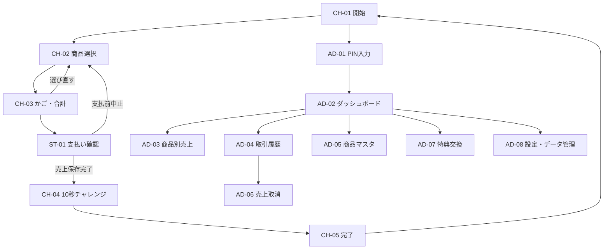
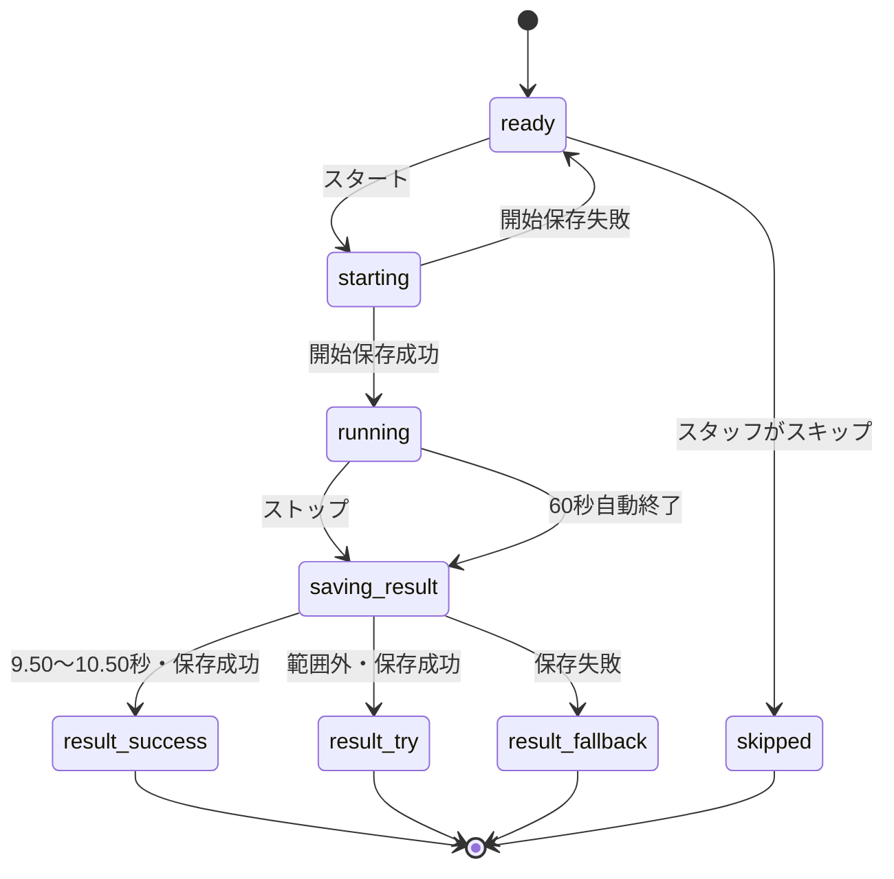

# 駄菓子 おかいもの体験アプリ 画面定義書

## 1. 文書情報

| 項目 | 内容 |
|---|---|
| 文書ID | DAGASHI-SD-001 |
| バージョン | v0.2 |
| ステータス | Draft / 実装レビュー用 |
| 作成日 | 2026-07-23 |
| 対象 | MVP（単一レジ端末・Next.js + Google Sheets + Google Drive） |
| 想定読者 | UI実装担当、API実装担当、QA担当、レビュー担当 |
| 機能仕様 | `./dagashi-shopping-app-functional-specification.md` |
| 技術要件 | `./dagashi-shopping-app-technical-requirements.md` |
| 実装定義 | `./dagashi-shopping-app-implementation-specification.md` |
| 実装手順 | `./dagashi-shopping-app-implementation-procedure.md` |
| デザイン仕様 | `../DESIGN.md` |

本書は、機能仕様で定義した全14画面を、実装可能な画面単位へ分解する。表示文言の微調整やビジュアル制作は可能だが、画面ID、権限、必須情報、遷移条件、売上確定条件、チャレンジ判定、スタンプ数を変更する場合は機能仕様の改訂を先に行う。

## 2. 参照資料と優先順位

1. 機能・運用仕様書：業務ルールと機能要件の正本
2. 技術要件定義書：アーキテクチャと非機能要件の正本
3. 本画面定義書：画面構成、状態、操作、遷移の正本
4. `DESIGN.md`：色、書体、余白、部品表現、動きの正本
5. 操作動画：見た目と操作感の参考。仕様と異なる場合は上記文書を優先

操作動画：

- `../outputs/demo-videos/child-shopping-experience-demo.webm`
- `../outputs/demo-videos/admin-operation-demo.webm`

## 3. 画面設計の基本方針

### 3.1 子ども向け画面

- 一画面一目的とし、次の操作を1つだけ強く見せる。
- Drive画像またはフォールバック絵文字、商品名、価格を必ず同時に表示する。
- 主要操作領域は44 × 44px以上とする。
- 合計金額は商品選択中から常に確認できるようにする。
- 漢字の使用を抑え、短い文と視覚表現を組み合わせる。
- 成功・不成功を色だけで区別しない。
- 「失敗」「ざんねん」「失格」を主要メッセージに使用しない。
- 公開ランキング、他の子との比較、個人名を表示しない。

### 3.2 スタッフ・アドミン画面

- 子ども向け画面と配色・ナビゲーションを明確に分ける。
- 売上保存前後、取消前後、設定変更結果を明示する。
- 破壊的操作には確認画面を設け、理由を記録する。
- 表示データに子どもの氏名、顔写真、カード番号を含めない。
- キーボードだけでも主要操作を完了できるようにする。

### 3.3 共通状態

| 状態 | 表示 | 操作 |
|---|---|---|
| `idle` | 通常表示 | 通常操作を許可 |
| `loading` | 読込中表示 | 二重操作を防止し、必要なボタンを無効化 |
| `empty` | 対象データがない説明 | 戻る、再読込、商品登録等の次操作を提示 |
| `saving` | 保存中と対象処理を表示 | 確定操作を再押下不可にする |
| `success` | 完了内容を表示 | 次画面または一覧へ移動可能 |
| `error` | 何が失敗したか、保存済みか、次の操作を表示 | 再試行または安全な中止を提示 |

### 3.4 レスポンシブ基準

| 項目 | 基準 |
|---|---|
| 基準画面 | 1,280 × 800px |
| 最低画面幅 | 1,024px |
| 子ども向け商品カード | 基準3〜4列、最低2列 |
| アドミンナビゲーション | 基準は左サイドバー |
| 表示倍率 | 125%でも主要操作を隠さない |
| 内部スクロール | 長い一覧・テーブルだけに限定 |

## 4. 画面・ルート一覧

| 画面ID | 画面名 | ルート | 権限 | 主なデータ |
|---|---|---|---|---|
| CH-01 | 開始 | `/` | 全員 | アプリ設定、商品利用可否 |
| CH-02 | 商品選択 | `/shop` | 全員 | 販売中商品、かご |
| CH-03 | かご・合計確認 | `/cart` | 全員 | かご、商品スナップショット |
| ST-01 | 支払い確認 | `/checkout` | 子ども表示／スタッフ確定 | かご、合計、支払い方法 |
| CH-04 | 10秒チャレンジ | `/challenge/[saleId]` | 全員／スキップはスタッフ | 売上、チャレンジ状態 |
| CH-05 | 完了・スタンプ案内 | `/complete/[saleId]` | 全員 | 売上、今回のスタンプ数 |
| AD-01 | PIN入力 | `/admin/login` | 全員 | 管理セッション |
| AD-02 | ダッシュボード | `/admin` | アドミン | 当日集計、最新取引 |
| AD-03 | 商品別売上 | `/admin/sales/products` | アドミン | 期間別商品集計 |
| AD-04 | 取引履歴・詳細 | `/admin/sales` | アドミン | 売上・明細・チャレンジ |
| AD-05 | 商品マスタ | `/admin/products` | アドミン | 商品、Drive画像状態 |
| AD-06 | 売上取消 | `/admin/sales/[saleId]/void` | アドミン | 取消対象売上 |
| AD-07 | 特典交換 | `/admin/rewards/new` | アドミン | 商品、特典交換 |
| AD-08 | 設定・データ管理 | `/admin/settings` | アドミン | 設定、接続状態、Spreadsheet情報 |

AD-06はAD-04上のモーダルとして実装してもよい。ただしURLを持たせ、再読込時にも取消対象を特定できるようにする。

## 5. 画面遷移

## 6. 共通画面部品

| 部品ID | 部品名 | 用途 | 主なprops・状態 |
|---|---|---|---|
| CMP-001 | `ChildHeader` | ロゴ、現在工程 | `step`, `label` |
| CMP-002 | `StepIndicator` | 選ぶ・かご・会計・チャレンジ | `currentStep` |
| CMP-003 | `ProductVisual` | Drive画像優先・絵文字フォールバック表示 | `productId`, `imageUrl`, `imageUpdatedAt`, `fallbackEmoji`, `alt` |
| CMP-004 | `ProductCard` | 商品選択 | `product`, `quantity`, `onAdd`, `onRemove` |
| CMP-005 | `QuantityStepper` | 数量増減 | `value`, `min`, `max`, `disabled` |
| CMP-006 | `CartTotalBar` | 個数・合計・かご遷移 | `itemCount`, `totalYen` |
| CMP-007 | `AsyncButton` | 保存中・二重押下防止 | `pending`, `disabled`, `error` |
| CMP-008 | `ResultPopup` | チャレンジ結果 | `result`, `elapsedMs`, `stampCount` |
| CMP-009 | `AdminShell` | サイドバー、ヘッダー | `activeMenu`, `connectionStatus` |
| CMP-010 | `StatusBadge` | 販売・売切・取消等 | `status`, `label` |
| CMP-011 | `DataTable` | 管理一覧 | `columns`, `rows`, `loading`, `emptyMessage` |
| CMP-012 | `ConfirmDialog` | 取消・変更確認 | `title`, `description`, `onConfirm` |
| CMP-013 | `InlineError` | 入力・APIエラー | `message`, `retryAction` |
| CMP-014 | `Toast` | 保存・操作結果 | `kind`, `message` |

## 7. 子ども・スタッフ画面

### 7.1 CH-01 開始画面

| 項目 | 定義 |
|---|---|
| 目的 | 新しい買い物を空のかごで開始する |
| 入口 | アプリURL、CH-05の終了、セッション初期化後 |
| 出口 | CH-02、AD-01 |
| 主API | `GET /api/health`, `GET /api/products`の事前確認 |

#### レイアウト

1. アプリロゴ・名称
2. お買い物イラスト
3. 「じぶんで えらんでみよう！」
4. 主操作「おかいものを はじめる」
5. 低強調の「スタッフ・アドミン」

#### 操作部品

| UI ID | 表示 | 動作 |
|---|---|---|
| UI-CH01-START | おかいものを はじめる | 空のかごと`request_id`を作りCH-02へ移動 |
| UI-CH01-ADMIN | スタッフ・アドミン | AD-01へ移動 |
| UI-CH01-RETRY | もういちど読みこむ | 接続・商品事前確認を再実行 |

#### 状態

- 初期読込中：開始ボタンを無効化し「おみせを じゅんびしています」を表示する。
- 販売可能：販売中かつ`fallback_emoji`を持つ商品が1件以上なら開始可能にする。
- 商品なし：開始不可とし「いまは じゅんびちゅうです。お店の人をよんでね」を表示する。
- 通信エラー：子ども向けには短い案内、詳細はスタッフ用展開欄へ表示する。

### 7.2 CH-02 商品選択画面

| 項目 | 定義 |
|---|---|
| 目的 | 商品と数量を自分で選ぶ |
| 入口 | CH-01、CH-03、ST-01の支払前中止 |
| 出口 | CH-03 |
| 主API | `GET /api/products` |

#### レイアウト

1. `ChildHeader`と工程表示
2. 「ほしいおかしを えらんでね」
3. 商品カードグリッド
4. 画面下部のかご個数・合計・「かごをみる」

#### 商品カード

| 要素 | 仕様 |
|---|---|
| 商品ビジュアル | 有効なDrive画像を優先表示。未設定・読込失敗時は`fallback_emoji`を1:1領域へ表示し、商品名をアクセシブル名に設定 |
| 商品名 | 1〜40文字。2行を超える場合は省略せずカード高を揃える |
| 価格 | `○○円` |
| 数量 | 0〜設定上限、初期20 |
| 売切 | 通常一覧から除外。運用判断で無効カード表示も可 |

#### 操作部品

| UI ID | 動作 |
|---|---|
| UI-CH02-ADD-[productId] | 数量を1増やし、小計・合計を即時更新 |
| UI-CH02-REMOVE-[productId] | 数量を1減らす。0未満にしない |
| UI-CH02-CART | 選択数1以上でCH-03へ移動 |
| UI-CH02-CANCEL | 買い物をやめ、確認後にCH-01へ戻る |

#### 状態

- 読込中：商品カードのスケルトンを表示する。
- 空：販売可能商品がない案内を表示し、CH-01へ戻る。
- 画像異常：対象商品は除外せず`fallback_emoji`へ切り替え、管理側へ監査可能な警告を残す。
- 再読込：選択中商品の価格・状態が変わった場合、かごを再検証して変更内容を表示する。

### 7.3 CH-03 かご・合計確認画面

| 項目 | 定義 |
|---|---|
| 目的 | 商品、単価、数量、小計、合計を確認する |
| 入口 | CH-02 |
| 出口 | CH-02、ST-01 |
| 主API | なし。ST-01遷移前に商品再検証を行う |

#### レイアウト

- 選択商品ごとの画像、商品名、単価、数量、小計
- 数量変更・削除
- 合計金額
- 「えらびなおす」「これで買う」

#### 操作・検証

| UI ID | 動作 |
|---|---|
| UI-CH03-ADD-[productId] | 数量を1増加 |
| UI-CH03-REMOVE-[productId] | 数量を1減少。0で行を除去 |
| UI-CH03-BACK | かごを保持してCH-02へ戻る |
| UI-CH03-BUY | 最新の商品状態・価格を検証後、ST-01へ移動 |

- かごが空なら「これで買う」を無効化する。
- 価格変更時は旧価格と新価格を示し、確認後に新価格を採用する。
- 売切・非表示になった商品は除去確認を表示する。

### 7.4 ST-01 支払い確認画面

| 項目 | 定義 |
|---|---|
| 目的 | 子どもへ支払い案内を出し、スタッフが売上を確定する |
| 入口 | CH-03 |
| 出口 | CH-02、CH-04 |
| 主API | `POST /api/admin/session`、`POST /api/sales` |

#### レイアウト

- 左：子ども向け「お店の人に画面とおかしを見せてね」
- 右：商品明細、合計、支払い方法、スタッフ操作
- スタッフ操作領域は視覚的に分離する。

#### 操作部品

| UI ID | 権限 | 動作 |
|---|---|---|
| UI-ST01-BACK | 全員 | かごを保持してCH-02へ戻る |
| UI-ST01-PAYMENT | スタッフ | 現金／その他を選択 |
| UI-ST01-CONFIRM | スタッフ | PIN確認後、同一`request_id`で売上保存 |
| UI-ST01-CANCEL | スタッフ | 支払前中止としてCH-02へ戻る |
| UI-ST01-RETRY | スタッフ | 保存結果照会後、同じ`request_id`で再試行 |

#### 保存状態

- `idle`：支払い受領前。確定ボタンを表示する。
- `auth_required`：有効な管理セッションがなければPIN入力をインライン表示する。
- `saving`：確定ボタンを無効にして「売上を保存しています」を表示する。
- `saved`：`sale_id`取得後だけCH-04へ移動する。
- `unknown`：応答不明時は取引照会を行い、新規`request_id`を発行しない。
- `error`：未保存／保存済み／確認不能を区別してスタッフへ表示する。

### 7.5 CH-04 10秒チャレンジ画面

| 項目 | 定義 |
|---|---|
| 目的 | 1売上につき1回だけ10秒チャレンジを行う |
| 入口 | ST-01の売上保存完了 |
| 出口 | CH-05 |
| 主API | `PATCH /api/sales/[saleId]/challenge` |

#### 状態遷移

#### 操作部品

| UI ID | 状態 | 動作 |
|---|---|---|
| UI-CH04-START | `ready` | サーバーへ開始状態を保存し、成功後に計測開始 |
| UI-CH04-STOP | `running` | 1回だけ受け付け、丸め前の`elapsedMs`を送信 |
| UI-CH04-SKIP | `ready` | スタッフ確認後、基本スタンプ1個で完了 |
| UI-CH04-NEXT | 結果ポップ | CH-05へ移動 |

#### 計測中の時間表示

- 0ms以上5,000ms未満は、経過時間を`0.00`〜`4.99`の秒表示で更新する。
- 5,000ms以上になった瞬間から、経過時間の数字を非表示にしてストップ操作だけを強調する。
- 数字を隠しても計測は継続し、ストップ後の結果ポップには結果時間を小数第2位まで表示する。

#### 結果ポップ

| 結果 | 画像・演出 | 文言 | スタンプ |
|---|---|---|---|
| 成功 | 星、紙吹雪、笑顔のマスコット | すごい！10秒にぴったり！ | 2個 |
| 範囲外 | 明るい応援イラスト | ナイスチャレンジ！ | 1個 |
| スキップ | お買い物完了イラスト | おかいものスタンプを押すよ | 1個 |
| 中断・保存失敗 | 落ち着いた案内画像 | お店の人に画面を見せてね | 1個 |

- 結果時間は小数第2位まで表示する。
- 判定には丸め前のミリ秒値を使用する。
- 結果ポップは全画面オーバーレイとし、背景操作を受け付けない。
- 「つぎへ」を押すまで閉じない。
- `prefers-reduced-motion`では紙吹雪等の動きを停止または縮小する。

### 7.6 CH-05 完了・スタンプ案内画面

| 項目 | 定義 |
|---|---|
| 目的 | 今回スタッフが押すスタンプ数を明確に伝える |
| 入口 | CH-04の結果確定・スキップ・中断 |
| 出口 | CH-01 |
| 主API | `GET /api/sales/[saleId]/completion` |

#### 表示

- 「おかいもの かんりょう！」
- 今回のスタンプ：1個または2個
- 「カードをお店の人にわたしてね」
- 「15個たまったら対象のおかし1個と交換」
- 「おわる」

累積スタンプ数や15個までの残数は表示しない。「おわる」でかご、`request_id`、画面上の結果を消去し、CH-01へ戻る。

## 8. アドミン画面

### 8.1 共通レイアウト

`AdminShell`は以下を表示する。

- 左サイドバー：ダッシュボード、商品別売上、取引履歴、商品管理、特典交換、設定
- 上部：画面名、対象日、ログアウト
- 下部またはサイドバー：Spreadsheet・Drive接続状態
- 本文：各画面固有コンテンツ

有効な管理セッションがない場合は、元のURLを`returnTo`としてAD-01へ移動する。

### 8.2 AD-01 PIN入力画面

| 項目 | 定義 |
|---|---|
| 目的 | スタッフ・アドミン操作を保護する |
| 入口 | 管理画面、ST-01の確定操作 |
| 出口 | `returnTo`またはAD-02 |
| 主API | `POST /api/admin/session` |

| UI ID | 動作 |
|---|---|
| UI-AD01-PIN | 4〜8桁のPINを入力。値を画面・ログへ残さない |
| UI-AD01-LOGIN | 認証し、成功時に`returnTo`へ移動 |
| UI-AD01-CANCEL | CH-01または呼出元へ戻る |

- 認証失敗はPIN内容を推測できない共通文言にする。
- 連続5回失敗時は30秒の待機表示を行う。
- ブラウザのパスワード保存対象にしない。

### 8.3 AD-02 ダッシュボード

| 項目 | 定義 |
|---|---|
| 目的 | 当日の売上と運用異常を最初に確認する |
| 主API | `GET /api/admin/dashboard?date=YYYY-MM-DD` |

#### 表示

1. 売上額
2. 取引件数
3. 販売個数
4. 特典交換数
5. 取消件数
6. 最新取引
7. 不完全書込件数
8. 商品画像エラー件数

集計カードから対応一覧へ遷移できるようにする。不完全書込と画像エラーは0件でも接続確認結果を表示する。

### 8.4 AD-03 商品別売上画面

| 項目 | 定義 |
|---|---|
| 目的 | 指定期間に何が何個・いくら売れたか確認する |
| 主API | `GET /api/admin/sales/products` |

#### 検索条件

- 開始日・終了日：両端を含む、初期値は当日
- 商品名・カテゴリ
- 商品状態：すべて／販売中／売切／非表示

#### 一覧列

商品ID、商品名、販売個数、売上額、特典交換数。取消済み売上を通常集計へ含めない。

| UI ID | 動作 |
|---|---|
| UI-AD03-SEARCH | 条件をURL queryへ反映して再取得 |
| UI-AD03-SORT | 商品名、販売個数、売上額で並べ替え |

### 8.5 AD-04 取引履歴・詳細画面

| 項目 | 定義 |
|---|---|
| 目的 | 売上、明細、チャレンジ、取消状態を確認する |
| 主API | `GET /api/admin/sales`、`GET /api/admin/sales/[saleId]` |

#### 一覧列

取引日時、取引ID、状態、商品数、合計金額、支払い方法、詳細操作。

#### 詳細ドロワーまたは詳細領域

- 商品名、取引時単価、数量、小計
- 合計金額
- チャレンジ状態、結果時間、成否、スタンプ数
- `request_id`、`write_status`
- 取消日時、取消理由

`pending`・`error`は通常売上と混同せず警告表示する。取消可能なのは`write_status=completed`かつ未取消の売上だけとする。

### 8.6 AD-05 商品マスタ画面

| 項目 | 定義 |
|---|---|
| 目的 | 商品、価格、フォールバック絵文字、任意のDrive画像、表示状態を管理する |
| 主API | `GET /api/admin/products`、`POST /api/admin/products`、`PATCH /api/admin/products/[productId]` |

#### 一覧列

| 列 | 内容 |
|---|---|
| 商品ビジュアル | Drive画像のサムネイルを優先。未設定・異常時は絵文字を表示し、異常時は警告 |
| 商品名 | 1〜40文字 |
| 価格 | 円単位整数 |
| カテゴリ | 任意 |
| 表示順 | 0以上 |
| 状態 | 下書き／販売中／売切／非表示 |
| 更新日時 | Asia/Tokyo表示 |

#### 登録・編集項目

| UI ID | 必須 | 仕様 |
|---|---|---|
| UI-AD05-NAME | 必須 | 1〜40文字 |
| UI-AD05-PRICE | 必須 | 1円以上の整数 |
| UI-AD05-CATEGORY | 任意 | 1〜20文字 |
| UI-AD05-EMOJI | 販売中は必須 | 商品を表す1つのフォールバック絵文字 |
| UI-AD05-IMAGE | 任意 | Driveの`file_id`または共有URL。設定時は絵文字より優先表示 |
| UI-AD05-ORDER | 必須 | 0以上の整数 |
| UI-AD05-STATUS | 必須 | `draft`、`active`、`sold_out`、`hidden` |
| UI-AD05-SAVE | - | 検証成功後に保存 |

#### Drive画像確認

- `file_id`または共有URL入力後に画像プレビューを表示する。未入力・読込失敗時はフォールバック絵文字のプレビューを表示する。
- 共有URLはAPI側で`file_id`へ正規化する。
- MIME type、容量、削除状態、専用フォルダ配下、サービスアカウントの権限を検証する。
- MVPではアプリからDriveへ画像をアップロードしない。
- 画像が未設定でも、フォールバック絵文字があれば`active`に変更できる。
- 画像が不正な場合は子ども画面で絵文字へ切り替え、商品は除外せず管理画面へ警告する。
- 商品画像は[指定Google Driveフォルダ](https://drive.google.com/drive/folders/1uhYVw7gofnxWvdbz_F3oHMidww1f2AR-)に格納する。

### 8.7 AD-06 売上取消画面

| 項目 | 定義 |
|---|---|
| 目的 | 誤登録を削除せず取消状態にする |
| 主API | `POST /api/admin/sales/[saleId]/void` |

#### 表示・操作

- 取引ID、日時、商品明細、合計を表示する。
- 取消理由を必須入力とする。
- 「この売上を取り消す」は確認ダイアログ後に実行する。
- 取消処理中は再押下不可にする。
- 完了後はAD-04詳細へ戻り、取消状態を表示する。
- 取消済み、未完了、不完全書込は取消不可とする。

### 8.8 AD-07 特典交換画面

| 項目 | 定義 |
|---|---|
| 目的 | 15スタンプ特典を通常売上と分けて記録する |
| 主API | `POST /api/admin/rewards` |

#### 必須操作

1. 商品を検索・選択する。
2. 通常価格を確認用に表示する。
3. 「紙カード15個確認済み」にチェックする。
4. 交換登録を実行する。

登録結果は金額0円、数量1個、通常売上・通常販売個数の対象外とする。交換済みカードの物理処理は画面完了後にスタッフへ案内する。

### 8.9 AD-08 設定・データ管理画面

| 項目 | 定義 |
|---|---|
| 目的 | 体験設定、接続状態、Spreadsheet情報を管理する |
| 主API | `GET/PATCH /api/admin/settings`、`GET /api/admin/health` |

#### 設定項目

- チャレンジ成功下限：初期9.50秒
- チャレンジ成功上限：初期10.50秒
- スタンプゴール数：初期15
- 1商品数量上限：初期20
- 支払い方法候補

#### 接続・データ管理

- Spreadsheet接続状態
- Google Drive接続状態
- Drive商品画像専用フォルダIDの設定有無。値全体は画面に露出しない
- 不完全書込件数
- 商品画像エラー件数
- 売上データ確認先Spreadsheetへのリンク
- アプリバージョン、Spreadsheetスキーマバージョン

PIN、サービスアカウント秘密鍵、セッション秘密鍵は画面から表示・変更しない。

## 9. 共通エラー文言

| コード | 子ども向け表示 | スタッフ向け表示 |
|---|---|---|
| `NETWORK_UNAVAILABLE` | つうしんを かくにんしています | ネットワーク接続を確認して再試行してください |
| `PRODUCTS_UNAVAILABLE` | お店の人を よんでね | 販売可能な商品がありません |
| `IMAGE_UNAVAILABLE` | 絵文字で表示しています | Drive画像のID、権限、形式を確認してください |
| `SALE_NOT_SAVED` | お店の人に 画面をみせてね | 売上は保存されていません。同じ取引で再試行してください |
| `SALE_STATUS_UNKNOWN` | お店の人に 画面をみせてね | 保存結果を照会中です。新しい会計を作成しないでください |
| `CHALLENGE_SAVE_FAILED` | ナイスチャレンジ！お店の人にみせてね | 結果を保存できないため基本スタンプ1個で完了します |
| `ADMIN_SESSION_EXPIRED` | - | セッションが終了しました。再度PINを入力してください |

## 10. アクセシビリティ受け入れ条件

- [ ] 主要ボタンがキーボードで操作できる。
- [ ] フォーカス位置が視覚的に分かる。
- [ ] モーダル表示中はフォーカスが背景へ移動しない。
- [ ] 商品画像または絵文字に商品名のアクセシブル名がある。
- [ ] 成否、状態、エラーを色だけで伝えていない。
- [ ] `prefers-reduced-motion`で不要な動きを抑制する。
- [ ] 125%表示でも確定・戻る・合計が欠けない。
- [ ] ローディング・保存完了・エラーが支援技術へ通知される。

## 11. 画面受け入れ条件

- [ ] CH-01からCH-05まで戻り先を含めて遷移できる。
- [ ] 支払済み保存完了前にCH-04へ進まない。
- [ ] CH-04の再読込で同一売上を再挑戦できない。
- [ ] CH-04は4.99秒まで小数第2位を表示し、5.00秒以降は結果確定まで数字を隠す。
- [ ] 成功・範囲外・スキップ・中断で正しい結果ポップが出る。
- [ ] CH-05は今回のスタンプ数だけを表示する。
- [ ] 管理セッションなしでAD-02〜AD-08へ入れない。
- [ ] AD-02に不完全書込と画像エラーが表示される。
- [ ] AD-05で`fallback_emoji`があればDrive画像なしでも販売中にできる。
- [ ] AD-06の取消後も元売上・明細が残る。
- [ ] AD-07の特典交換が通常売上へ混入しない。
- [ ] AD-08から接続状態と売上データ確認先Spreadsheetを確認できる。

## 12. Human Check

| ID | 確認事項 | 現在の仮置き |
|---|---|---|
| HC-SD-001 | ロゴ、ブランドカラー、マスコット | 未決定 |
| HC-SD-002 | 中心対象年齢と漢字使用量 | 未決定 |
| HC-SD-003 | アドミン画面のサイドバー文言 | 動画案を仮採用 |
| HC-SD-004 | Drive共有URL入力を許可するか、`file_id`だけにするか | 両方入力可、保存時は`file_id`へ正規化 |
| HC-SD-005 | 商品画像エラー時の運営通知方法 | ダッシュボード警告を仮採用 |
| HC-SD-006 | 結果音 | 初期は音なし |
| HC-SD-007 | AD-06をモーダル／独立画面のどちらにするか | URL付きモーダルを推奨 |
| HC-SD-008 | 商品画像フォルダ | [指定Google Driveフォルダ](https://drive.google.com/drive/folders/1uhYVw7gofnxWvdbz_F3oHMidww1f2AR-)を使用 |
