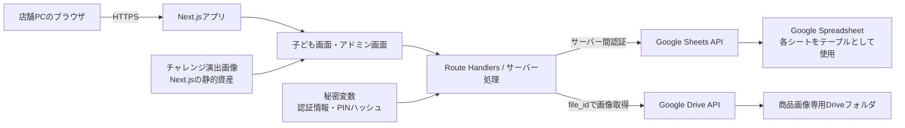
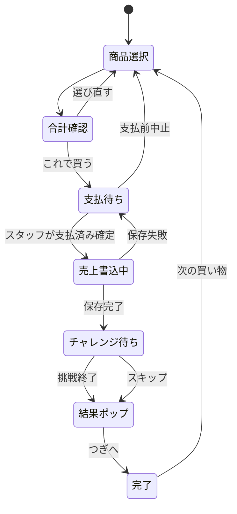

# 駄菓子 おかいもの体験アプリ 技術要件定義書

## 1. 文書情報

| 項目 | 内容 |
|---|---|
| 文書ID | DAGASHI-TRD-001 |
| バージョン | v0.4 |
| ステータス | Draft / レビュー用 |
| 更新日 | 2026-07-23 |
| 対象 | MVP（単一レジ端末・クラウド配信Webアプリ） |
| 想定読者 | 開発担当、レビュー担当、運営責任者 |
| 上位資料 | `../outputs/dagashi_shopping_experience_concept_v0.2.docx` |
| 関連仕様 | `./dagashi-shopping-app-functional-specification.md` |

本書は、企画コンセプトv0.2を実装可能な技術要件へ落とすための定義書である。会計仕訳、税務、法務、食品衛生、営業許可・届出の判断は対象外とし、現場での販売記録と購買体験を支える技術要件に限定する。

## 2. 結論

MVPは、TypeScript、Next.js App Router、Google Sheets API、Google Drive APIで実装する。専用のRDBや店舗PC上のDBは使用せず、1つのGoogle Spreadsheet内の各シートをテーブルとして扱う。商品画像の実体はGoogle Driveへ置き、Spreadsheetには画像を識別する`file_id`と、画像未設定・読込失敗時に表示する`fallback_emoji`を保存する。

ただし、Google Sheetsを保存先にするため、完全オフライン運用ではない。店舗PCではローカルサーバーを立ち上げず、デプロイ済みURLをブラウザで開いて利用する。商品読込、売上確定、管理画面の利用にはインターネット接続が必要である。

### 2.1 採用判断

| 項目 | 判断 |
|---|---|
| TypeScript + Next.js | 採用 |
| 専用DB | 不採用 |
| Google Spreadsheet | 商品・売上等の永続保存先として採用 |
| Google Drive | 商品画像の保存先として採用 |
| 店舗PC上のサーバー | 不要 |
| 完全オフライン | 対象外 |
| 利用端末 | MVPはレジ用PC 1台 |
| 商品ビジュアル | 販売中は`fallback_emoji`必須。Driveの`file_id`は任意で、設定時は画像を優先表示する |
| 純粋な静的書き出し | 不採用。サーバー側処理が必要 |

### 2.2 採用範囲の限界

Google Sheetsは、少量・低頻度・単一端末のMVPには適するが、RDBと同じ一意制約や複数テーブル間トランザクションは持たない。次のいずれかが必要になった時点で、専用DBへの移行を再検討する。

- 複数レジから同時に会計する。
- 複数店舗のデータを統合する。
- 在庫をリアルタイムで厳密に管理する。
- 取引量が増え、集計や一覧表示が遅くなる。
- 会計・監査上、より強い整合性保証が必要になる。

## 3. 目的

- 子どもが商品と数量を選び、合計を確認してから支払いへ進める。
- スタッフが支払済みを確定した取引だけを売上として保存する。
- 支払い後に10秒チャレンジを1回実施し、画像と演出を含む結果ポップを表示する。
- アドミン画面で、日別・商品別に「何が何個、いくら売れたか」を確認できる。
- 店舗PCへのNode.js、DB、ローカルサーバーのセットアップを不要にする。
- 子どものアカウント、氏名、スタンプ残高を保存しない。
- 券制度は実装せず、無記名の物理スタンプカードを使用する。

## 4. システム境界

### 4.1 システムに含めるもの

- 子ども向け商品選択・かご・合計画面
- スタッフによる支払済み確定
- 10秒チャレンジ、結果ポップ、今回のスタンプ数表示
- 商品マスタ管理
- Google Driveの商品画像取得と画面表示
- 売上、明細、取消、特典交換、設定、監査ログのSpreadsheet保存
- 日別・商品別売上集計
- スタッフ用PINによる管理機能の保護

### 4.2 システムに含めないもの

- 子ども・保護者の会員登録、氏名、連絡先、顔写真、位置情報
- スタンプカードの個別残高・カード番号管理
- 会計仕訳、税区分計算、税務申告、請求書、インボイス
- 決済端末、レシートプリンター、バーコード機器との自動連携
- 自動在庫管理、仕入れ、発注、棚卸し、廃棄判断
- 券、認定証、クーポン、公開ランキング、SNS共有
- 複数レジからの同時会計

## 5. 全体アーキテクチャ

### 5.1 技術構成

| 層 | 技術・役割 | 要件 |
|---|---|---|
| 言語 | TypeScript | `strict`を有効にし、画面・API・データ変換を型付けする |
| Web | Next.js App Router | 子ども画面、アドミン画面、サーバー側APIを同一プロジェクトで管理する |
| UI | React | タッチ操作を中心に構成する |
| サーバーAPI | Next.js Route Handlers | ブラウザとGoogle Sheets・Google Driveの間に置き、認証情報を隠す |
| 永続化 | Google Sheets API | Spreadsheetの各シートをテーブルとして読み書きする |
| 認証 | サービスアカウント等のサーバー間認証 | 認証情報はサーバーの秘密変数だけに置く |
| 商品画像 | Google Drive API | Driveの画像をNext.jsが取得し、同一オリジンの画像APIとして返す |
| 演出画像 | Next.js静的資産 | 10秒チャレンジの共通演出画像をアプリへ同梱する |
| テスト | Vitest + Playwright | 単体、結合、E2Eを実施する |
| 配信 | Next.jsのサーバー実行に対応したホスティング | HTTPS、秘密変数、サーバー処理を利用できること |

Google Sheetsへの書込処理と秘密情報の利用が実行時に必要なため、`output: 'export'`による純粋な静的サイトにはしない。

## 6. 実行・配布要件

| ID | 要件 |
|---|---|
| TR-RUN-001 | 店舗PCはデプロイ済みのHTTPS URLをブラウザで開いて利用する |
| TR-RUN-002 | 店舗PCへNode.js、パッケージ、専用DBをインストールしない |
| TR-RUN-003 | 商品・画像読込、売上確定、集計にはインターネット接続を必須とする |
| TR-RUN-004 | Google APIの認証情報をブラウザへ配信しない |
| TR-RUN-005 | 本番・検証でSpreadsheetと秘密変数を分離する |
| TR-RUN-006 | リリースごとにアプリのバージョンを画面へ表示できるようにする |
| TR-RUN-007 | Google Sheets APIへ接続できない場合、支払済み確定を完了扱いにしない |
| TR-RUN-008 | Google Drive画像が未設定または取得できない場合も、商品を除外せず`fallback_emoji`を表示する |

### 6.1 対応環境

MVPはレジ用PC 1台と現行安定版のChromium系ブラウザを第一候補とする。

- 画面幅：1,024px以上
- 推奨解像度：1,280 × 800px以上
- 入力：タッチまたはマウス
- 表示倍率：100%を基準に、125%でも主要操作が欠けないこと
- 通信：HTTPSおよびGoogle APIへ安定して接続できること

## 7. アプリケーション状態

### 7.1 状態要件

- 支払済み確定前のかごは売上へ含めない。
- Spreadsheetに`completed`まで書き込めた取引だけを売上集計へ含める。
- 売上保存後にブラウザが閉じても、確定済み売上を失わない。
- チャレンジが未実施でも、確定済み売上は有効とする。
- 取消は売上レコードを削除せず、状態と取消情報を更新する。
- 確定ボタンの無効化と同一`request_id`の再利用により再送時の重複を防ぐ。

## 8. Spreadsheet設計

### 8.1 共通ルール

| ID | 要件 |
|---|---|
| TR-DATA-001 | 1行目を固定の列名行とし、列名をアプリとSpreadsheetで一致させる |
| TR-DATA-002 | 金額は円単位の整数で保存する |
| TR-DATA-003 | 日時はサーバー側でUTCのISO 8601文字列として作成し、画面ではAsia/Tokyoで表示する |
| TR-DATA-004 | IDはサーバー側でUUIDとして発行する |
| TR-DATA-005 | 商品名と単価を売上明細へスナップショット保存する |
| TR-DATA-006 | 子どもの識別情報とスタンプ残高を保存しない |
| TR-DATA-007 | アプリ外から列の削除・並べ替え・列名変更を行わない |
| TR-DATA-008 | 手入力セルを数式として解釈させないよう、商品名等を文字列として書き込む |
| TR-DATA-009 | Driveの共有URL全体ではなく、URLから抽出した不変の`file_id`を商品行へ保存する |

### 8.2 シート一覧

| シート名 | 役割 | 主な列 |
|---|---|---|
| `products` | 商品マスタ | `product_id`, `name`, `price_yen`, `category`, `fallback_emoji`, `image_file_id`, `image_updated_at`, `display_order`, `status`, `created_at`, `updated_at` |
| `sales` | 取引ヘッダー | `sale_id`, `request_id`, `sold_at`, `write_status`, `sale_status`, `total_yen`, `payment_method`, `experience_status`, `elapsed_ms`, `challenge_success`, `stamp_count`, `voided_at`, `void_reason` |
| `sale_items` | 取引明細 | `sale_item_id`, `sale_id`, `product_id`, `product_name_snapshot`, `unit_price_yen`, `quantity`, `line_total_yen` |
| `reward_redemptions` | 15スタンプ特典 | `redemption_id`, `redeemed_at`, `product_id`, `product_name_snapshot`, `quantity`, `amount_yen`, `status`, `voided_at`, `void_reason` |
| `settings` | 公開設定 | `key`, `value`, `updated_at` |
| `audit_logs` | 管理操作履歴 | `log_id`, `occurred_at`, `action`, `target_type`, `target_id`, `summary` |

### 8.3 値の定義

- `products.status`：`draft`、`active`、`sold_out`、`hidden`
- `products.fallback_emoji`：商品画像領域へ表示する1つの絵文字。`active`では必須
- `products.image_file_id`：Google Driveの画像ファイルを一意に識別するID。Driveのフォルダパスや閲覧URLではない
- `products.image_updated_at`：画像変更時のキャッシュ更新に使用するISO 8601日時
- `sales.write_status`：`pending`、`completed`、`error`
- `sales.sale_status`：`completed`、`voided`
- `sales.experience_status`：`challenge_pending`、`challenge_started`、`completed`、`skipped`、`interrupted`
- `stamp_count`：1または2
- `reward_redemptions.amount_yen`：常に0

### 8.4 売上書込と整合性

Spreadsheetの複数シートへまたがる書込は、RDBのトランザクションと同等には扱わない。次の手順で不完全な取引を集計から除外する。

1. ブラウザが買い物開始時に`request_id`を1つ生成し、確定再試行でも同じ値を使う。
2. サーバーは同じ`request_id`の`completed`取引がないか確認する。
3. `sales`へ`write_status=pending`の行を追加する。
4. `sale_items`へ明細行を追加する。
5. 明細件数と合計を検証する。
6. `sales.write_status`を`completed`へ更新する。
7. 集計は`write_status=completed`かつ`sale_status=completed`だけを対象にする。

| ID | 要件 |
|---|---|
| TR-CONS-001 | 確定処理中は確定ボタンを再押下できないようにする |
| TR-CONS-002 | 再試行時は同一`request_id`を送信する |
| TR-CONS-003 | 同一`request_id`の完了済み売上がある場合、新しい売上を追加せず既存結果を返す |
| TR-CONS-004 | `pending`のまま残った取引は通常売上へ集計しない |
| TR-CONS-005 | アドミン画面に不完全書込の件数と確認操作を設ける |
| TR-CONS-006 | 一部書込が発生した場合は削除せず、`error`として監査可能にする |

この方式は単一端末MVPでの実用的な重複防止であり、DBの一意制約と同等の保証ではない。複数レジ運用へ移る場合は専用DBを採用する。

### 8.5 売上集計

| 集計値 | 定義 |
|---|---|
| 売上額 | 書込完了・支払済み・未取消の`sales.total_yen`合計 |
| 取引件数 | 書込完了・支払済み・未取消の`sales`件数 |
| 販売個数 | 対象売上に属する`sale_items.quantity`合計 |
| 商品別売上額 | 商品ごとの`unit_price_yen × quantity`合計 |
| 特典交換数 | 未取消の`reward_redemptions.quantity`合計。売上額には含めない |
| 取消件数 | `sale_status=voided`の件数 |

## 9. 商品ビジュアル要件

### 9.1 採用方針

- 子どもが文字だけに頼らず商品を選べるよう、`active`商品は`fallback_emoji`必須とする。
- Drive画像は任意とし、有効な画像がある場合は絵文字より優先して表示する。
- Drive画像が未設定または読込不能でも、絵文字が設定されていれば`active`にできる。
- 商品ビジュアルだけでなく、商品名と価格も必ず表示する。
- 画像の実体をSpreadsheetのセルへBase64等で保存しない。

### 9.2 MVPでの保存方式

- 商品画像の実体は、[指定の商品画像Google Driveフォルダ](https://drive.google.com/drive/folders/1uhYVw7gofnxWvdbz_F3oHMidww1f2AR-)（folder ID: `1uhYVw7gofnxWvdbz_F3oHMidww1f2AR-`）へ保存する。
- 専用フォルダをアプリ用サービスアカウントへ`reader`権限で共有し、不特定多数への公開は必須としない。
- `products.image_file_id`には画像ファイルのGoogle Drive `file_id`を保存する。
- Driveのフォルダ名・ファイル名によるパスは、移動や同名ファイルの影響を受けるため識別子として使用しない。
- Drive共有URLを入力として受け付ける場合は、サーバー側で`file_id`を抽出してからSpreadsheetへ保存する。
- 画像ファイル本体、Base64文字列、短時間で失効する`thumbnailLink`はSpreadsheetへ保存しない。
- MVPではアプリからDriveへ画像をアップロードしない。運営担当がDriveへ画像を配置し、Spreadsheetまたは商品管理画面へ`file_id`を入力する。
- 画像差替え時は`image_updated_at`も更新し、ブラウザとサーバーのキャッシュを更新する。

### 9.3 画像取得・表示フロー

1. `/api/products`が`products`シートを読み込む。
2. `active`商品の`fallback_emoji`が設定されていることを検証する。
3. `image_file_id`がある商品だけ、同一オリジンの`/api/product-images/[productId]`を画像URLとして返す。未設定時は`imageUrl=null`とする。
4. 画面は有効な画像を優先し、画像URLがない場合は`fallback_emoji`を表示する。
5. 画像APIは`productId`から商品行と`image_file_id`を特定する。
6. サーバーがDrive APIの`files.get`と`alt=media`で画像本体を取得する。
7. Driveから取得した`Content-Type`を検証し、画像データとキャッシュヘッダーをブラウザへ返す。
8. 画像取得または表示に失敗した場合は同じ画像領域を`fallback_emoji`へ切り替え、アドミン画面へ警告を表示する。
9. 子ども画面は画像の`alt`または絵文字のアクセシブル名に商品名を使用する。

`file_id`を画像APIの検索キーとして直接受け取らず、`productId`からサーバー側で解決する。これにより、利用者が任意のDriveファイルIDを指定して取得することを防ぐ。

### 9.4 画像仕様

| 項目 | 初期値 |
|---|---|
| 形式 | WebP、PNG、JPEG |
| 推奨比率 | 1:1 |
| 推奨サイズ | 800 × 800px程度 |
| 最大容量 | 1画像500KBを目安 |
| 代替テキスト | 商品名を使用 |
| 絵文字 | 商品を表す1つの絵文字。装飾用UIアイコンの代用にはしない |

### 9.5 画像異常時

- `image_file_id`未設定は正常な「絵文字表示」として扱い、画像エラーにはしない。
- 権限不足、削除済み、画像以外のMIME type、容量超過は画像不正として扱う。
- 画像不正でも商品を販売一覧から除外せず、その商品の`fallback_emoji`を表示する。
- アドミン画面には対象商品と理由を警告表示する。
- Drive APIの一時障害では短時間キャッシュを利用し、取得できない場合は`fallback_emoji`へ切り替える。
- フォールバック中も商品名と価格を表示し、運営担当がDriveとSpreadsheetの設定を修正できるようにする。

## 10. 10秒チャレンジ技術要件

| ID | 要件 |
|---|---|
| TR-CH-001 | 計測には`performance.now()`等の単調増加タイマーを使用する |
| TR-CH-002 | 初期成功条件は9,500ms以上10,500ms以下とする |
| TR-CH-003 | 成否判定は表示用に丸める前のミリ秒値で行う |
| TR-CH-004 | 結果時間は秒単位・小数第2位まで表示する |
| TR-CH-005 | 1売上につき挑戦は1回までとし、再読み込みで再挑戦させない |
| TR-CH-006 | 挑戦結果の保存失敗で確定済み売上を取り消さない |
| TR-CH-007 | 60秒を超えた場合は自動終了し、ボーナス対象外とする |
| TR-CH-008 | 終了直後に画面全体を覆う結果ポップを表示する |
| TR-CH-009 | 結果ポップには結果別の画像、結果時間、肯定的メッセージ、今回のスタンプ数を含める |
| TR-CH-010 | 結果ポップは「つぎへ」の明示操作まで閉じない |
| TR-CH-011 | 演出は3秒程度を上限とし、連続点滅を使わない |
| TR-CH-012 | `prefers-reduced-motion`が有効な場合は紙吹雪等の動きを停止または縮小する |
| TR-CH-013 | 計測開始から5,000ms未満は、経過時間を秒単位・小数第2位まで表示する |
| TR-CH-014 | 経過時間が5,000ms以上になった時点で計測中の数字を非表示にする。ストップ後の結果時間は小数第2位まで表示する |

### 10.1 結果ポップの状態

| 状態 | 画像・演出 | 表示例 | スタンプ |
|---|---|---|---|
| 成功 | 星、紙吹雪、笑顔のマスコット | 「すごい！10秒にぴったり！」 | 2個 |
| 不成功 | 明るい応援イラスト、やさしい光 | 「ナイスチャレンジ！」 | 1個 |
| スキップ・中断 | お買い物完了イラスト | 「おかいものスタンプを押すよ」 | 1個 |

赤い×、悲しい顔、失格音、他の子との比較は使用しない。音を追加する場合も補助表現とし、ミュート状態で意味が伝わるようにする。

## 11. API要件

| API | メソッド | 目的 |
|---|---|---|
| `/api/products` | GET | 販売中商品を取得する |
| `/api/product-images/[productId]` | GET | 商品IDからDrive画像を取得して返す |
| `/api/admin/products` | GET / POST / PATCH | 商品マスタを管理する |
| `/api/sales` | POST | 売上と明細を書き込む |
| `/api/sales/[saleId]/challenge` | PATCH | チャレンジ結果を保存する |
| `/api/admin/sales` | GET | 売上履歴・集計を取得する |
| `/api/admin/sales/[saleId]/void` | POST | 売上を取り消す |
| `/api/admin/rewards` | POST | 特典交換を記録する |

- すべての入力をサーバー側で再検証する。
- 金額はクライアントから受け取った値を信用せず、最新の商品マスタから計算する。
- 支払確定時の商品名と価格をスナップショットとして保存する。
- 画像APIは商品IDから`image_file_id`を解決し、任意のDriveファイルを取得させない。
- 管理APIはPIN認証後のサーバーセッションを要求する。
- エラー応答は、売上保存済みか否かを判別できるコードを返す。

## 12. 認証・セキュリティ

### 12.1 Google API認証

- Google APIの認証はサーバー側だけで行う。
- Spreadsheetと商品画像専用Driveフォルダは、専用サービスアカウント等に必要最小限の権限で共有する。
- Driveフォルダは画像読取だけに使用し、サービスアカウントには原則`reader`権限だけを与える。
- サービスアカウントの秘密鍵をリポジトリ、Spreadsheet、ブラウザ、ログへ保存しない。
- 現行実装はサービスアカウント認証を使用し、`GOOGLE_CLIENT_EMAIL`と`GOOGLE_PRIVATE_KEY`を必須の秘密変数として管理する。
- Application Default Credentials（ADC）やWorkload Identity相当の短期認証へ移行する場合は、認証クライアントと環境変数検証を同時に変更し、移行完了まで長期鍵と混在させない。
- サービスアカウント鍵は漏えい時にローテーションする。

### 12.2 スタッフPIN

- 支払済み確定とアドミン画面はスタッフ用PINで保護する。
- PINのソルト付きハッシュとセッション署名鍵はサーバーの秘密変数に保存する。
- PINを画面、Spreadsheet、ログへ出力しない。
- 連続5回失敗した場合は30秒間入力を停止する。
- セッションは15分無操作または明示ログアウトで終了する。
- PIN変更はMVPではデプロイ環境の秘密変数更新として運営責任者が行う。

### 12.3 アプリケーションセキュリティ

| ID | 要件 |
|---|---|
| TR-SEC-001 | HTTPSを必須とする |
| TR-SEC-002 | 商品名や取消理由をHTMLとして解釈せず文字列として表示する |
| TR-SEC-003 | API入力の型、長さ、範囲、列挙値を検証する |
| TR-SEC-004 | 管理APIへCSRF対策とSameSite Cookieを設定する |
| TR-SEC-005 | 子どもの情報、PIN、Google認証情報をログへ出さない |
| TR-SEC-006 | Spreadsheet IDと認証情報を公開環境変数へ入れない |
| TR-SEC-007 | Driveの`file_id`は秘密情報として扱わないが、任意IDを画像APIへ通さない |
| TR-SEC-008 | Driveから取得したMIME typeと容量を検証してから画像として返す |

## 13. ネットワーク障害時の要件

本MVPでは、売上の永続的なオフラインキューを持たない。通信が不安定な状態で支払済み確定を押した場合は、結果が確認できるまで画面を保持する。

| 状況 | 動作 |
|---|---|
| 初回商品読込失敗 | 買い物を開始させず、再読込とスタッフ案内を表示する |
| 売上書込前の通信失敗 | 売上未保存と表示し、同じ`request_id`で再試行する |
| 応答不明 | 既存取引を照会してから再試行し、無条件に追加しない |
| 売上保存後のチャレンジ保存失敗 | 売上は保持し、基本スタンプ1個で完了できるようにする |
| 長時間障害 | アプリ会計を停止し、運営が定めた紙の売上記録へ切り替える |

通信断でも会計を継続する機能が必要になった場合は、端末内キュー、同期、競合解決が必要になるため、別要件として設計する。

## 14. 性能・API制限

MVPは商品20〜30件、レジ1台を想定する。

| ID | 指標 | 目標 |
|---|---|---|
| TR-PERF-001 | 商品件数 | 200件で利用可能 |
| TR-PERF-002 | 初期表示 | 通常回線で3秒以内を目標 |
| TR-PERF-003 | 売上確定 | 通常時3秒以内を目標 |
| TR-PERF-004 | 商品一覧キャッシュ | サーバー側で短時間キャッシュし、商品更新時に無効化する |
| TR-PERF-005 | API呼出 | 必要な範囲をまとめて読み書きし、セル単位の大量呼出を避ける |
| TR-PERF-006 | 再試行 | 429・一時障害では上限付き指数バックオフを使用する |

Google Sheets APIには分単位の読取・書込クォータがあるため、一覧表示のたびに全シートを何度も読まない。取引量増加によりクォータ、応答時間、シートサイズが運用上の問題になった場合は専用DBへ移行する。

## 15. バックアップ・データ管理

- Google Spreadsheetを正本とする。
- アプリからCSV出力機能は提供せず、権限を持つアドミンがGoogle Spreadsheetへ直接アクセスしてデータを確認する。
- 定期バックアップは、運営担当がSpreadsheetを日付付きで複製して行う。
- Spreadsheetの変更履歴を利用できるGoogle Workspace運用とする。
- 列構成変更前は必ずSpreadsheetを複製する。
- 本番用Spreadsheetと検証用Spreadsheetを分離する。

## 16. テスト要件

### 16.1 自動テスト

- 金額、数量、小計、合計の計算
- 売上確定、同一`request_id`の再送、取消、価格スナップショット
- `pending`取引が集計から除外されること
- 10秒判定境界値：9,499ms、9,500ms、10,500ms、10,501ms
- 計測中の表示境界値：4,999msでは小数第2位まで表示し、5,000msでは非表示になること
- 結果ポップの成功、不成功、スキップ、中断状態
- `prefers-reduced-motion`時に強い動きを停止すること
- `active`商品には`fallback_emoji`が必須であること
- Drive画像未設定の`active`商品が絵文字で表示されること
- Driveの有効な`file_id`から画像を取得できること
- 権限不足、削除済み、画像以外のDriveファイルでは絵文字へ切り替わり、アドミンへ警告されること
- 売上、取消、特典交換の集計分離
- Google Sheets APIの正常、429、タイムアウト、部分書込相当の異常系
- PIN認証、連続失敗、セッションタイムアウト

### 16.2 E2Eテスト

1. 通常購入からチャレンジ成功、画像付きポップ、スタンプ2個表示まで。
2. 通常購入からチャレンジ不成功、肯定的な画像付きポップ、スタンプ1個表示まで。
3. 支払前中止が売上に入らないこと。
4. 確定操作の連打・再送でも売上が1件になること。
5. 確定済み売上を取り消すと日計から除外されること。
6. 15スタンプ特典を0円・別区分で記録できること。
7. 通信失敗時に売上保存の成否が明確に表示されること。
8. Driveの`file_id`なしでも、`fallback_emoji`があれば販売中に変更でき、絵文字が表示されること。
9. Drive画像の権限不足・削除・非画像ファイル時に、商品を除外せず絵文字へ切り替えること。
10. 10秒チャレンジ中は4.99秒まで数字が見え、5.00秒以降はストップまで数字が見えないこと。

### 16.3 現地確認

- 対象端末でタッチ操作、画面サイズ、URL起動を確認する。
- 実際の商品画像または絵文字と価格で20〜30件の商品一覧を確認する。
- 店舗回線からアプリ、Google Sheets API、Google Drive APIへ接続できることを確認する。
- 結果ポップが子どもに分かりやすく、演出が過度でないことを確認する。
- 通信障害時の紙運用への切替手順を確認する。

## 17. リリース要件

- `main`相当の承認済みコードから本番へデプロイする。
- 依存ライブラリのバージョンをロックファイルで固定する。
- 本番秘密変数をソースコードやリポジトリに含めない。
- 本番デプロイ前に検証用SpreadsheetでE2Eテストを行う。
- Spreadsheetの列構成に変更がある場合は、アプリとシートを同一手順で移行する。
- 旧バージョンへ戻す手順と、Spreadsheetバックアップを用意する。
- リリース成果物に起動URL、障害時手順、画像追加手順、Spreadsheet運用手順を含める。

## 18. 技術受け入れ条件

- [ ] 店舗PCはブラウザだけでアプリを利用できる。
- [ ] Google認証情報がブラウザやリポジトリへ露出しない。
- [ ] 支払済み確定前のかごが売上へ入らない。
- [ ] 同一`request_id`の再送で売上が重複しない。
- [ ] 不完全書込の取引が通常売上へ集計されない。
- [ ] 商品価格変更後も過去売上額が変わらない。
- [ ] 商品別の販売個数と売上額を指定期間で確認できる。
- [ ] 取消売上と特典交換が通常売上へ混入しない。
- [ ] 販売中の全商品にDrive画像またはフォールバック絵文字が表示される。
- [ ] Spreadsheetの`image_file_id`からGoogle Drive画像を取得できる。
- [ ] Drive画像未設定・読込失敗時に`fallback_emoji`へ切り替わる。
- [ ] Drive画像が非公開でも、サービスアカウント経由で表示できる。
- [ ] 任意のDriveファイルIDを画像APIから取得できない。
- [ ] 成功・不成功の双方で、画像付きの肯定的な結果ポップが表示される。
- [ ] 10秒判定の境界値が仕様どおりである。
- [ ] 計測中は4.99秒まで小数第2位を表示し、5.00秒以降は数字を非表示にする。
- [ ] 子どもの氏名、カード番号、スタンプ残高を保存していない。
- [ ] ネットワーク障害時に売上保存の成否と次の対応が分かる。

## 19. Human Check / 実装前決定事項

| ID | 決定事項 | 現在の仮置き |
|---|---|---|
| HC-TR-001 | 対象端末、OS、ブラウザ | レジ用PC 1台、Chromium系ブラウザ |
| HC-TR-002 | ホスティング先 | 未決定。Next.jsのサーバー実行と秘密変数が必要 |
| HC-TR-003 | Google Workspace / Cloudの管理者 | 未決定。Sheets APIとDrive APIを管理する |
| HC-TR-004 | SpreadsheetとDriveの所有者・編集権限 | 運営責任者が管理し、アプリ用IDへ必要最小限の権限を付与 |
| HC-TR-005 | 商品画像の追加手順 | [指定Driveフォルダ](https://drive.google.com/drive/folders/1uhYVw7gofnxWvdbz_F3oHMidww1f2AR-)へ配置し、`products.image_file_id`へIDを入力 |
| HC-TR-006 | 結果ポップのイラスト、ロゴ、マスコット | 未決定 |
| HC-TR-007 | 結果音の有無 | 初期は音なし |
| HC-TR-008 | 通信障害時の紙売上表と後入力ルール | 未決定 |
| HC-TR-009 | Spreadsheet複製の担当・頻度・保存期間 | 営業終了時または日次を仮置き |
| HC-TR-010 | 特典対象棚または上限金額 | 未決定 |

## 20. 公式技術資料

- [Next.js Route Handlers](https://nextjs.org/docs/app/getting-started/route-handlers)
- [Next.js Static Exports](https://nextjs.org/docs/pages/guides/static-exports)
- [Google Sheets API: values.append](https://developers.google.com/workspace/sheets/api/reference/rest/v4/spreadsheets.values/append)
- [Google Sheets API: Usage limits](https://developers.google.com/workspace/sheets/api/limits)
- [Google OAuth 2.0 for server-to-server applications](https://developers.google.com/identity/protocols/oauth2/service-account)
- [Google Cloud: service account security best practices](https://cloud.google.com/iam/docs/best-practices-service-accounts)
- [Google Drive API: files resource](https://developers.google.com/workspace/drive/api/reference/rest/v3/files)
- [Google Drive API: share files and folders](https://developers.google.com/workspace/drive/api/guides/manage-sharing)
- [Google Drive API: download file content](https://developers.google.com/workspace/drive/api/guides/manage-downloads)
